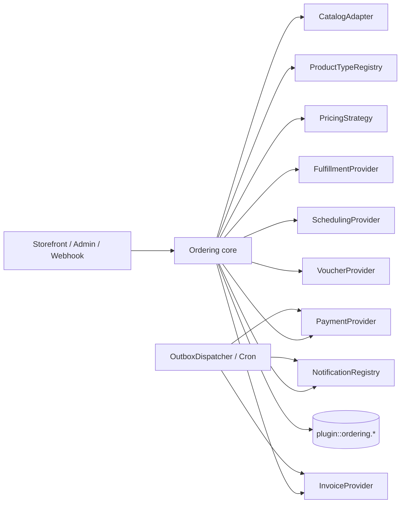

# Hợp đồng lõi cho plugin `ordering`

Ngày cập nhật: 2026-10-10

Đây là tài liệu thiết kế duy nhất của lõi. Nó mô tả contract và dữ liệu, chưa phải code hay schema
Strapi đã triển khai. Plugin là local plugin tại `src/plugins/ordering`, dùng UID và tên bảng
`plugin::ordering.*`; lõi không import UID hoặc API của Salanca.

Voucher/thẻ quà tặng và dịch vụ đặt lịch hẹn đã được chủ dự án xác nhận sẽ có về sau. Chúng chưa
bắt buộc phải bật ở v1, nhưng các contract dưới đây phải giữ đường cho cả hai.

## 1. Phạm vi và nguyên tắc bất biến

- Lõi sở hữu order, order line, totals, payment/refund ledger, hold, outbox, idempotency, timeline
  và các quan hệ nội bộ của plugin.
- Catalog, product type, pricing, payment, fulfillment, scheduling, voucher, notification và invoice
  là registry/provider có contract; provider không import content type của app.
- Plugin có module catalog riêng làm adapter mặc định (mục 20). Lõi đơn hàng vẫn chỉ gọi catalog qua
  `CatalogAdapter`, nên module catalog thay được bằng adapter khác.
- Sản phẩm của app được tham chiếu bằng `sourceUid`/`sourceDocumentId` dạng string. Quan hệ giữa
  bảng nội bộ plugin là relation thật, không dùng `orderRef` string để giả làm relation.
- Client chỉ gửi ref, quantity, variant, option, nhận hàng, slot và locale. Server đọc lại catalog,
  tính tiền và kiểm availability.
- Một order có thể có nhiều loại line. Workflow được chọn theo `productType` và fulfillment; nếu các
  line không thể cùng xử lý thì core phải tách fulfillment group hoặc từ chối rõ ràng.
- Mọi thay đổi trạng thái, tiền, giữ chỗ và outbox event trong cùng transaction DB. Side effect ra
  ngoài chỉ chạy sau commit qua outbox dispatcher.
- Tiền phase đầu chỉ bật VND nhưng mọi contract có `currency`. Không dùng `bigint` trong API JSON.
- Secret nằm ở env/provider config, không nằm trong order, event, log hoặc raw webhook.

## 2. Module và chiều phụ thuộc



Controller chỉ gọi application service. Provider không được tự ghi bảng app hoặc gọi lại controller.
Registry được đăng ký lúc bootstrap; graph workflow và capability phải được validate trước khi app
nhận traffic. Nguồn tham khảo: [Medusa](https://github.com/medusajs/medusa/tree/146c46b0ad1146b40595c8ef586c4d5890982603),
[Vendure](https://github.com/vendure-ecommerce/vendure/tree/e5146b14b080809b5d4b3bc429eb87b771aa843c) và
[Sylius StateMachine](https://github.com/Sylius/Sylius/tree/39313695548c709756ee9073bf309fa4ae89365a).

## 3. Kiểu chung và tiền

```ts
type Currency = 'VND' | string;
type Money = { amount: number; currency: Currency };
type JsonObject = Record<string, unknown>;
type Locale = string;

type ReceiveMethod =
  | { kind: 'pickup'; locationRef: string }
  | { kind: 'delivery'; address: AddressSnapshot; providerCode?: string }
  | { kind: 'appointment'; locationRef: string; slot: SlotSelection };

type AddressSnapshot = {
  recipientName: string;
  phone: string;
  line1: string;
  provinceCode?: string;
  wardCode?: string;
  provinceName?: string;
  wardName?: string;
  note?: string;
};

type SlotSelection = {
  scheduleRef: string;
  resourceRef?: string;
  startsAt: string;
  endsAt: string;
  timezone: string;
};

type ValidationResult =
  | { valid: true }
  | { valid: false; code: string; message: string; details?: JsonObject };
type SelectedOptionInput = { groupUid: string; optionUid: string; quantity: number };
type LineConfiguration = {
  sellable: Sellable;
  selected: SelectedOptionInput[];
  quantity: number;
  context: { locale: Locale; locationRef?: string; at: string };
};
type QuoteTotals = {
  subtotal: Money;
  adjustmentTotal: Money;
  fulfillmentTotal: Money;
  taxTotal: Money;
  grandTotal: Money;
};
type Adjustment = { code: string; label: string; amount: Money; priority: number; taxable: boolean };
type Quote = {
  quoteVersion: string;
  cartHash: string;
  lines: JsonObject[];
  adjustments: Adjustment[];
  totals: QuoteTotals;
};
type AdapterContext = { now: string; locationRef?: string; channel?: string };
type AvailabilityResult = { available: boolean; reasonCode?: string; availableQuantity?: number };
type Hold = { id: string; expiresAt: string; quantity: number; resourceRef?: string };
type OrderEvent = {
  order: Order;
  type: string;
  actorRef?: string;
  isPublic: boolean;
  payload: JsonObject;
  occurredAt: string;
};
type Refund = {
  payment: Payment;
  amount: number;
  currency: Currency;
  reason: string;
  status: string;
  lines: RefundLine[];                  // rỗng khi hoàn theo số tiền, không theo món
};
```

Money dùng `number` vì VND không có phần thập phân và giá trị thực tế nằm trong giới hạn số nguyên an
toàn của JavaScript. Mọi boundary phải gọi `Number.isSafeInteger(amount)` và từ chối overflow. PostgreSQL
`bigint`/Strapi `biginteger` đọc về string thì chuyển đổi có kiểm tra trước khi tạo `Money`; không để
`BigInt` lọt vào JSON vì `JSON.stringify()` sẽ lỗi. Nếu currency hoặc amount vượt safe integer, trả
`MONEY_OUT_OF_RANGE` thay vì làm tròn. Đây là rủi ro đã chấp nhận cho VND, không phải tuyên bố an toàn
cho mọi currency tương lai.

## 4. Sellable, variant, option và registry theo dòng

`kind` enum duy nhất không đủ để diễn tả sản phẩm có nhiều capability. Dùng product type registry và
các cờ capability tách rời, theo cách các hệ thống phân biệt physical/virtual/downloadable/gift card.

```ts
type SellableRef = {
  uid: string;
  sourceUid?: string;
  sourceDocumentId?: string;
};

type Sellable = {
  ref: SellableRef;
  productType: string;                 // food, retail, service, voucher, combo...
  title: string;
  description?: string;
  imageUrl?: string;
  variant?: {
    uid: string;
    sku?: string;
    title?: string;
    attributes: JsonObject;
    inventoryRef?: string;
  };
  listPrice: Money;
  compareAtListPrice?: Money;
  requiresShipping: boolean;
  isVirtual: boolean;
  isDownloadable: boolean;
  isGiftCard: boolean;
  fulfillmentKinds: string[];          // pickup, delivery, appointment, issue-code...
  options: OptionGroup[];
  availability: AvailabilityRules;
  categories: { ref: string; title: string; path: string[] }[]; // mục 20; line lưu snapshot
  minQuantity?: number;
  taxGroupRef?: string;
  isActive: boolean;
  purchasable: boolean;
  metadata?: JsonObject;
};

type OptionGroup = {
  uid: string;
  name: string;
  required: boolean;
  defaultOptionUids: string[];
  minQuantity: number;
  maxQuantity: number;
  stepQuantity: number;
  freeQuantity: number;
  visibleWhen?: JsonObject;
  options: Array<{
    uid: string;
    name: string;
    unitPriceDelta: Money;
    isActive: boolean;
    taxGroupRef?: string;
  }>;
};

type AvailabilityRules = {
  locationRefs?: string[];
  fulfillmentKinds?: string[];
  activeFrom?: string;
  activeTo?: string;
  blackout?: JsonObject[];
};

type ProductTypeDefinition = {
  code: string;
  version: string;
  capabilities: string[];
  validateLine(input: LineConfiguration): ValidationResult;
  quoteLine(input: LineConfiguration): Promise<LinePriceResult>;
  selectWorkflow(input: { lines: Sellable[]; fulfillment: ReceiveMethod }): { name: string; version: string };
};

interface ProductTypeRegistry {
  register(definition: ProductTypeDefinition): void;
  resolve(productType: string): ProductTypeDefinition;
}
```

Variant là SKU/inventory identity. Option selection là cấu hình và price add-on; không gộp hai khái
niệm. `defaultOptionUids`, `freeQuantity`, điều kiện hiển thị, min/max/step và branch/time availability
phải được snapshot vào line. Combo/kit là product type có component:

```ts
type KitComponent = {
  sellableRef: SellableRef;
  requiredQuantity: number;
  variantUid?: string;
  selectedOptions?: SelectedOptionInput[];
};
```

`CatalogAdapter` chỉ normalize catalog, trả list price và availability data. Nó không validate option
lần hai và không quyết định final order price:

```ts
interface CatalogAdapter {
  listCategories(ctx: AdapterContext, input: { locale: Locale }): Promise<JsonObject[]>;   // mục 20
  listSellables(ctx: AdapterContext, input: {
    locale: Locale;
    categoryRef?: string;
    cursor?: string;
    limit: number;
  }): Promise<{ items: Sellable[]; nextCursor?: string }>;                                 // mục 20
  getSellable(ctx: AdapterContext, ref: SellableRef, input: { locale: Locale }): Promise<Sellable | null>;
  getListPrice(ctx: AdapterContext, sellable: Sellable): Promise<Money>;
  getAvailability(ctx: AdapterContext, sellable: Sellable, quantity: number): Promise<AvailabilityResult>;
}
```

Nguồn so sánh: [Bagisto product types](https://github.com/bagisto/bagisto/tree/3fb8300b6343baefcf57bec5b6a9c188a2177d57/packages/Webkul/Product/src/Type),
[Medusa product module](https://github.com/medusajs/medusa/tree/146c46b0ad1146b40595c8ef586c4d5890982603/packages/modules) và
[Woo product types](https://github.com/woocommerce/woocommerce/tree/5fb08bdc3cd394aa3748f1e74e46bf0681e85183/plugins/woocommerce/includes).

## 5. Snapshot dòng hàng và quan hệ dữ liệu

```ts
type OrderLine = {
  id: string;
  order: Order;                         // relation thật
  fulfillmentGroup: FulfillmentGroup;   // relation thật; mỗi line thuộc đúng một group
  sourceUid?: string;                   // external ref, không phải relation
  sourceDocumentId?: string;
  productType: string;
  variantUid?: string;
  sku?: string;
  titleSnapshot: string;
  descriptionSnapshot?: string;
  imageUrlSnapshot?: string;
  selectedOptionsSnapshot: JsonObject;
  componentsSnapshot?: JsonObject;
  categoriesSnapshot: JsonObject;       // ref/title/path lúc đặt, cho báo cáo theo danh mục
  note?: string;
  quantity: number;
  fulfilledQuantity: number;
  returnedQuantity: number;
  canceledQuantity: number;
  unitAmount: number;
  optionAmount: number;
  discountAmount: number;
  feeAmount: number;
  roundingDelta: number;
  taxAmount: number;
  lineTotalAmount: number;
  currency: Currency;
};

type FulfillmentGroup = {
  id: string;
  order: Order;                         // relation thật
  workflowName: string;
  workflowVersion: string;
  receiveMethod: JsonObject;
  status: string;                       // state trong workflow của group
  lines: OrderLine[];                   // relation ngược của order-line.fulfillmentGroup
};

type Fulfillment = {
  id: string;
  order: Order;                         // relation thật
  group: FulfillmentGroup;              // relation thật
  providerCode: string;
  providerReference?: string;
  status: string;
  assigneeRef?: string;                 // nhân viên giao khi quán tự giao (mục 19.8)
  addressSnapshot?: AddressSnapshot;
  packedAt?: string;
  shippedAt?: string;
  deliveredAt?: string;
  canceledAt?: string;
  trackingNumber?: string;
  trackingUrl?: string;
  metadata?: JsonObject;
};

type FulfillmentLine = {
  fulfillment: Fulfillment;             // relation thật
  line: OrderLine;                      // relation thật; line phải thuộc fulfillment.group
  quantity: number;
};

type OrderAdjustment = {
  id: string;
  order: Order;                         // relation thật
  kind: 'discount' | 'fee' | 'rounding';
  code: string;                         // mã khuyến mãi, loại phí...
  label: string;
  sourceRef?: string;                   // promotion/rule ngoài plugin, dạng string
  ruleSnapshot?: JsonObject;            // điều kiện và cách tính tại lúc đặt
  amount: number;                       // âm cho giảm, dương cho phí; tổng đã phân bổ
  taxable: boolean;
  allocations: AdjustmentAllocation[];  // relation thật
};

type AdjustmentAllocation = {
  adjustment: OrderAdjustment;          // relation thật
  line: OrderLine;                      // relation thật
  weight: number;
  amount: number;                       // số nguyên VND sau largest remainder
};

type RefundLine = {
  refund: Refund;                       // relation thật
  line: OrderLine;                      // relation thật
  quantity: number;
  amount: number;                       // tính từ snapshot line, không từ catalog
};

type OrderStatus = 'draft' | 'open' | 'completed' | 'canceled';
type OrderPaymentStatus =
  | 'unpaid'
  | 'partially-paid'
  | 'paid'
  | 'overpaid'
  | 'partially-refunded'
  | 'refunded';
type OrderFulfillmentStatus = 'not-started' | 'in-progress' | 'partially-done' | 'done' | 'canceled';

type Order = {
  id: string;
  lines: OrderLine[];                   // relation thật
  fulfillmentGroups: FulfillmentGroup[]; // relation thật
  fulfillments: Fulfillment[];          // relation thật
  adjustments: OrderAdjustment[];       // relation thật
  payments: Payment[];                  // relation thật
  refunds: Refund[];                    // relation thật
  timeline: OrderEvent[];               // relation thật
  code: string;
  publicTokenHash: string;
  status: OrderStatus;                  // projection, xem mục 7
  paymentStatus: OrderPaymentStatus;    // cột cache, tính lại được từ payment ledger
  fulfillmentStatus: OrderFulfillmentStatus; // cột cache, tính lại được từ các group
  subtotalAmount: number;
  adjustmentAmount: number;
  fulfillmentAmount: number;
  taxAmount: number;
  totalAmount: number;
  currency: Currency;
  customerRef?: string;
  contactSnapshot: {
    name?: string;
    phone?: string;
    email?: string;
  };
  locationRef?: string;
  businessDate: string;                 // YYYY-MM-DD theo timezone + giờ chốt của chi nhánh, tính một lần
  placedAt: string;                     // UTC
  receiveMethod: JsonObject;
  origin: {
    kind: 'storefront' | 'staff-draft' | 'import';
    actorRef?: string;
    staffPriceOverride?: { reason: string; actorRef: string; amount: Money };
  };
};
```

`fulfilledQuantity + returnedQuantity + canceledQuantity <= quantity` là invariant. Nếu cần chia
partial fulfillment, mỗi fulfillment giữ relation tới line và quantity; không sửa quantity gốc.
Order totals là cột snapshot để lọc/báo cáo nhanh, đồng thời totals breakdown giữ các adjustment.
Không đọc lại tên/giá catalog khi in đơn cũ.

`workflowName` và `workflowVersion` được lưu trên từng `FulfillmentGroup`. Như vậy workflow mới không
làm order cũ mất transition hợp lệ. Order có một group vẫn đi qua group, không có đường riêng.
`contactSnapshot` là tên/SĐT/email tại lúc đặt; `customerRef` chỉ là liên kết tùy chọn.

Sửa sau review vòng 4: bản trước lưu `workflowName`/`workflowVersion` cả trên order lẫn group, nên có
hai nguồn sự thật khi order nhiều group. Nay workflow chỉ nằm trên group. Bản trước cũng cho
`FulfillmentGroup.lines` trỏ tới `FulfillmentLine`, mà `FulfillmentLine` thuộc `Fulfillment`, nên không
biết line nào thuộc group nào trước khi giao. Nay line thuộc group qua `order-line.fulfillmentGroup`;
`fulfillment-line` chỉ ghi số lượng đã giao trong từng lần giao.

Adjustment cấp order được lưu thành `order-adjustment` kèm `adjustment-allocation` theo line, không
chỉ nằm trong quote. Tổng `allocation.amount` của một adjustment bằng `adjustment.amount`; cột
`discountAmount`/`feeAmount` trên line là tổng các allocation của line đó. Refund theo món ghi
`refund-line`; refund theo số tiền (thiện chí, bồi thường) không có line.

### Mô hình dữ liệu lõi

| Entity | Quan hệ và dữ liệu bất biến tối thiểu |
| --- | --- |
| `order` | code, status (projection), paymentStatus/fulfillmentStatus (cache), contact snapshot, consent snapshot, customerNote, receive/address snapshot, totals, currency, customerRef, branch relation + locationRef, businessDate, placedAt, public token hash, origin (mục 21) |
| `order-line` | order và fulfillment group relation, source refs, product type/variant, title/SKU/options/components snapshot, quantity và fulfilled/returned/canceled quantities, unit/discount/fee/tax/total |
| `order-adjustment` | order relation, kind discount/fee/rounding, code, label, sourceRef, rule snapshot, amount, taxable |
| `adjustment-allocation` | adjustment/line relations, weight, amount đã làm tròn |
| `order-event` | order relation, type, actorRef, `isPublic`, payload đã che PII, occurredAt |
| `fulfillment-group` | order relation, workflow name/version, receive method, status; line nối qua `order-line.fulfillmentGroup` |
| `fulfillment` | order/group relation, provider, status, address snapshot, timestamps, tracking |
| `fulfillment-line` | fulfillment/line relations và quantity |
| `payment` | order relation, provider, requested/captured/refunded amount, status, provider reference |
| `payment-event` | payment tùy chọn, provider transaction id unique, transfer type, amount, kind, raw payload đã bảo vệ, review status/reason/actor (mục 19.1) |
| `cash-closing` | locationRef, businessDate, actor, số tiền hệ thống tính, số tiền đếm được, chênh lệch, ghi chú (mục 19.3) |
| `refund` | payment/order relation, amount, reason, actor, idempotency key, provider reference, status |
| `refund-line` | refund/line relations, quantity, amount theo snapshot line |
| `invoice` | order relation, provider, reference, status, issuedAt/canceledAt, lỗi gần nhất (không chứa dữ liệu người mua thô) |
| `hold` | order/line hoặc group relation, resource, quantity, expiresAt, releasedAt |
| `idempotency-key` | scope, key unique, request hash, response reference, status, expiresAt |
| `outbox` | event type/aggregate, payload, unique key, availableAt, attempts, lease, deliveredAt, lastError |
| `notification-delivery` | event, channel, recipient reference đã che, template, idempotency key, status, provider id, attempts |
| `voucher` / `voucher-redemption` | line/order relation, code hash, balance/expiry/status, redemption amount, actor/time/location |
| `order-job-lock` | job name, shard/key, lease owner, lockedAt, expiresAt, attempts, lastError |
| `staff-location-scope` | admin user id unique, allLocations (cờ rõ ràng), locationRefs, updatedBy/updatedAt (xem mục 14) |
| `branch` | code unique bất biến (= `locationRef`), tên/địa chỉ đa ngôn ngữ, SĐT, email, timezone, trạng thái, setting bán hàng theo cách nhận (mục 21.1) |
| `admin-change-log` | actor, action, entity, locationRef, thời điểm, field đổi trước/sau đã che (mục 21.6) |
| `ops-alert` | alertCode, dedupe key, severity/critical, aggregate ref đã che, status open/acknowledged/resolved, acknowledgedBy, firstSeenAt/lastSeenAt, count; mỗi key chỉ một bản ghi `open` |

Các quan hệ trong bảng là relation thật của plugin. Chỉ `sourceUid`, `sourceDocumentId`,
`customerRef`, `locationRef` và admin user id đi ra ngoài plugin mới là string/số tham chiếu.

```ts
interface FulfillmentProvider {
  code: string;
  capabilities: string[]; // pickup, self-delivery, carrier, label, tracking...
  getOptions(input: { order: Order; group: FulfillmentGroup }): Promise<JsonObject[]>;
  validate(input: { order: Order; group: FulfillmentGroup; option: JsonObject }): Promise<ValidationResult>;
  calculatePrice(input: { order: Order; group: FulfillmentGroup; option: JsonObject }): Promise<Money>;
  create(input: { order: Order; group: FulfillmentGroup; option: JsonObject }): Promise<{
    providerReference?: string;         // mã phía hãng giao; id của fulfillment do core tạo
    trackingNumber?: string;
    trackingUrl?: string;
  }>;
  cancel?(input: { fulfillment: Fulfillment; reason: string }): Promise<void>;
  getDocuments?(input: { fulfillment: Fulfillment }): Promise<JsonObject[]>;
}
```

`create()` không tự đổi `order.status`; core tạo `fulfillment` và `fulfillment-line` trong transaction,
sau đó phát `fulfillment.changed`. `addressSnapshot` là địa chỉ tại lúc đặt, còn tracking/provider
reference là dữ liệu của fulfillment. Pickup, cửa hàng tự giao và hãng giao đều dùng contract này.
Bản trước trả `fulfillmentId` từ provider, dễ nhầm với id core; nay provider chỉ trả
`providerReference`, lưu vào cột `fulfillment.providerReference`.

## 6. Phân vai tính giá và thứ tự gọi

Chỉ `PricingStrategy` điều phối pipeline. `ProductTypeDefinition.validateLine` là authority duy nhất
cho option/product-type rules; catalog chỉ trả dữ liệu và trạng thái publish/availability. Không giữ
đồng thời `CatalogAdapter.validateOptions` và `IndustryModule.validateLine` vì sẽ tạo hai nguồn sự thật.

```ts
interface PricingStrategy {
  quote(ctx: QuoteContext): Promise<Quote>;
}
```

Pipeline cố định:

1. resolve `Sellable` và variant từ `CatalogAdapter`;
2. normalize selected options và gọi `ProductTypeRegistry.resolve().validateLine`;
3. đọc list price/option deltas, kiểm `Number.isSafeInteger`;
4. gọi `quoteLine` để tính product-specific price (combo, voucher, service);
5. lấy fulfillment/scheduling quote (để khuyến mãi kiểu miễn phí giao biết phí trước);
6. áp adjustment/discount/fee cấp line và cấp order theo priority;
7. phân bổ adjustment cấp order xuống line theo weight; làm tròn từng line theo currency policy,
   dùng phương pháp phần dư lớn nhất để tổng các line khớp tổng order;
8. resolve tax category/rate nếu bật, tính thuế theo từng line trên số tiền đã phân bổ;
9. tạo totals và kiểm `Σ lineTotal + fulfillment = grandTotal`; lệch thì lỗi, không tự bù.

Sửa sau review vòng 4: bản trước tính thuế (bước 7) trước khi phân bổ giảm giá (bước 8), nên VAT theo
line tính trên số tiền chưa giảm. Nay phân bổ trước, thuế sau.

Quote trả `quoteVersion`, `cartHash`, lines, adjustments, fulfillment, tax và totals. Create order phải
re-quote; nếu hash/giá/availability khác, trả `PRICE_CHANGED` hoặc `SELLABLE_UNAVAILABLE` và không tạo
order. Client không gửi amount.

Với giảm/phí cấp order, pipeline tính weight theo giá trị dòng hoặc strategy đã chọn, phân bổ số tiền
nguyên xuống từng line, làm tròn từng line theo VND và phân các đồng dư lớn nhất trước. Line lưu
`discountAmount`, `feeAmount` và `roundingDelta`. Refund/hoàn một món dùng đúng các số đã snapshot;
không tính lại discount từ tổng order sau khi một line bị hủy. Cách này theo
[Vendure `OrderLineDiscountDistributionStrategy`](https://github.com/vendure-ecommerce/vendure/blob/e5146b14b080809b5d4b3bc429eb87b771aa843c/packages/core/src/config/order/order-line-discount-distribution-strategy.ts)
và tránh lệch VAT/tổng do chỉ làm tròn một lần ở cuối.

## 7. Workflow và quantity state

Mỗi product type khai báo workflow/version. Bootstrap kiểm graph: initial tồn tại, `next` hợp lệ,
terminal không có cạnh ra. Core lưu transition event và actor. Payment và fulfillment có state riêng;
order status không được set tay từ webhook. `FulfillmentGroup` là entity riêng, có workflow/version,
receive method và các line quantity; một order có thể có nhiều group (bếp/đóng gói, issue-code,
appointment hoặc shipping). Order status chỉ là projection từ các group và payment ledger, không phải
workflow duy nhất. Nếu các line không có group tương thích, trả `MIXED_WORKFLOW_UNSUPPORTED`.

`selectWorkflow` chạy sau khi biết toàn bộ line và receive method. Một order có nhiều product type có
thể tạo fulfillment groups; nếu không có workflow tương thích thì từ chối với
`MIXED_WORKFLOW_UNSUPPORTED`.

```ts
type WorkflowDefinition = {
  name: string;
  version: string;
  initial: string;
  states: Record<string, {
    next: string[];
    terminal?: 'success' | 'canceled'; // state cuối và kết quả của nó
    isPublic: boolean;                  // có hiện bước này cho khách không
    slaMinutes?: number;                // ở bước này quá lâu thì mở alert (mục 12)
  }>;
};
```

Bổ sung khi code O1 (2026-10-10): definition có thêm `cancelState` (tên state terminal `canceled`
mà `cancelOrder`/`customerCancel` chuyển tới) và cờ `customerCancellable` trên state (mục 21.9).
Bootstrap còn kiểm: không có cạnh tự lặp, mọi state đến được từ `initial`, state chưa terminal
đều đi tới được một terminal. Điều kiện "payment không còn thiếu" của `completed` được code hóa là
`Σ capturedAmount ≥ totalAmount` (tiền đã thu gộp, không trừ refund): hoàn tiền sau khi giao không
mở lại đơn đã `completed`; `paymentStatus` vẫn phản ánh refund.

`selectWorkflow` trả `{ name, version }` của definition đã đăng ký; core ghi cả hai vào group. Khi
cấu hình không cho trộn loại hàng (câu hỏi 4), core vẫn tạo đúng một group và từ chối line khác
workflow; khi cho trộn, core tạo một group cho mỗi workflow. Hai chế độ dùng chung code.

`order.status` là projection, core tính lại trong cùng transaction với mọi transition của group,
payment hoặc refund:

| `order.status` | Điều kiện |
| --- | --- |
| `draft` | `origin.kind = staff-draft` và staff chưa xác nhận gửi khách |
| `canceled` | mọi group ở state `terminal = canceled` |
| `completed` | mọi group đã terminal, ít nhất một group `success`, và payment không còn thiếu |
| `open` | các trường hợp còn lại |

Hủy cả đơn là transition hủy lần lượt từng group, không set thẳng `order.status`. `paymentStatus`
tính từ payment ledger (mục 8), `fulfillmentStatus` tính từ trạng thái các group; cả hai là cột cache
để Admin lọc nhanh và có job kiểm lại khớp với nguồn. Cách này giống Sylius: order chỉ giữ vài giá
trị, payment và giao nhận có trục riêng.
Voucher có fulfillment kiểu `issue-code`; appointment có line metadata `scheduleRef/resourceRef`;
món ăn có pickup/delivery. Đường này giữ cả voucher và appointment mà không biến chúng thành cột bắt
buộc cho mọi order.

## 8. Payment ledger và `PaymentProvider`

```ts
type Payment = {
  order: Order;
  providerCode: string;
  requestedAmount: number;
  capturedAmount: number;
  refundedAmount: number;
  currency: Currency;
  status: 'pending' | 'authorized' | 'captured' | 'failed' | 'cancelled';
  providerReference?: string;
};

type PaymentEvent = {
  providerCode: string;
  providerTransactionId: string;
  payment?: Payment;                    // relation nếu đã khớp
  transferType?: 'in' | 'out';
  amount: number;
  currency: Currency;
  kind: string;
  rawPayload: JsonObject;
  receivedAt: string;
  reviewStatus: 'auto-matched' | 'needs-review' | 'matched-manually' | 'refund-due' | 'ignored';
  reviewReason?: string;                // no-code, order-not-found, underpaid... (mục 19.1)
  reviewedBy?: string;
  reviewedAt?: string;
};

type RawWebhook = {
  headers: Record<string, string>;
  body: string;
  receivedAt: string;
};
type NormalizedPaymentEvent = {
  providerCode: string;
  providerTransactionId: string;
  kind: string;
  amount: Money;
  transferType?: 'in' | 'out';
  reference?: string;
  metadata?: JsonObject;
};
type WebhookAckMode = 'after-processing' | 'immediate';
type WebhookProcessingResult =
  | 'accepted'
  | 'duplicate'
  | 'order-not-found'
  | 'amount-mismatch'
  | 'invalid-signature'
  | 'invalid-payload'
  | 'ignored-money-out'
  | 'failed';
type PaymentInitiation = {
  order: Order;
  amount: Money;
  returnUrl?: string;
  metadata?: JsonObject;
};
type PaymentInitiationResult = {
  status: Payment['status'];
  providerReference?: string;
  redirectUrl?: string;
};
type PaymentAction = { payment: Payment; amount?: Money; providerReference?: string };
type PaymentActionResult = { status: string; providerReference?: string };
type RefundRequest = { payment: Payment; amount: Money; reason: string; idempotencyKey: string };

interface PaymentProvider {
  code: string;
  capabilities: string[];
  webhookAckMode: WebhookAckMode;
  getPresentation(input: PaymentInitiation): Promise<{ qr?: string; bankAccount?: JsonObject; memo?: string; expiresAt?: string }>;
  initiate(input: PaymentInitiation): Promise<PaymentInitiationResult>;
  authorize?(input: PaymentAction): Promise<PaymentActionResult>;
  capture?(input: PaymentAction): Promise<PaymentActionResult>;
  cancel?(input: PaymentAction): Promise<PaymentActionResult>;
  refund?(input: RefundRequest): Promise<PaymentActionResult>;
  parseWebhook(input: RawWebhook): Promise<NormalizedPaymentEvent[]>;
  webhookResponse(input: {
    raw: RawWebhook;
    result: WebhookProcessingResult;
  }): { status: 200 | 201 | 202 | 204 | 400 | 401 | 500; headers?: Record<string, string>; body?: JsonObject };
  queryTransaction?(reference: string): Promise<NormalizedPaymentEvent | null>;
  listTransactions?(input: { from: string; to: string; cursor?: string }): Promise<NormalizedPaymentEvent[]>;
}
```

`parseWebhook` trả mảng vì một request có thể chứa nhiều event. Core xác minh chữ ký, lưu raw payload
và unique `providerCode + providerTransactionId` trước khi chạy nghiệp vụ. Khi
`webhookAckMode = immediate`, response `accepted`/`duplicate` được tạo ngay sau khi bản ghi raw và
outbox đã bền vững; khi `after-processing`, core truyền kết quả thực tế (`amount-mismatch`,
`order-not-found`...) vào `webhookResponse`. Provider quyết định mã HTTP/body riêng của mình. SePay
phải trả HTTP 200/201 và body JSON đúng `{"success": true}` trong 30 giây; VNPAY dùng `RspCode` theo
kết quả (`00`, `01`, `02`, `04`, `97`, `99`); MoMo yêu cầu HTTP 204. Không hard-code một response
chung trong core.

`RawWebhook.body` phải là bytes gốc, không phải JSON đã parse rồi stringify lại. Không có body gốc thì
trả lỗi và mở alert, không dùng `JSON.stringify(ctx.request.body)` thay thế như plugin Creem
(reference C20). SePay HMAC ký chuỗi
`{X-SePay-Timestamp}.{raw_body}` và tài liệu cảnh báo serialize lại sẽ làm sai chữ ký
([xác thực](https://developer.sepay.vn/vi/sepay-webhooks/xac-thuc)). Strapi 5.51.1 parse body bằng
`koa-body` trong middleware `strapi::body` toàn cục, chạy trước route của plugin, nên plugin không tự
lấy được body gốc. App phải bật `includeUnparsed: true` cho `strapi::body` trong
`config/middlewares.ts`; route webhook đọc `ctx.request.body[Symbol.for('unparsedBody')]`. Bootstrap
plugin kiểm: provider nào cần chữ ký mà app chưa bật thì báo lỗi rõ ràng, không âm thầm bỏ qua kiểm
chữ ký. Timestamp lệch quá 5 phút bị từ chối (`invalid-signature`) để chống replay.

Đối soát SePay dùng `GET https://userapi.sepay.vn/v2/transactions` với `since_id` làm cursor của
`listTransactions`; API giới hạn 3 request/giây, vượt thì HTTP 429
([đối soát](https://developer.sepay.vn/vi/sepay-webhooks/doi-soat-giao-dich)). Event từ đối soát đi
qua cùng đường unique `providerCode + providerTransactionId` như webhook nên không tạo ledger trùng.

Memo/reference được tạo từ template cấu hình, ví dụ `SLC{orderCode}`; provider adapter chịu trách
nhiệm parse code nhưng không tự hoàn tất order. Underpayment giữ pending; overpayment và tiền không
khớp giữ unmatched/review; duplicate provider id không tạo ledger thứ hai. Việc tự động phân bổ phần
thừa hoặc nhiều transfer hợp lệ là câu hỏi nghiệp vụ, không được suy đoán từ free-form content.

Trạng thái payment là projection từ captured ledger trừ refund settled. Refund có amount, reason,
actor, idempotency key và provider reference. [Saleor transaction models](https://github.com/saleor/saleor/blob/782a751f622c4a047798ce7084b7c66c0877ec6f/saleor/payment/models.py)
được dùng làm tham khảo cho transaction item/event.

## 9. Scheduling và giữ slot

```ts
type SchedulePolicy = {
  locationRef: string;
  fulfillmentKind: string;
  timezone: string;
  businessDayPolicy: {
    startLocalTime: string;
    cutoffLocalTime?: string;
    holidayDates: string[];
  };
  openingHours: JsonObject;
  leadTimeMinutes: number;
  slotLengthMinutes: number;
  bufferMinutes: number;
  maxAdvanceDays: number;
  capacity: number;
  blackoutPeriods: JsonObject[];
};

interface SchedulingProvider {
  getAvailability(input: { locationRef: string; fulfillmentKind: string; at: string }): Promise<AvailabilityResult>;
  listSlots(input: { scheduleRef: string; from: string; to: string; quantity: number }): Promise<SlotSelection[]>;
  validateSlot(input: { slot: SlotSelection; quantity: number }): Promise<ValidationResult>;
  reserveSlot(input: { order: Order; slot: SlotSelection; quantity: number; expiresAt: string }): Promise<Hold>;
  releaseSlot(input: { hold: Hold; reason: string }): Promise<void>;
}
```

Availability theo branch × fulfillment phải chứa opening hours, lead time, slot duration, break/buffer,
capacity/resource, max advance, holiday/blackout và timezone. Reserve/validate chạy trong DB transaction,
khóa resource theo thứ tự ổn định, hold có `expiresAt`. Payment deposit có thể tạo nhiều payment event;
không coi pending payment là slot đã phục vụ. Nguồn: [Bagisto Booking helper](https://github.com/bagisto/bagisto/blob/3fb8300b6343baefcf57bec5b6a9c188a2177d57/packages/Webkul/BookingProduct/src/Helpers/Booking.php)
 và [TastyIgniter local](https://github.com/tastyigniter/ti-ext-local/tree/b8e31850c6168e4195c15f3049944bad354b7e92/src/Models).

Server lưu timestamp UTC; `businessDate` được tính từ `timezone` và `businessDayPolicy` của branch,
không từ timezone của server. `Asia/Ho_Chi_Minh` là mapping hiện tại cho Salanca. Việc ngày kinh doanh
có kết thúc sau nửa đêm (quán mở tới 1–2 giờ sáng) vẫn là câu hỏi chủ dự án; contract giữ được cả
`startLocalTime` và `cutoffLocalTime`.

Quy tắc thời gian (nguồn so sánh ở reference C17.2):

- `timezone` là tên IANA trên từng chi nhánh, bắt buộc khi bật bán online. Không dùng timezone của
  server, của Node process hay của người đang xem Admin.
- `order.businessDate` được tính một lần khi đặt đơn: đổi `placedAt` sang giờ chi nhánh; nếu giờ địa
  phương trước `cutoffLocalTime` thì thuộc ngày hôm trước. Ví dụ chốt ngày lúc 04:00: đơn 01:30 sáng
  thứ Bảy thuộc ngày thứ Sáu. Báo cáo, "hết món đến cuối ngày" và số thứ tự trong ngày đều theo cột này.
  Đổi giờ chốt chỉ áp cho đơn mới, không viết lại đơn cũ.
- Khoảng giờ mở có `end < start` nghĩa là đóng sau nửa đêm (22:00–02:00), giống
  `WorkingRange::endsNextDay()` của TastyIgniter. Slot và lead time tính trên giờ chi nhánh rồi đổi
  sang UTC để lưu.
- `SlotSelection` lưu `startsAt`/`endsAt` bằng UTC. Màn hình bếp và email hiển thị theo timezone
  chi nhánh.
- Ca bán hàng/đóng ca (Odoo POS gắn mỗi đơn vào một session đang mở) phục vụ đối soát tiền mặt; là
  module về sau. Lõi chỉ cần `businessDate`, actor và thời điểm ghi nhận tiền để module đó dùng lại.

## 10. Voucher/thẻ quà tặng

Voucher là product type và fulfillment module, không phải một chuỗi trên line. Core giữ relation tới
order/line và payment; `VoucherProvider` sở hữu mã đã hash, balance, expiry, trạng thái và redemption
ledger:

```ts
interface VoucherProvider {
  issue(input: { order: Order; line: OrderLine; policy: string }): Promise<{ voucherRef: string; delivery: JsonObject }>;
  redeem(input: { code: string; amount?: Money; actorRef?: string }): Promise<{ redemptionRef: string; remaining: Money }>;
  refundUnused(input: { voucherRef: string; reason: string }): Promise<void>;
  getStatus(input: { voucherRef: string }): Promise<JsonObject>;
}
```

Module phải chống đoán mã, lock khi redeem, ghi actor/time/location và giữ expiry/use-once hoặc partial
balance theo policy. Issue sau captured hay sau duyệt thủ công, revenue lúc bán hay redeem, và refund
chưa dùng cần owner quyết định; core không chặn lựa chọn nào. Salanca map `menu-package` vào `productType`
voucher khi bật module.

## 11. Storefront, draft order và lỗi chuẩn

API chung tối thiểu: `GET /ordering/config`, `POST /ordering/quote`, `POST /ordering/orders`,
`GET /ordering/orders` với header `X-Order-Token` (không dùng `Authorization: Bearer`, lý do ở dưới),
`GET /ordering/orders/payment`, `POST /ordering/orders/cancel`. Token không nằm trong path/query để
không lọt vào access log của Cloudflare, proxy hoặc analytics.

Link gửi khách qua email/SMS (`https://<web>/don-hang#t=<token>`) đặt token sau dấu `#`. Phần fragment
không được trình duyệt gửi lên server, không vào access log và không nằm trong header `Referer`. Trang
web đọc token từ fragment, gọi API bằng header, rồi xóa fragment bằng `history.replaceState` để token
không còn trên thanh địa chỉ. Token có thể lưu trong `sessionStorage` của tab cho lần tải lại; không
lưu vào cookie hay `localStorage` lâu dài. Header tùy chỉnh làm phát sinh CORS preflight, nên
`X-Order-Token` và `Idempotency-Key` phải nằm trong danh sách header được phép của `strapi::cors`.
Mặc định của Strapi và `config/middlewares.ts` hiện tại của Salanca chỉ cho `Content-Type`,
`Authorization`, `Origin`, `Accept`; đây là bước cài đặt của app. Chọn `X-Order-Token`,
không dùng `Authorization: Bearer`, vì header đó đã dành cho JWT users-permissions và API token của
Strapi; dùng chung dễ bị middleware xác thực hiểu nhầm.
Endpoint staff tạo draft, sửa giá và gửi link là route Admin riêng, cần permission và audit.

Staff draft giữ `origin.kind = staff-draft`, actor và lý do override trong timeline. Payment link chỉ
được tạo từ draft đã có `publicTokenHash`, expiry và số tiền quote; link không cấp quyền sửa order.

```ts
type ApiError = {
  code: string;
  message: string;
  details?: JsonObject;
  requestId: string;
};
```

Quote/create order dùng locale input nhưng message có thể locale hóa ở adapter. Public lookup dùng
`publicToken` random lưu hash, expiry và rate limit; không dùng code ngắn + số điện thoại làm bí mật
duy nhất. Polling payment có backoff và dừng khi terminal.

`Idempotency-Key` bắt buộc cho create order, payment action, refund và redeem. Cùng key trả cùng result;
khác payload với key cũ trả `IDEMPOTENCY_PAYLOAD_MISMATCH`.

Route `quote`, create order và public lookup có rate limit theo IP/token. Trước khi tạo order, core gọi
`CaptchaProvider` đã đăng ký; provider có thể là Turnstile hoặc reCAPTCHA tùy app. Captcha chỉ chứng
minh request không phải bot, không thay cho idempotency, kiểm giá, branch scope hay permission.

```ts
interface CaptchaProvider {
  code: string;
  verify(input: { token: string; ip?: string; action: string }): Promise<ValidationResult>;
}
```

## 12. Outbox, cron và reliable event

Không phát `ordering.order.created` trực tiếp sau commit mà không có durable record: process có thể chết
giữa commit và publish. Tạo outbox row trong cùng transaction với order/payment/hold:

```ts
type OutboxEvent = {
  id: string;
  type: string;
  aggregateType: string;
  aggregateId: string;
  payload: JsonObject;
  uniqueKey: string;
  occurredAt: string;
  availableAt: string;
  attempts: number;
  lockedAt?: string;
  deliveredAt?: string;
  lastError?: string;
};
```

`OutboxDispatcher` chạy bằng Strapi cron hoặc worker được triển khai riêng: claim batch bằng row lock,
`availableAt <= now`, retry exponential backoff, lease timeout và đánh dấu `deliveredAt`. Consumer phải
idempotent theo event id. Strapi hiện không có queue trong `config/server.ts`; cron chỉ là scheduler,
không thay thế outbox hoặc lock. Action Scheduler chỉ được tham khảo thiết kế, không chép vì GPL.

Khi có nhiều server, dispatcher dùng `SELECT ... FOR UPDATE SKIP LOCKED` để claim batch và lease;
job hết hạn hold, reconciliation và alert dùng cùng cơ chế với `jobName + shardKey` unique. Advisory
lock có thể bảo vệ một singleton không có row, nhưng không thay thế trạng thái job/attempt. Process
chết sẽ để lease hết hạn để worker khác claim lại.

### Bảng event

| Event | Khi phát | Payload tối thiểu |
| --- | --- | --- |
| `order.created` | order và line đã commit | orderId, code, status, total, currency, locationRef |
| `order.transitioned` | projection `order.status` đổi giá trị | orderId, from, to, actorRef |
| `fulfillment-group.transitioned` | transition của group đã commit | orderId, groupId, from, to, workflowName/version, actorRef, isPublic |
| `payment.event.received` | raw payment event đã lưu | paymentEventId, providerCode, providerTransactionId, kind, amount, transferType |
| `payment.captured` | ledger captured đã commit | orderId, paymentId, capturedAmount, providerReference |
| `refund.settled` | refund settled đã commit | orderId, paymentId, refundId, amount, actorRef |
| `fulfillment.changed` | fulfillment được tạo, đổi trạng thái hoặc có tracking | orderId, groupId, fulfillmentId (id core), status, trackingNumber |
| `voucher.issued` | voucher code đã tạo và hash | orderId, lineId, voucherRef, expiresAt |
| `appointment.reserved` | hold slot đã commit | orderId, lineId, scheduleRef, resourceRef, startsAt, endsAt |
| `notification.delivery.failed` | delivery vượt retry policy | deliveryId, channel, errorCode, attempts |
| `ordering.alert.raised` | rule vận hành mở alert | alertCode, aggregateRef, severity, attempts, occurredAt |

Notification, invoice và provider calls chỉ chạy từ outbox sau commit. Alert cho webhook lỗi liên tục,
tiền không khớp, outbox kẹt/retry quá ngưỡng hoặc order chờ nhận quá lâu dùng
`NotificationProvider`; log chỉ ghi alertCode, provider/order ref đã che, status, attempts, requestId,
không ghi tên, SĐT, địa chỉ hoặc raw payload.

Alert ghi vào `ops-alert` theo `dedupeKey` (ví dụ `webhook-failing:sepay`). Cùng key đang `open` chỉ
tăng `count`/`lastSeenAt`, không gửi lại; gửi nhắc lại theo chu kỳ cấu hình hoặc khi severity tăng.
Không có bước này thì webhook lỗi liên tục sẽ sinh hàng trăm email cảnh báo.

Mô hình cảnh báo theo `AppProblem` của Saleor (reference C17.3): báo lại cùng key trong cửa sổ gộp
chỉ tăng `count`; đạt ngưỡng thì thành `critical` và gửi ngay; ngoài cửa sổ thì mở bản ghi mới; người
xem bấm "đã biết" (`acknowledged`) thì ngừng nhắc; giữ tối đa N bản ghi, xóa bản cũ nhất đã đóng.

```ts
type OpsAlertRule = {
  code: string;
  enabled: boolean;
  threshold: number;                    // số lần hoặc số phút, tùy rule
  criticalThreshold?: number;
  aggregationMinutes: number;           // cửa sổ gộp cùng dedupeKey
  recipients: string[];                 // channel + nhóm người nhận, resolver quyết định địa chỉ
};
```

Rule mặc định (giá trị là đề xuất, chủ dự án chỉnh được; câu hỏi 15):

| Rule | Điều kiện mặc định | Nguồn tham khảo |
| --- | --- | --- |
| `webhook-failing` | 5 webhook liên tiếp lỗi chữ ký/xử lý cùng provider; critical ở 20; thành công thì đặt lại đếm | WooCommerce tự tắt webhook sau 5 lần lỗi |
| `payment-unmatched` | mỗi tiền vào không khớp đơn hoặc sai số tiền; gộp theo provider trong 60 phút | Saleor gộp 60 phút |
| `outbox-stuck` | event chờ lâu nhất quá 10 phút, hoặc một event vượt số lần retry tối đa | Action Scheduler cảnh báo việc quá hạn |
| `job-heartbeat-missed` | dispatcher/đối soát không chạy thành công trong 2 chu kỳ liên tiếp | Strapi `/_health` không thấy lỗi này |
| `order-awaiting-acceptance` | group ở bước chờ nhận quá `slaMinutes` của bước đó (mặc định 10 phút) | Theo nghiệp vụ quán; chưa thấy ở nguồn đã đọc |
| `reconciliation-mismatch` | đối soát định kỳ thấy giao dịch có ở provider mà chưa có trong ledger | SePay khuyên đối soát định kỳ |
| `manual-payment-unconfirmed` | chuyển khoản ghi tay quá 24 giờ chưa thấy ở SePay (mục 19.1) | Quyết định 2026-10-10 |
| `cash-closing-mismatch` | chốt tiền mặt cuối ngày có chênh lệch khác 0 (mục 19.3) | Quyết định 2026-10-10 |

Lease mặc định 5 phút: claim mà không chạy, hoặc chạy quá 5 phút, thì trả lại để worker khác nhận
(Action Scheduler dùng 300 giây). Thời hạn lưu mặc định: outbox đã giao 30 ngày, outbox lỗi 90 ngày,
alert đã đóng 90 ngày (Action Scheduler giữ việc xong 1 tháng, việc lỗi 3 tháng).

Plugin có trang "Tình trạng vận hành" trong Admin, cần permission riêng: số event outbox đang chờ và
tuổi của event chờ lâu nhất, lần webhook thành công gần nhất theo provider, lần chạy gần nhất của từng
job, alert đang mở. `/_health` của Strapi chỉ cho biết process còn sống nên không thay được trang này.

## 13. Invoice, tax và phí

```ts
interface InvoiceProvider {
  issue(input: { order: Order; lines: OrderLine[]; totals: QuoteTotals; buyer?: JsonObject }): Promise<{ reference: string; status: string }>;
  cancel(input: { reference: string; reason: string }): Promise<void>;
  getStatus(input: { reference: string }): Promise<JsonObject>;
}
```

Line snapshot có `taxGroupRef`, tax-inclusive flag, unit price, quantity, tax rate/amount khi tax bật.
Vendure tax category/rate/zone và Medusa tax provider chỉ là nguồn tham khảo. Nghị định 70/2025/NĐ-CP
sửa Nghị định 123/2020/NĐ-CP; core không tự kết luận Salanca thuộc diện hóa đơn máy tính tiền.

Fee là `Adjustment` có code, amount, priority, taxable và source; pipeline phải quy định fee trước/sau
discount, VAT và rounding. Phí dịch vụ, đóng gói, tip và fulfillment không thêm cột ad-hoc.

## 14. Notification, admin và provider config

```ts
interface NotificationProviderRegistry {
  register(channel: string, provider: NotificationProvider): void;
  resolve(channel: string): NotificationProvider;
}
interface NotificationProvider { send(input: { recipient: JsonObject; template: string; data: JsonObject }): Promise<void>; }
```

Channel là registry string, không phải union hard-code. Recipient resolver quyết định người nhận; template
renderer quyết định nội dung/locale; provider chỉ gửi. Notification event phát từ outbox và có delivery log.

Provider config có code, enabled, capabilities, secret ref, memo template, display data, min/max order,
fee/conditions và location scope. UI Admin chỉ được bật/tắt instance khi permission cho phép; env secret
không hiển thị. Điều kiện bật provider và toggle runtime cần owner chốt.

Cấu hình có hai nửa, theo cách Strapi 5.51.1 nạp config plugin
(`@strapi/core/dist/loaders/plugins/index.js`, hàm `applyUserConfig`): Strapi lấy `default` của
plugin, gộp với `<tên plugin>.config` của app bằng `defaultsDeep` (giá trị của app thắng), rồi gọi
`validator(config)`. `validator` phải throw khi sai; giá trị nó trả về bị bỏ qua.

Sửa sau review vòng 4: bản trước đặt `default` và `validator` trong `config/plugins.ts` của app. Ở đó
Strapi coi chúng là giá trị cấu hình bình thường, nên validator không bao giờ chạy. Bản trước cũng
thiếu `resolve` cho local plugin và dùng mảng cho danh sách provider.

Nửa của plugin (`src/plugins/ordering/server/src/config/index.ts`):

```ts
export default {
  default: {
    currency: 'VND',
    // Danh sách provider/product type là object theo code, không dùng mảng:
    // defaultsDeep gộp mảng theo vị trí, nên mảng mặc định của plugin sẽ trộn vào mảng của app.
    productTypes: {},
    providers: { payment: {}, fulfillment: {}, scheduling: {}, voucher: {}, captcha: {} },
  },
  validator(config) {
    if (config.currency !== 'VND') throw new Error('currency must be VND in phase 1');
    for (const [code, provider] of Object.entries(config.providers.payment)) {
      if (provider.enabled && provider.requiresSecret !== false && !provider.webhookSecret) {
        throw new Error(`providers.payment.${code}: webhookSecret is required`);
      }
    }
  },
};
```

Nửa của app Salanca (`config/plugins.ts`):

```ts
export default ({ env }) => ({
  ordering: {
    enabled: true,
    resolve: './src/plugins/ordering',
    config: {
      catalog: { adapter: 'ordering-catalog', defaultLocale: 'vi' }, // module catalog của plugin (mục 20)
      productTypes: { food: { enabled: true }, voucher: { enabled: false } },
      providers: {
        payment: {
          sepay: { enabled: true, webhookSecret: env('SEPAY_WEBHOOK_SECRET'), memoTemplate: 'SLC{orderCode}' },
          cash: { enabled: true, requiresSecret: false },
        },
        fulfillment: { pickup: { enabled: true } },
        scheduling: { 'salanca-location': { enabled: true } },
        captcha: { turnstile: { enabled: true, secret: env('TURNSTILE_SECRET_KEY') } },
      },
    },
  },
});
```

`validator` chạy lúc nạp plugin, trước `register()` của app, nên chưa kiểm được code có tồn tại không.
App đăng ký adapter riêng (nếu có) trong `register()` của mình; catalog mặc định `ordering-catalog` do
plugin tự đăng ký. `bootstrap()`
của plugin mới đối chiếu mọi code đang `enabled` với registry và dừng khởi động nếu thiếu. Thứ tự này
có trong `@strapi/core/dist/Strapi.js`: register plugin, register app, bootstrap plugin, bootstrap app.
Secret lấy
qua `env()` của Strapi; plugin không log, không trả config ra API Admin hay storefront. Setting vận hành theo branch (bật/tắt, min/max order, fee, location scope)
để trong `strapi.store` hoặc content type setting riêng, có permission và audit; không để admin đổi
workflow graph đang chạy.

Schema nội bộ nên ẩn khỏi Content Manager nếu không cần CRUD; transition, refund, webhook và outbox phải
qua service/route có permission, không cho nhân viên sửa trực tiếp. Source local Strapi 5.51.1 cho thấy
Document Service middleware có thể chặn call qua Document Service và schema có
`content-manager.visible`, nhưng direct `strapi.db.query` bypass và UI/permission cần fixture kiểm chứng.

Bổ sung sau C20 (các plugin Strapi 5 đã đọc):

- Mọi content type của plugin có `collectionName` tiền tố `plugins_ordering_` và ẩn khỏi
  Content-Type Builder (`content-type-builder.visible: false`), kể cả catalog đang hiện ở Content
  Manager, để admin không sửa được schema của plugin. Bảng nội bộ (order, payment-event, outbox…) ẩn
  luôn khỏi Content Manager.
- Plugin không bao giờ ghi file vào thư mục của app lúc chạy. WebbyCommerce làm vậy để lách việc plugin
  không nạp được component; container production thường chỉ đọc.
- Secret ưu tiên lấy từ env. Khi muốn cho admin nhập thông tin cổng thanh toán trong Admin (tiện cho
  khách không có quyền sửa env), lưu bằng AES-256-GCM với khóa `ORDERING_ENCRYPTION_KEY` 32 byte từ env,
  chỉ hiện dạng che (`••••1234`), env thắng nếu có cả hai. Plugin Shopify dùng AES-256-CBC không có MAC;
  GCM phát hiện được dữ liệu bị sửa.
- Setting chung của plugin lưu bằng `strapi.store({ type: 'plugin', name: 'ordering' })` như Open
  Mercato và Creem; setting theo chi nhánh lưu bằng content type riêng để lọc theo chi nhánh và có audit.
- Plugin có thể cung cấp custom field `plugin::ordering.product-ref` để app gắn sản phẩm vào content
  của mình, kèm Document Service middleware gắn giá/trạng thái bán vào kết quả đọc (cách của plugin
  Shopify). Không bắt buộc; Salanca hiện không dùng (mục 20.5).

Route custom phải lấy `branchRef` từ identity/permission và thêm predicate vào mọi query order,
fulfillment, payment và setting; không dựa vào việc ẩn link trong Admin. Condition của Strapi có thể
đóng góp query condition, nhưng service vẫn phải kiểm tra lại branch trước transition, refund hoặc
đọc raw payment. Việc map role/branch cụ thể cho Admin UI còn **Chưa kiểm** bằng fixture.

Tài khoản admin của Strapi không có field chi nhánh, và plugin không được sửa schema `admin::user`.
Vì vậy plugin giữ bảng `staff-location-scope` (admin user id → danh sách `locationRef`, hoặc
`allLocations` cho quản lý chung). Màn hình gán chi nhánh nằm trong Settings của plugin, cần permission
riêng và ghi audit. Nhân viên không có dòng scope thì không thấy đơn nào (mặc định từ chối).

Service đọc scope một lần mỗi request rồi thêm `locationRef IN (...)` vào mọi query. Có thể đăng ký
thêm condition Admin dạng `plugin::ordering.same-location`: handler nhận `user` và trả query object,
giống condition `admin::is-creator` có sẵn (`@strapi/admin/dist/server/server/src/config/admin-conditions.js`
trả `{ 'createdBy.id': user.id }`). Condition chỉ có tác dụng với route dùng permission engine của
Strapi; route custom của plugin vẫn phải tự áp scope ở service.

Quy tắc scope (nguồn so sánh ở reference C17.1):

```ts
type StaffLocationScope = {
  adminUserId: string;
  allLocations: boolean;                // cờ rõ ràng, không suy ra từ danh sách rỗng
  locationRefs: string[];
  updatedBy: string;
  updatedAt: string;
};
```

- Không có dòng scope, hoặc `allLocations = false` và `locationRefs` rỗng: không thấy đơn nào.
  TastyIgniter làm ngược lại (danh sách rỗng thì bỏ lọc), nên quên gán chi nhánh là lộ mọi đơn.
- Super Admin của Strapi được coi là `allLocations = true`; quy tắc này ghi rõ trong code, không dựa
  vào việc thiếu dữ liệu.
- Đọc: lọc `locationRef IN (...)`. Ghi (transition, refund, ghi nhận tiền mặt, sửa đơn): đọc đơn
  trong transaction rồi kiểm `order.locationRef` thuộc scope trước khi làm, như
  `check_channel_permissions` của Saleor. Đơn ngoài scope trả `ORDER_NOT_FOUND`, không trả 403, để
  nhân viên không dò được mã đơn của chi nhánh khác.
- Condition Strapi trả `false` khi không có scope. **Sửa sau spike O0 (2026-10-10):** bản trước ghi trả `null` sẽ cấp quyền không
  điều kiện; spike chứng minh ngược lại: engine 5.51.1 từ chối khi mọi kết quả bị loại. Handler nhận
  thẳng object user, không phải `{ user }` (reference C17.1).
- Scope gắn theo user (giống TastyIgniter) vì nhân viên quán hay luân chuyển; quyền làm gì vẫn do role
  Strapi quyết định. Nếu khách sau muốn gắn theo role (giống Vendure/Saleor), thêm bảng
  `role-location-scope` và lấy hợp của hai bảng; không đổi service.
- "Chỉ thấy đơn được giao cho mình" (TastyIgniter `sale_permission = 3`) là chiều khác, thuộc module
  phân đơn về sau.

## 15. Nâng cấp, migration và PII

Mỗi version plugin có migration forward-only, preflight, backup, changelog và compatibility window.
Không đổi nghĩa snapshot cũ; thêm cột nullable trước, backfill theo batch, rồi mới enforce invariant.
Migration và outbox dispatcher phải chịu retry/concurrent deploy.

Order chứa tên, phone, address, public token hash, raw payment payload và audit actor. Áp dụng data
inventory, purpose/consent, retention, access log, redaction và xóa/ẩn danh theo chính sách pháp lý.
Không ghi full phone/token/raw credential vào log. Nghị định 13/2023/NĐ-CP và Luật 91/2025/QH15 là
nguồn cần bộ phận pháp lý xác nhận trước khi chốt retention.

Các module chưa bật vẫn có thể cần dữ liệu bất biến ngay từ v1:

| Module về sau | Dữ liệu nên giữ trong lõi |
| --- | --- |
| Báo cáo doanh thu | totals snapshot, line snapshot, location, tax, payment/refund event |
| Khuyến mãi | adjustment code, rule snapshot, usage reservation và release event |
| Phân đơn/cảnh báo | assignee ref, SLA timestamps, transition event |
| Chống gian lận | risk result, reason code, review actor/event |
| Webhook ra ngoài | outbox destination, delivery attempts, response/status |
| Khách hàng/tích điểm | customerRef, consent, immutable order snapshot |
| Ca bán hàng/đối soát tiền mặt | businessDate, actor và thời điểm ghi nhận từng payment, locationRef |

Subscription, marketplace, multi-currency và in phiếu bếp vẫn ngoài phạm vi; không thêm cột hoặc
workflow dành riêng cho chúng vào phase hiện tại.

## 16. Mapping Salanca

- `menu-item`: catalog adapter; food product type; pickup là fulfillment đầu tiên.
  **Đã thay bằng mục 20 (2026-10-10):** catalog thuộc plugin; `menu-item` giữ nguyên làm content
  (mục 20.5).
- `menu-package`: product type voucher về sau; mã và redemption thuộc `VoucherProvider`.
- `location`: `locationRef`, opening hours, capacity, `Asia/Ho_Chi_Minh` và provider scope; không import UID vào core.
- SePay: `PaymentProvider` bank transfer, memo template, QR/presentation, HMAC/API Key secret ref,
  webhook raw/event, query reconciliation và response theo `webhookAckMode`.
- Cash: provider nội bộ, capture do staff với permission và audit.
- Pickup: `FulfillmentProvider` `pickup`, `FulfillmentGroup` lưu workflow/version và
  `fulfillment-line` lưu quantity theo món.
- Catalog: dùng module catalog của plugin (mục 20), không đọc `menu-item` qua adapter riêng.
- `reservation-request`: tính năng app hiện có; khi chuyển sang appointment, adapter map line schedule
  vào `SchedulingProvider`, không biến reservation content type thành dependency lõi.
- Delivery, VAT/e-invoice, customer account, promotion và loyalty là capability/module bật sau.

## 17. Câu hỏi còn mở

### Cần chủ dự án quyết định

1. SePay: tiền vào được auto-capture ngay hay phải staff duyệt; over/underpayment và nhiều transfer
   hợp lệ xử lý thế nào. **Đã trả lời 2026-10-10:** tự ghi nhận khi khớp, kèm luồng duyệt tay cho
   trường hợp lệch (mục 19.1).
2. Voucher: issue sau captured hay duyệt thủ công; use-once hay trừ dần; expiry, refund và revenue
   recognition. **Mặc định 2026-10-10:** mục 19.9.
3. Appointment: deposit/multiple payment, giữ slot bao lâu khi pending, policy đổi/hủy, resource và
   capacity theo location. **Mặc định 2026-10-10:** mục 19.9.
4. Mixed product types: có cho món + voucher + appointment trong một order hay tách fulfillment group.
   **Mặc định 2026-10-10:** mục 19.9.
5. Provider Admin: ai được bật/tắt, điều kiện min/max/fee/location và audit.
   **Mặc định 2026-10-10:** mục 19.9.
6. VAT/e-invoice: giá đã gồm VAT chưa, tax category/rate, nhà cung cấp hóa đơn và thời điểm issue.
   **Đã trả lời 2026-10-10:** làm thành cấu hình (mục 19.4). Giá trị cụ thể (gồm VAT hay chưa, thuế
   suất, có xuất hóa đơn không) vẫn cần kế toán xác nhận trước khi bật.
7. Guest/customer v1: chỉ public token hay thêm customer theo phone; retention và consent.
   **Mặc định 2026-10-10:** mục 19.9.
8. Raw payload/log: thời hạn lưu và field nào được phép giữ để đối soát.
   **Mặc định 2026-10-10:** mục 19.9; pháp lý/kế toán xác nhận số ngày trước go-live.
9. Ngày kinh doanh của branch có kết thúc sau nửa đêm không, và `cutoffLocalTime` cụ thể là gì.
   **Mặc định 2026-10-10:** mục 19.9.
10. SePay dùng auto-capture sau khi đã xác minh amount/code hay staff duyệt; webhook ACK immediate hay
    after-processing cho từng provider. **Đã trả lời 2026-10-10:** như câu 1. ACK là quyết định kỹ
    thuật: SePay `immediate` sau khi lưu raw event, VNPAY `after-processing` vì mã trả về phụ thuộc kết
    quả (mục 19.1).
11. Discount/fee tính trước hay sau VAT, rounding policy cho từng loại fee, và refund line dùng weight
    placement-stable hay re-distribute. **Mặc định 2026-10-10:** mục 19.9.
12. Role nào được xem raw payment/PII và nhận alert vận hành; retention/ẩn danh cụ thể theo policy nào.
    **Phần role đã chốt 2026-10-10** (mục 19.2). Thời hạn lưu và ẩn danh: mặc định ở mục 19.9, gộp
    với câu 8.
13. Ai được xem đơn của mọi chi nhánh; một nhân viên có làm ở nhiều chi nhánh không; ai gán chi nhánh
    cho nhân viên. **Đã chốt 2026-10-10:** chủ dự án giao cho thiết kế tự định nghĩa (mục 19.2).
14. Đơn trả tiền mặt khi nhận: group đã giao xong nhưng chưa ghi nhận tiền thì đơn chưa `completed`.
    Staff ghi nhận tiền mặt ngay khi giao, hay cuối ca đối soát? **Đã chốt 2026-10-10:** chủ dự án giao
    cho thiết kế tự định nghĩa (mục 19.3).
15. Ngưỡng cảnh báo: đơn chờ nhận bao lâu thì báo (đề xuất 10 phút), báo cho ai (bếp chi nhánh, quản
    lý, kỹ thuật) và qua kênh nào (email, Zalo, Telegram…); các ngưỡng còn lại ở bảng rule mục 12.
    **Mặc định 2026-10-10:** người nhận theo vai trò ở mục 19.2, ngưỡng và kênh ở mục 19.9.

### Câu hỏi từ khách Salanca

| Câu hỏi | Trạng thái 2026-10-10 |
| --- | --- |
| Khách tự đến lấy hay giao tận nơi; nếu giao thì ai giao | **Đã trả lời:** có cả hai; v1 quán tự giao, tích hợp hãng giao về sau (mục 19.8). |
| "Tối thiểu 3 giờ" | **Đã trả lời:** là policy cấu hình, không phải số cố định (mục 19.5). |
| Trả tiền trước hay sau khi quán nhận đơn | **Đã trả lời:** cấu hình được (mục 19.6). |
| Các chi nhánh dùng chung tài khoản SePay không | **Để sau:** cấu hình tài khoản theo chi nhánh, hỗ trợ cả dùng chung (mục 19.7). |
| Chi nhánh nào nhận đơn online | **Đã trả lời:** hiện có 1 chi nhánh; code hỗ trợ nhiều chi nhánh từ đầu (mục 19.7). |

### Cần kiểm bằng plugin trống

1. Build TypeScript với Strapi 5.51.1 và `@strapi/sdk-plugin`.
2. PostgreSQL fixture cho `strapi.db.transaction`, `trx`/`getConnection`, `forUpdate`, sequence và
   relation thật của plugin.
3. Document Service middleware ordering, direct DB bypass, Content Manager visibility và Admin RBAC.
4. Cron/outbox claim, lease, retry và hai process chạy đồng thời.
5. Migration chạy khi có dữ liệu cũ, backfill và rollback/forward compatibility.
6. Contract test cho SePay response exact body, duplicate/money-out, VNPAY/MoMo response và reconciliation.
7. Fixture cho mixed product types, voucher redemption lock, appointment capacity và payment deposit.
8. Fixture hai branch và hai role để chứng minh service query/transition/refund đều áp branch scope.
9. Fixture rounding nhiều line/discount/fee/VAT để chứng minh largest-remainder luôn reconcile totals.
10. Local plugin với `resolve` trong `config/plugins.ts`: `default`/`validator` của plugin chạy đúng,
    validator throw thì Strapi dừng; app `register()` đăng ký được adapter vào registry của plugin.
11. Bật `includeUnparsed` cho `strapi::body`: route webhook lấy đúng bytes gốc qua
    `Symbol.for('unparsedBody')`, HMAC SePay khớp; đo ảnh hưởng tới upload/route khác.
12. `strapi::cors` cho phép `X-Order-Token` và `Idempotency-Key`; preflight qua Cloudflare chạy đúng.
13. Condition `plugin::ordering.same-location` với handler async đọc `staff-location-scope`. Source
    đã xác nhận engine `await` handler; fixture cần chứng minh user không có scope bị từ chối (handler
    trả `false`) và hành vi khi handler trả `null` (kết quả spike: bị từ chối).
14. Fixture `businessDate` với giờ chốt 04:00 và giờ mở 22:00–02:00 theo `Asia/Ho_Chi_Minh`, server
    chạy UTC.
15. Local plugin đăng ký custom field `localized-text` và hai custom field JSON (`modifierGroups`,
    `bundleSlots`) có ô nhập riêng trong Content Manager; validate khi lưu.
16. Content type catalog không bật i18n và Draft & Publish vẫn hiện đúng trong Content Manager khi app
    bật i18n cho content khác; slug theo ngôn ngữ unique bằng index migration.
17. Truy vấn JSON trên PostgreSQL (`jsonb`) để tìm product theo slug từng ngôn ngữ và product dùng một
    modifier group.
18. Thêm field cho `catalog-product` từ app bằng `src/extensions/ordering/strapi-server.ts`, nâng cấp
    plugin không mất field.
19. Build bằng `@strapi/sdk-plugin` (`strapi-plugin build`/`verify`) cho local plugin trong monorepo
    pnpm; content type của plugin không tự mở REST route nào ngoài route plugin khai.

## 18. Quyết định đã đổi so với vòng 1

- Bỏ `bigint` khỏi JSON contract, dùng safe integer `number` vì VND và xử lý string từ DB có kiểm tra.
- Đổi `IndustryModule` đơn thành `ProductTypeRegistry` theo từng line để giữ voucher, appointment,
  combo và service cùng lõi.
- Tách variant/SKU khỏi option price add-on, bổ sung default/free/conditional/min-max-step/tax/
  availability và combo component.
- Tách trách nhiệm catalog, product type và pricing; chỉ một authority validate option và một pipeline
  quote/create order.
- Đổi event sau commit thành outbox trong cùng transaction với cron/worker retry; `order.created` không
  còn là publish best-effort.
- Mở rộng PaymentProvider cho QR/memo/expiry, per-provider HTTP response, cancel, query/list và
  webhook nhiều event; SePay money-out bị bỏ khỏi captured ledger.
- Thêm SchedulingProvider dùng chung cho pickup capacity và appointment; appointment cùng voucher là
  đều là năng lực tương lai đã chốt.
- Thêm fee adjustments, storefront/draft/payment-link, migration strategy, PII controls và InvoiceProvider.
- Thêm `FulfillmentGroup`/`FulfillmentLine`, workflow name/version và contact snapshot để một order
  chạy nhiều workflow mà không làm kẹt order cũ.
- Đổi webhook contract nhận `WebhookProcessingResult` và `webhookAckMode`; provider tự tạo HTTP response
  (SePay ACK exact, VNPAY `RspCode`, MoMo 204) thay vì core đoán từ raw payload.
- Đổi public lookup sang header token, thêm `CaptchaProvider` và rate limit vì token trong URL lọt access log.
- Đổi rounding sang phân bổ từng line bằng largest remainder, lưu discount/fee/rounding snapshot để
  refund một món và tax theo line không lệch.
- Thêm branch predicate ở service, business date theo timezone branch, row claim/lease cho cron nhiều
  server và event/alert payload tối thiểu để vận hành không ghi PII.

Sửa sau review vòng 4 (đã đối chiếu source Strapi 5.51.1 và tài liệu SePay):

- `order.status` chỉ còn `draft`/`open`/`completed`/`canceled`, tính từ group và payment; thêm cột cache
  `paymentStatus`/`fulfillmentStatus`. Lý do: bản trước nói "projection" nhưng không có giá trị và quy tắc.
- Workflow name/version chỉ nằm trên group; line thuộc group qua `order-line.fulfillmentGroup`. Lý do:
  bản trước có hai nguồn workflow và group không biết line nào của mình.
- Thêm `order-adjustment`, `adjustment-allocation`, `refund-line`, `invoice`, `staff-location-scope`,
  `ops-alert`. Lý do: adjustment chỉ có trong quote, hoàn theo món không có chỗ ghi, scope chi nhánh và
  chống gửi trùng cảnh báo chưa có dữ liệu.
- Pipeline phân bổ giảm giá trước rồi mới tính thuế. Lý do: VAT theo line phải tính trên số đã giảm.
- Ví dụ config tách nửa plugin (`default`/`validator`) và nửa app (`resolve`/`config`), provider theo
  object. Lý do: Strapi chỉ gọi `validator` của plugin, và `defaultsDeep` trộn mảng theo vị trí.
- Link khách dùng `#t=<token>`, API dùng `X-Order-Token`, bỏ phương án `Authorization: Bearer`. Lý do:
  fragment không lên server/log/Referer; Bearer trùng JWT của Strapi.
- Webhook đọc body gốc qua `includeUnparsed`; đối soát SePay dùng `since_id`. Lý do: HMAC SePay ký
  bytes gốc kèm timestamp.
- `FulfillmentProvider.create` trả `providerReference` thay vì `fulfillmentId`. Lý do: tránh nhầm với
  id do core tạo.

Bổ sung sau quyết định catalog thuộc plugin và nghiên cứu C18–C19:

- Catalog là module của plugin (mục 20); `CatalogAdapter` giữ làm port. Lý do: plugin generic như
  WooCommerce, cài được vào Strapi bất kỳ; content của Salanca giữ nguyên.
- Catalog không bật i18n và Draft & Publish; chữ đa ngôn ngữ trong custom field JSON; product dùng
  `status`. Lý do: i18n của Strapi nhân mọi relation theo ngôn ngữ, Draft & Publish nhân bản ghi và
  phải đăng theo thứ tự khi có nhiều content type liên quan.
- Tách biến thể (SKU, giá, tồn kho) khỏi tùy chọn cộng thêm (thư viện dùng chung + ghi đè theo món);
  combo có nhóm chọn; giá là bảng có điều kiện; tồn kho là module riêng nối qua `inventoryRef`. Lý do:
  theo TastyIgniter, Bagisto, Medusa, Vendure (reference C19).

Bổ sung sau nghiên cứu C17:

- Scope chi nhánh có cờ `allLocations` rõ ràng; không có scope thì từ chối; ghi phải kiểm chi nhánh của
  đơn đích và trả `ORDER_NOT_FOUND`. Lý do: TastyIgniter bỏ lọc khi danh sách rỗng, Saleor kiểm object
  khi sửa. (Lý do thứ ba ghi trước đây, "engine cấp quyền không điều kiện khi condition trả giá trị không
  hợp lệ", đã được spike O0 chứng minh là sai.)
- Thêm `order.businessDate` và `placedAt`, tính một lần theo timezone và giờ chốt của chi nhánh. Lý do:
  báo cáo và "hết món đến cuối ngày" không được đổi khi đổi cấu hình; quán mở qua nửa đêm.
- Thêm `OpsAlertRule` với ngưỡng mặc định, cửa sổ gộp, ngưỡng critical, `slaMinutes` trên bước workflow
  và trang tình trạng vận hành. Lý do: theo `AppProblem` của Saleor, WooCommerce và Action Scheduler;
  `/_health` của Strapi không thấy outbox hay webhook kẹt.

Bổ sung sau review spec các phase (mục 21):

- Chi nhánh là content type `branch` của plugin; thay `location-settings`. Lý do: plugin cài vào Strapi
  nào cũng có danh sách chi nhánh, giống quyết định catalog.
- Email tùy chọn, tra cứu bằng mã + số điện thoại chỉ ra dạng xem trạng thái. Lý do: khách Việt Nam
  thường chỉ để số điện thoại.
- Thêm tạo đơn hộ, hủy một phần món, bằng chứng đồng ý xử lý dữ liệu, nhật ký thay đổi Admin, quy tắc
  bảo mật route công khai và các quy tắc nhỏ ở 21.9.

## 19. Quyết định của chủ dự án (2026-10-10)

Chủ dự án trả lời một phần câu hỏi ở mục 17 và giao một số chỗ cho thiết kế tự định nghĩa. Mục này là
thiết kế cho các câu trả lời đó. Các mục trước giữ nguyên; chỗ nào khác nhau thì mục này thắng.

### 19.1. SePay tự ghi nhận, có luồng duyệt tay

Tiền vào được **tự ghi nhận** (`reviewStatus = auto-matched`) khi đủ mọi điều kiện:

- chữ ký và timestamp hợp lệ, `transferType = in`;
- tách được mã đơn từ nội dung chuyển khoản theo memo template;
- đơn tồn tại, chưa hủy hay hết hạn, và còn thiếu tiền;
- số tiền đúng bằng số còn thiếu (`amountTolerance`, mặc định 0);
- tài khoản nhận (`accountNumber`/`subAccount`) thuộc chi nhánh của đơn (mục 19.7).

Ghi ledger, cập nhật projection và transition của group chạy trong cùng transaction với payment-event.

Thiếu bất kỳ điều kiện nào thì payment-event là `needs-review` kèm lý do, và **không** tự đổi đơn:

| `reviewReason` | Ví dụ |
| --- | --- |
| `no-code` | khách chuyển khoản không ghi mã đơn |
| `order-not-found` | mã sai hoặc không tồn tại |
| `underpaid` | chuyển thiếu |
| `overpaid` | chuyển dư |
| `order-closed` | đơn đã hủy hoặc hết hạn rồi mới có tiền |
| `already-paid` | đơn đã đủ tiền, khách chuyển thêm lần nữa |
| `account-mismatch` | tiền vào tài khoản không thuộc chi nhánh của đơn |

Màn hình **"Duyệt chuyển khoản"** trong Admin (quyền `payment.review`, lọc theo chi nhánh; tiền không
xác định được chi nhánh chỉ hiện với người có `allLocations`). Thao tác:

- **Gán vào đơn:** chọn đơn. Đủ tiền thì ghi nhận và chạy transition như tự động. Thiếu thì ghi nhận
  một phần, đơn vẫn chờ; lần chuyển bù có mã và đúng số còn thiếu sẽ tự khớp. Dư thì ghi nhận đủ,
  phần dư thành `refund-due`.
- **Cần hoàn tiền:** tạo refund thủ công (chuyển khoản trả lại ngoài hệ thống), nhân viên nhập mã giao
  dịch hoàn.
- **Mở lại đơn** (chỉ với `order-closed`): chỉ được khi còn hàng/slot; không thì phải hoàn tiền.
- **Bỏ qua:** tiền không liên quan đơn hàng, ví dụ chuyển khoản nội bộ.

Mọi thao tác bắt buộc ghi lý do, ghi timeline và audit, khóa dòng payment-event để hai người không xử
lý cùng lúc, và idempotent.

**Ghi nhận chuyển khoản thủ công** khi webhook không tới (nhân viên thấy tiền trong app ngân hàng): tạo
payment-event `kind = manual` kèm mã tham chiếu ngân hàng, cần quyền `payment.review`. Webhook hoặc job
đối soát tới sau với cùng mã tham chiếu và số tiền sẽ được gắn vào event thủ công này, không ghi tiền
lần hai. Quá 24 giờ không thấy giao dịch tương ứng ở SePay thì mở alert `manual-payment-unconfirmed`.

Cấu hình theo provider: `captureMode: 'auto' | 'review-all'` (mặc định `auto`; khách khác có thể bắt
duyệt mọi giao dịch) và `amountTolerance`.

ACK: SePay dùng `webhookAckMode = immediate`. Sai chữ ký thì trả lỗi. Còn lại, sau khi lưu raw event
thì luôn trả `{"success": true}`, kể cả khi không khớp đơn: event đã lưu và đã vào hàng duyệt, trả lỗi
chỉ làm SePay gửi lại vô ích. VNPAY dùng `after-processing` vì `RspCode` phụ thuộc kết quả.

### 19.2. Vai trò và quyền

Plugin đăng ký các action dưới đây. Bootstrap cấp hết cho Super Admin, role khác mặc định không có,
giống cách các action hiện có trong `docs/admin-roles.md`. Plugin không tự tạo role; tài liệu cài
đặt hướng dẫn tạo role, như role `Quản lý` hiện có.

| Action | Cho phép |
| --- | --- |
| `plugin::ordering.order.read` | xem danh sách và chi tiết đơn trong scope |
| `plugin::ordering.order.process` | nhận, từ chối, chuyển bước đơn |
| `plugin::ordering.order.cancel` | hủy đơn |
| `plugin::ordering.payment.record-cash` | ghi nhận tiền mặt khi giao (mục 19.3) |
| `plugin::ordering.payment.review` | duyệt chuyển khoản, ghi nhận chuyển khoản thủ công |
| `plugin::ordering.refund.manage` | tạo và ghi nhận hoàn tiền |
| `plugin::ordering.payment.raw-read` | xem payload gốc của cổng thanh toán |
| `plugin::ordering.report.read` | báo cáo, chốt tiền mặt cuối ngày |
| `plugin::ordering.export` | xuất CSV đơn (có dữ liệu cá nhân) |
| `plugin::ordering.settings.manage` | cấu hình chi nhánh, giờ, policy, provider |
| `plugin::ordering.scope.manage` | gán nhân viên vào chi nhánh |
| `plugin::ordering.ops.read` | trang tình trạng vận hành, alert kỹ thuật |
| `plugin::ordering.order.create` | tạo đơn hộ khách gọi điện (mục 21.3) |
| `plugin::ordering.order.edit-lines` | hủy một phần món sau khi đặt (mục 21.5) |

Vai trò đề xuất:

| Vai trò | Scope | Action |
| --- | --- | --- |
| Nhân viên chi nhánh | chi nhánh được gán | `order.read`, `order.process`, `order.create`, `payment.record-cash` |
| Quản lý chi nhánh | chi nhánh được gán | như trên, thêm `order.cancel`, `order.edit-lines`, `payment.review`, `refund.manage`, `report.read` |
| Kế toán | `allLocations` | `order.read`, `payment.review`, `refund.manage`, `payment.raw-read`, `report.read`, `export` |
| Quản trị chuỗi | `allLocations` | mọi action trừ `ops.read` |
| Super Admin (kỹ thuật) | `allLocations` | mọi action |

- Một nhân viên có thể được gán nhiều chi nhánh. `scope.manage` chỉ thuộc Quản trị chuỗi và Super
  Admin, nên quản lý chi nhánh không tự mở rộng scope của mình.
- Payload thanh toán gốc chỉ Kế toán, Quản trị chuỗi và Super Admin xem được. Các role khác chỉ thấy
  số tiền, thời gian, mã đơn và tên ngân hàng.
- Người nhận alert: `order-awaiting-acceptance` đến nhân viên và quản lý của chi nhánh đó;
  `payment-unmatched`, `manual-payment-unconfirmed`, `cash-closing-mismatch` đến quản lý chi nhánh và
  kế toán; `webhook-failing`, `outbox-stuck`, `job-heartbeat-missed` đến người có `ops.read`.

### 19.3. Tiền mặt

- Đơn trả khi nhận hàng có một thao tác **"Thu tiền và giao"**. Thao tác này ghi payment tiền mặt
  (số tiền bằng số còn thiếu, actor, thời điểm, `businessDate`) và chuyển group sang bước đã giao
  trong **cùng một transaction**. Không có trạng thái "đã giao mà chưa thu tiền", nên đơn không kẹt ở
  `open`.
- Khách đưa thiếu thì không giao được. Muốn giảm giá tại quầy phải dùng adjustment có lý do và quyền
  riêng (module khuyến mãi về sau); v1 báo quản lý.
- Hệ thống không theo dõi tiền thối; chỉ ghi số tiền của đơn.
- Hủy hoặc hoàn sau khi đã thu tiền mặt: tạo refund qua provider `cash`, ghi actor.
- Cuối ngày: báo cáo tiền mặt theo nhân viên và `businessDate` của chi nhánh. Quản lý bấm **"Chốt
  tiền mặt"**: nhập số đếm được, hệ thống lưu `cash-closing` (số tính ra, số đếm, chênh lệch, ghi chú).
  Chênh lệch khác 0 thì mở alert `cash-closing-mismatch`. Đây là bản nhẹ của ca bán hàng Odoo;
  module ca đầy đủ để sau.

### 19.4. VAT là cấu hình

```ts
type TaxConfig = {
  enabled: boolean;
  pricesIncludeTax: boolean;            // giá niêm yết đã gồm VAT
  defaultCategory: string;
  categories: Record<string, {
    label: string;
    rates: { ratePercent: number; validFrom: string; validTo?: string }[];
  }>;
  invoice?: { providerCode: string; issueAt: 'on-capture' | 'on-complete' | 'on-request' };
};
```

- Có cấu hình chung và ghi đè theo chi nhánh. Loại thuế của món lấy từ `Sellable.taxGroupRef` qua
  catalog adapter; không có thì dùng `defaultCategory`.
- Thuế suất có ngày hiệu lực, vì Việt Nam từng giảm VAT tạm thời theo từng giai đoạn. Line lưu thuế
  suất áp dụng tại lúc đặt; đổi thuế suất không ảnh hưởng đơn cũ.
- `pricesIncludeTax = true`: thuế của line = làm tròn(`số tiền line sau phân bổ` × r / (100 + r)).
  `false`: thuế = làm tròn(`số tiền line` × r / 100) và cộng thêm vào tổng.
- Salanca để `enabled = false` cho tới khi kế toán xác nhận giá đã gồm VAT chưa, thuế suất bao nhiêu và
  có xuất hóa đơn điện tử không. Khi tắt, đơn không tách thuế nhưng dữ liệu vẫn đủ để bật về sau.

### 19.5. "Tối thiểu 3 giờ" là policy

- Đây là `leadTimeMinutes` (180) của `SchedulePolicy`, cấu hình trong Admin theo chi nhánh × cách nhận
  hàng.
- Món nào cần chuẩn bị lâu hơn có thể khai `leadTimeMinutes` riêng trong availability của sellable.
  Lead time của đơn là giá trị lớn nhất giữa chi nhánh và các line.
- Frontend đọc giá trị từ `GET /ordering/config` và quote để hiển thị và khóa slot quá sớm. Server vẫn
  kiểm lại ở quote và create order, trả `SLOT_TOO_EARLY`; không tin frontend.

### 19.6. Trả trước hay sau là cấu hình

`paymentTiming` cấu hình theo chi nhánh × cách nhận hàng. Mỗi giá trị ứng với một workflow có phiên
bản:

| `paymentTiming` | Luồng |
| --- | --- |
| `prepay` | đặt đơn → chờ thanh toán (hết hạn sau `paymentTimeoutMinutes`, mặc định 15) → chờ quán nhận → chuẩn bị → sẵn sàng → đã giao |
| `accept-then-pay` | đặt đơn → chờ quán nhận → quán nhận và gửi QR/link → chờ thanh toán → chuẩn bị → sẵn sàng → đã giao |
| `pay-on-pickup` | đặt đơn → chờ quán nhận → chuẩn bị → sẵn sàng → thu tiền và giao (mục 19.3) |

- `prepay` mà quán từ chối sau khi khách đã trả thì sinh `refund-due`; nhân viên hoàn tiền qua luồng
  19.1.
- Bootstrap và màn hình cấu hình kiểm tính hợp lệ: `prepay` và `accept-then-pay` cần ít nhất một
  provider online đang bật; `pay-on-pickup` cần `cash` hoặc chuyển khoản tại quầy.
- Đổi cấu hình chỉ áp cho đơn mới; đơn cũ giữ workflow/version đã lưu trên group.

Setting vận hành theo chi nhánh (sửa trong Admin với quyền `settings.manage`, có audit):

```ts
type LocationOrderingSettings = {
  locationRef: string;
  onlineOrdering: boolean;
  fulfillment: Record<string, {         // key: pickup, delivery...
    enabled: boolean;
    schedule: SchedulePolicy;           // timezone, giờ chốt ngày, giờ mở, leadTimeMinutes (180 = 3 giờ)
    paymentTiming: 'prepay' | 'accept-then-pay' | 'pay-on-pickup';
    paymentProviders: string[];
    paymentTimeoutMinutes: number;
  }>;
  tax?: Partial<TaxConfig>;             // ghi đè cấu hình thuế chung
};
```

### 19.7. Nhiều chi nhánh từ đầu

Hiện Salanca có 1 chi nhánh bán online, nhưng code hỗ trợ nhiều chi nhánh ngay từ v1:

- `order.locationRef` bắt buộc. Mọi setting, scope, báo cáo và alert đều theo chi nhánh.
- Chi nhánh có `onlineOrdering = false` thì quote trả `LOCATION_UNAVAILABLE`.
- Tài khoản SePay khai trong config app theo object có key (không dùng mảng, xem mục 14):
  `providers.payment.sepay.accounts: { <id>: { accountNumber, subAccount?, locationRefs | 'all' } }`.
  Dùng chung một tài khoản cho mọi chi nhánh hay mỗi chi nhánh một tài khoản đều chạy; việc chọn cách
  nào để sau.
- Mã đơn duy nhất trên toàn hệ thống, nên dùng chung tài khoản vẫn khớp được đơn. Memo template có thể
  thêm mã chi nhánh nếu cần.
- Fixture và test luôn có ít nhất 2 chi nhánh, dù production đang có 1.

### 19.8. Tự đến lấy và giao tận nơi

V1 có cả hai cách nhận hàng: `pickup` và `delivery`.

- Giao tận nơi ở v1 là **quán tự giao** (provider `self-delivery`): nhân viên của quán đi giao, hoặc
  quán tự gọi xe ngoài hệ thống rồi nhập mã chuyến/link theo dõi bằng tay.
- Tích hợp hãng giao (GHN, Ahamove, Grab Express…) là provider có capability `carrier` về sau. Nó cắm
  vào cùng `FulfillmentProvider` ở mục 5 (`calculatePrice`, `create`, `cancel`, tracking), không đổi
  lõi hay dữ liệu đơn.

Vùng giao và phí, theo cách của TastyIgniter (reference C17.4):

```ts
type DeliveryZone = {
  code: string;
  label: string;
  priority: number;                     // vùng ưu tiên cao xét trước
  match:
    | { kind: 'commune'; communeCodes: string[] }  // v1
    | { kind: 'radius'; maxKm: number };            // cần provider geocoding, để sau
  rules: {                              // xét theo thứ tự, rule đầu tiên khớp thắng
    when: 'any' | 'subtotal-gte' | 'subtotal-lt';
    subtotal?: number;
    fee: number | 'unavailable';
  }[];
  minOrderAmount?: number;
  extraLeadTimeMinutes?: number;        // cộng vào lead time của chi nhánh
};
```

- V1 khớp theo mã xã/phường trong địa chỉ khách (địa chỉ 2 cấp từ 01/07/2025), không cần API bản đồ.
- Ví dụ rule: đơn dưới 100.000 thì không giao; dưới 300.000 thì phí 20.000; từ 300.000 thì miễn phí.
- Địa chỉ ngoài mọi vùng, hoặc rule khớp là `unavailable`, thì quote trả `DELIVERY_UNAVAILABLE`.
- Phí giao là `fulfillmentAmount` của group, tính ở bước 5 của pipeline (mục 6), nên khuyến mãi miễn
  phí giao dùng được về sau.
- Setting: `LocationOrderingSettings.fulfillment.delivery` có thêm `zones: DeliveryZone[]`.
- Đơn giao tận nơi bắt buộc có số điện thoại trong `contactSnapshot` và `addressSnapshot` trên
  fulfillment.

Workflow giao dùng chung 3 kiểu thanh toán ở mục 19.6, phần cuối thay bằng:

| Bước | Ghi chú |
| --- | --- |
| sẵn sàng | món đã xong, chờ người giao |
| đang giao | gán `assigneeRef`; tracking nhập tay nếu quán gọi xe ngoài |
| đã giao | trả khi nhận thì người giao bấm "Thu tiền và giao" (mục 19.3) |
| giao thất bại | bắt buộc lý do; giao lại hoặc hủy và hoàn tiền |

- Tiền mặt người giao thu được tính vào báo cáo và chốt tiền mặt theo người giao.
- Khách nhận thông báo ở các bước có `isPublic`.

### 19.9. Mặc định cho các câu còn lại

Chủ dự án giao thiết kế tự đặt mặc định. Mọi giá trị dưới đây là cấu hình, chỉnh được về sau. Ba chỗ
đánh dấu cần người có chuyên môn xác nhận trước mốc ghi trong bảng.

| Câu | Mặc định | Cần xác nhận |
| --- | --- | --- |
| 2. Voucher | Phát mã sau khi thanh toán đủ; dùng một lần (hợp với voucher buffet); hạn dùng cấu hình theo sản phẩm; mã chưa dùng hoàn được khi quản lý duyệt | **Kế toán**: ghi doanh thu lúc bán hay lúc dùng, trước khi bật module voucher |
| 3. Lịch hẹn | Giữ slot 15 phút khi chờ thanh toán; cọc tùy chọn theo dịch vụ (mặc định không cọc); đổi/hủy miễn phí trước 24 giờ | Chủ dự án, khi bật module |
| 4. Trộn loại hàng | V1 không trộn: mỗi đơn một workflow (`allowMixedProductTypes = false`) | Không |
| 5. Bật/tắt provider | Quản trị chuỗi qua `settings.manage`, có audit; secret chỉ nằm trong env | Không |
| 6. Giá trị VAT | `TaxConfig.enabled = false` (mục 19.4) | **Kế toán**: gồm VAT chưa, thuế suất, hóa đơn điện tử, trước khi bật thuế |
| 7. Khách hàng | V1 chỉ khách vãng lai, lưu snapshot liên hệ; module khách hàng theo số điện thoại về sau | Không |
| 8 và 12. Lưu dữ liệu | Ledger và snapshot đơn giữ theo thời hạn lưu chứng từ kế toán. Raw payload thanh toán giữ 180 ngày rồi xóa các field cá nhân (tên, số tài khoản của người chuyển), chỉ giữ id, số tiền, thời gian. Log không chứa PII. | **Pháp lý/kế toán**: số năm và số ngày, trước go-live |
| 9. Ngày kinh doanh | Chốt ngày lúc 04:00 giờ chi nhánh | Không, chỉnh trong Admin |
| 11. Giảm giá và VAT | Giảm giá áp trên giá niêm yết (đã gồm VAT khi `pricesIncludeTax`), phân bổ xuống line rồi mới tách thuế; hoàn một món dùng số đã phân bổ lúc đặt, không chia lại | Không, quyết định kỹ thuật |
| 15. Cảnh báo | Ngưỡng ở bảng rule mục 12; người nhận theo vai trò ở 19.2; kênh v1 là email qua SMTP hiện có của app; Zalo/Telegram là `NotificationProvider` về sau | Không, chỉnh trong Admin |

## 20. Catalog thuộc plugin (quyết định 2026-10-10)

Chủ dự án chốt: plugin là plugin bán hàng generic, cài vào nhiều Strapi khác nhau, giống WooCommerce
với WordPress. Salanca chỉ là một trường hợp dùng; content type của Salanca chỉ là nội dung, không
phải nguồn dữ liệu bán hàng. Vì vậy **catalog (danh mục, sản phẩm, biến thể, tùy chọn, combo, khung giờ
bán) là module của plugin**.

Điều này thay cho giả định cũ ở mục 4 và mục 16 rằng catalog nằm ở app và plugin chỉ đọc qua adapter.
`CatalogAdapter` vẫn giữ làm port: module catalog của plugin là adapter mặc định (`ordering-catalog`).
Khách nào đã có bảng sản phẩm riêng và muốn giữ thì mới viết adapter khác.

### 20.1. Content type của module catalog

Sửa sau nghiên cứu C19 (2026-10-10). Bản đầu của mục này bật i18n và Draft & Publish, có một bảng
`catalog-option` chung cho mọi loại tùy chọn và `catalog-component` cho combo. Đã đổi vì: i18n của
Strapi nhân mọi relation theo ngôn ngữ (giá, biến thể, danh mục sẽ lệch giữa VI/EN); biến thể và tùy
chọn cộng thêm là hai khái niệm khác nhau; combo cần nhóm chọn có quy tắc.

| Content type | Nội dung chính |
| --- | --- |
| `catalog-category` | cây danh mục (`parent`), `name`/`description`/`slug` dạng chữ đa ngôn ngữ, ảnh, `rank`, `isActive`, `isInternal` |
| `catalog-product` | `productType`, chữ đa ngôn ngữ (tên, mô tả, slug), ảnh, danh mục (nhiều-nhiều), `status` (`draft`/`active`/`archived`), `sellOnline`, `minQuantity`, cách nhận hàng được phép, `taxGroupRef`, `modifierGroups` và `bundleSlots` (JSON, xem dưới), `rank`, `metadata` |
| `catalog-variant` | thuộc product, SKU unique, tên đa ngôn ngữ, `attributes` (giá trị sinh biến thể, ví dụ `{ size: 'L' }`), `isDefault`, `rank`, `trackInventory`, `inventoryRef` |
| `catalog-price` | thuộc variant, `amount`, `compareAtAmount`, `currency`, `minQuantity`, `rules` (`locationRef`, `channel`, `customerGroup`…), `priority`, `validFrom`/`validTo`. V1 mỗi variant một giá gốc không điều kiện |
| `catalog-modifier-group` | thư viện tùy chọn cộng thêm dùng chung: tên đa ngôn ngữ, kiểu chọn (`single`, `multiple`, `quantity`, `text`), min/max mặc định, `rank` |
| `catalog-modifier` | thuộc group: tên đa ngôn ngữ, giá cộng thêm, `rank`, `trackInventory`, `inventoryRef` |
| `catalog-availability-window` | khung giờ bán theo giờ địa phương (bữa sáng, bữa trưa…), ngày trong tuần, thời gian hiệu lực; gắn vào danh mục hoặc product |
| `catalog-location-state` | product, variant hoặc modifier × `locationRef`: có bán ở chi nhánh không, tạm hết đến lúc nào, ai bật |

**Hai field JSON trên product**, sửa ngay trong trang product của Content Manager bằng custom field của
plugin, validate ở service:

```ts
type ProductModifierGroup = {             // gắn thư viện vào món, ghi đè theo món (TastyIgniter)
  groupRef: string;                       // catalog-modifier-group
  required: boolean;
  min: number;
  max: number;
  freeQuantity: number;
  rank: number;
  overrides: Record<string, {             // key: catalog-modifier
    priceDelta?: number;
    isDefault?: boolean;
    hidden?: boolean;
  }>;
};

type BundleSlot = {                       // nhóm chọn trong combo (Bagisto bundle)
  key: string;
  name: Record<string, string>;           // { vi, en }
  selection: 'single' | 'multiple';
  required: boolean;
  min: number;
  max: number;
  rank: number;
  items: { variantRef: string; quantity: number; isDefault: boolean; priceDelta: number }[];
};
```

Quy tắc:

- **Không bật i18n.** Chữ cần dịch dùng custom field `plugin::ordering.localized-text` (kiểu `json`,
  dạng `{ vi: '...', en: '...' }`), ô nhập hiện một ô cho mỗi ngôn ngữ đang bật trong Strapi. Slug unique
  theo từng ngôn ngữ được kiểm ở service và bằng index của plugin migration.
- **Không bật Draft & Publish.** Product dùng `status`; chỉ `active` mới bán được. Đổi giá áp ngay cho
  quote mới; đơn đã đặt giữ snapshot. Giá theo đợt dùng `validFrom`/`validTo` của `catalog-price`.
- **Biến thể và tùy chọn cộng thêm tách riêng.** Variant có SKU, giá, tồn kho riêng; modifier chỉ cộng
  giá vào line, không sinh SKU. Món không có biến thể vẫn có một variant mặc định.
- **Combo** là product có `bundleSlots`. Combo cố định là mọi slot chỉ có một item. Một item bắt buộc
  đang tạm hết thì combo hết. Line lưu `componentsSnapshot`.
- **Chọn giá:** bước 3 của pipeline (mục 6) lấy `catalog-price` khớp ngữ cảnh cụ thể nhất (chi nhánh,
  kênh, nhóm khách, số lượng, thời điểm), như cách Medusa resolve price rule. V1 chỉ có giá gốc.
- **Tồn kho đếm số lượng** là module `inventory` về sau (`stock-item`, `stock-level` theo location có
  `onHand`/`reserved`, sổ `stock-movement`), nối qua `inventoryRef` trên variant và modifier; giữ hàng
  dùng `hold` của lõi. V1 chỉ có `catalog-location-state` ("tạm hết").
- **Thuộc tính khai trong Admin** cho ngành bán lẻ (bộ thuộc tính kiểu Bagisto attribute family) là
  module về sau; v1 `attributes` của variant là JSON tự do.
- Nhân viên sửa catalog bằng Content Manager có sẵn (đúng `AGENTS.md`). Plugin thêm hai custom field
  JSON ở trên và màn hình nhanh "tạm hết món" theo chi nhánh; đây là chỗ CRUD sinh sẵn không đủ (sửa
  lồng nhóm tùy chọn và combo ngay trong trang món).
- Quyền: action `plugin::ordering.catalog.manage` và `plugin::ordering.catalog.toggle-availability`
  (nhân viên chi nhánh chỉ bật/tắt "tạm hết" trong scope của mình).
- Line lưu `categoriesSnapshot`, nên báo cáo theo danh mục không đổi khi đổi tên hay chuyển danh mục.
- Danh mục còn dùng cho khung giờ bán; về sau dùng cho khuyến mãi theo danh mục và chia món về bếp/bar.
- Adapter `ordering-catalog` đổi dữ liệu trên thành `Sellable` của mục 4: `modifierGroups` đã áp ghi đè
  thành `Sellable.options`, `bundleSlots` thành thành phần combo, `catalog-price` đã chọn thành
  `listPrice`, `catalog-location-state` và khung giờ bán thành `availability`.

### 20.2. API storefront cho catalog

- `GET /ordering/catalog/categories?locale=`
- `GET /ordering/catalog/products?locale=&category=&location=&cursor=`
- `GET /ordering/catalog/products/:slug?locale=&location=`

Kết quả đã tính sẵn: giá, tùy chọn, có bán ở chi nhánh không, có trong khung giờ bán không, tạm hết hay
không. Cả ba route chỉ đọc, chỉ trả bản published và có cache ngắn. Giá cuối cùng vẫn do quote quyết
định.

### 20.3. App mở rộng catalog

App thêm field riêng (ví dụ cờ "món nổi bật" của Salanca) bằng `src/extensions/ordering/strapi-server.ts`,
thêm attribute bằng code. Không chép `schema.json`: Strapi 5.51.1 gộp schema mở rộng một cách nông,
nên khai `attributes` trong `schema.json` sẽ thay toàn bộ attribute của plugin và mất field khi nâng cấp
plugin (reference C18). Plugin cam kết giữ tên attribute ổn định giữa các bản; đổi tên phải qua
migration và changelog.

### 20.4. Phạm vi plugin so với WooCommerce

Để không sót nghiệp vụ lõi, bảng dưới so các phần chính của WooCommerce với module của plugin.

| WooCommerce | Plugin `ordering` | Khi nào |
| --- | --- | --- |
| Sản phẩm, danh mục, thuộc tính, biến thể | module catalog (mục 20.1) | Mốc 1 |
| Sản phẩm grouped/bundle | `bundleSlots` trên product (combo có nhóm chọn) | Mốc 1 |
| Tùy chọn cộng thêm (ở WooCommerce là extension trả phí) | thư viện `catalog-modifier-group` + ghi đè theo món | Mốc 1 |
| Sản phẩm virtual/downloadable | cờ trên product type, voucher là product type | voucher sau go-live |
| Tồn kho | v1 chỉ "tạm hết" theo chi nhánh (cả modifier); module `inventory` đếm số lượng, giữ hàng, sổ biến động | sau |
| Giỏ hàng | v1 giỏ ở client + quote ở server; giỏ lưu ở server (đồng bộ nhiều máy, giỏ bỏ dở) là module sau | sau |
| Checkout, đơn hàng, trạng thái | lõi order + workflow theo group | Mốc 1 |
| Cổng thanh toán | `PaymentProvider`: SePay, tiền mặt; VNPAY, MoMo sau | Mốc 1 |
| Hoàn tiền | refund + refund-line | Mốc 1 |
| Vùng giao và phương thức giao | `DeliveryZone` + `FulfillmentProvider` | Mốc 2 |
| Thuế | `TaxConfig` | khi kế toán chốt |
| Mã giảm giá | `order-adjustment` đã có chỗ; module khuyến mãi | sau |
| Khách hàng, tài khoản | v1 khách vãng lai; module khách hàng | sau |
| Email | `NotificationProvider` + template | Mốc 1 |
| Báo cáo | theo ngày kinh doanh, chi nhánh, danh mục | Mốc 3 |
| REST/Store API | storefront API (mục 11, 20.2) | Mốc 1 |
| Webhook ra ngoài | outbox đã có chỗ; module webhook | sau |
| Cài đặt cửa hàng | config plugin + setting theo chi nhánh | Mốc 1 |

Những thứ WooCommerce không có mà plugin cần cho F&B và dịch vụ: nhiều chi nhánh và scope nhân viên,
khung giờ bán, lead time, thời điểm trả tiền, ngày kinh doanh qua nửa đêm, đặt lịch hẹn, cảnh báo vận
hành.

### 20.5. Salanca dùng catalog của plugin

- Món bán online của Salanca nằm trong `catalog-product`, danh mục trong `catalog-category`.
- ~~Còn mở: số phận của `menu-item`/`menu-category`.~~ **Đã chốt 2026-10-10:** giữ nguyên
  `menu-item`, `menu-category`, `menu-package` và seed bundle; đó là content của Salanca, có từ trước
  khi có bán hàng. Không chuyển dữ liệu, không liên kết, không sửa schema. Khi bán online, khách tự
  nhập sản phẩm vào catalog của plugin; website đọc sản phẩm bán được từ API catalog (mục 20.2).
  Trang menu hiện tại có tiếp tục đọc content cũ hay chuyển sang catalog là việc của phase frontend.
  Hệ quả đã chấp nhận: một món có thể có ở cả content và catalog; giá bán online lấy theo catalog.
- Voucher buffet về sau là `catalog-product` có `productType = voucher`, khách nhập trong catalog
  plugin; `menu-package` vẫn là content.

## 21. Bổ sung sau review spec các phase (2026-10-10)

Chủ dự án giao thiết kế tự định nghĩa ba điểm còn mở (21.1–21.3). Các mục còn lại là chỗ thiếu tìm thấy
khi review spec O0–O6. Chỗ nào khác các mục trước thì mục này thắng.

### 21.1. Chi nhánh thuộc plugin

Plugin có content type `branch` riêng; `location` của Salanca giữ nguyên làm content. Cách này giống
quyết định catalog (mục 20): plugin cài vào Strapi nào cũng có sẵn danh sách chi nhánh.

| Field | Ghi chú |
| --- | --- |
| `code` | unique, không đổi sau khi tạo; đây là giá trị của `locationRef` ở mọi chỗ khác |
| `name`, `address.street` | chữ đa ngôn ngữ (`localized-text`) |
| `address` | mã và tên tỉnh/thành, xã/phường theo danh mục 2 cấp (O5), số nhà/đường |
| `phone`, `email` | liên hệ của chi nhánh, hiện cho khách |
| `timezone` | IANA, bắt buộc |
| `isActive`, `onlineOrdering`, `rank` | |
| `fulfillment` | setting theo cách nhận hàng như `LocationOrderingSettings.fulfillment` (mục 19.6), gồm `schedule`, `paymentTiming`, provider, hạn thanh toán, `zones` (O5) |
| `tax` | ghi đè `TaxConfig` (mục 19.4), tùy chọn |

- Thay cho content type `location-settings` ở các mục trước: `LocationOrderingSettings` giờ là một phần
  của `branch`.
- Order có relation thật tới `branch` và vẫn lưu `locationRef` (= `branch.code`) cùng tên chi nhánh lúc
  đặt trong snapshot. `staff-location-scope`, alert, báo cáo, setting dùng `locationRef`.
- Sửa trong màn hình "Chi nhánh" của plugin (quyền `settings.manage`, có nhật ký thay đổi, mục 21.6);
  ẩn khỏi Content Manager vì setting là JSON lồng.
- API công khai: `GET /api/v1/ordering/branches` trả chi nhánh `isActive` + `onlineOrdering`, chỉ field
  công khai.
- Về sau, app nào muốn dùng bảng chi nhánh của mình thì viết `LocationAdapter`; v1 không làm.

### 21.2. Theo dõi đơn khi khách không để lại email

- Email là tùy chọn khi đặt; số điện thoại bắt buộc.
- Đặt xong, API trả token một lần; web hiện link `#t=` kèm nút "Sao chép link" và "Lưu link" (OW).
- Tra cứu không cần token: `POST /api/v1/ordering/orders/lookup` với `{ code, phone, captchaToken }`.
  - Chỉ trả **dạng xem trạng thái**: mã đơn, trạng thái, các bước `isPublic`, giờ lấy/giao dự kiến, tên chi
    nhánh, tổng tiền, trạng thái thanh toán. Không trả tên, số điện thoại, email, địa chỉ, ghi chú.
  - Không hủy đơn và không lấy QR thanh toán qua đường này; các việc đó cần token.
  - Bắt buộc captcha; rate limit theo IP và theo mã đơn (mặc định 5 lần / 15 phút); so số điện thoại sau
    khi chuẩn hóa về E.164.
  - Sai mã hoặc sai số điện thoại trả cùng một lỗi `ORDER_LOOKUP_FAILED`, để không dò được mã nào tồn tại.
- Cách này không trái mục 11 ("không dùng mã ngắn + số điện thoại làm bí mật duy nhất"): mã + số điện
  thoại chỉ mở dạng xem trạng thái, không mở thao tác nào.

### 21.3. Đơn do nhân viên tạo (khách gọi điện)

- O3: màn hình **"Tạo đơn hộ"** trong Admin, quyền mới `plugin::ordering.order.create`.
  - Nhân viên chọn chi nhánh trong scope, món từ catalog, cách nhận, slot, liên hệ của khách (tên, số
    điện thoại, email tùy chọn).
  - Giá lấy từ catalog qua cùng pipeline; v1 không cho sửa giá tay. Giảm giá tay có lý do và quyền riêng
    là việc của module khuyến mãi về sau.
  - `origin.kind = staff-draft`, actor là nhân viên. Nhân viên bấm "Xác nhận" thì đơn rời `draft`.
  - Đồng ý xử lý dữ liệu: nhân viên tích "Khách đã đồng ý qua điện thoại"; lưu kênh `phone-staff` (mục 21.4).
  - Thanh toán: trả khi lấy hàng (tiền mặt) ở O3.
- O4: nút **"Sao chép link thanh toán"** cho đơn nhân viên tạo; nhân viên tự gửi cho khách qua Zalo/SMS.
  Link mở trang QR bằng token, có hạn thanh toán; không cấp quyền sửa đơn.
- Vai trò: thêm `order.create` cho Nhân viên chi nhánh và Quản lý chi nhánh.

### 21.4. Bằng chứng đồng ý xử lý dữ liệu cá nhân

Order lưu `consentSnapshot`:

```ts
type ConsentSnapshot = {
  policyVersion: string;                // phiên bản chính sách app cấu hình
  acceptedAt: string;                   // UTC
  channel: 'web-checkout' | 'phone-staff';
  actorRef?: string;                    // nhân viên ghi nhận khi channel = phone-staff
  marketingOptIn: boolean;              // mặc định false, tách khỏi đồng ý xử lý đơn
};
```

- `POST /orders` bắt buộc `consent.policyVersion` khớp phiên bản đang bật; thiếu thì `CONSENT_REQUIRED`.
- Phiên bản và đường dẫn chính sách cấu hình trong setting chung; nội dung chính sách do pháp lý duyệt
  (cổng go-live O6).
- Căn cứ: Nghị định 13/2023/NĐ-CP và Luật 91/2025/QH15 (mục 15); số năm lưu chờ pháp lý.

### 21.5. Hủy một món, đổi món khi hết

- Nhân viên hủy một phần số lượng của line (`canceledQuantity`), bắt buộc lý do; trong cùng transaction
  tạo `refund` + `refund-line` theo số đã phân bổ lúc đặt nếu đơn đã thanh toán, cập nhật totals hiển thị
  và timeline (`isPublic`), gửi email cho khách nếu có email.
- "Đổi món" ở v1 = hủy món cũ + nhân viên tạo đơn hộ cho món mới; không sửa line tại chỗ (mô hình
  `OrderModifier` của Vendure để về sau).
- O3 làm cho tiền mặt và đơn chưa trả; O4 thêm hoàn tiền chuyển khoản thủ công.
- Quyền mới `plugin::ordering.order.edit-lines` cho Quản lý chi nhánh.

### 21.6. Nhật ký thay đổi trong Admin

- Bảng `admin-change-log`: actor, action, entity type/id, `locationRef`, thời điểm, các field đổi với giá
  trị trước/sau **đã che** dữ liệu cá nhân và secret.
- Ghi cho: chi nhánh và setting, scope nhân viên, catalog (tạo/sửa/xóa, "tạm hết"), provider, ngưỡng
  cảnh báo, duyệt chuyển khoản, chốt tiền mặt. Thao tác trên đơn ghi ở timeline của đơn (đã có).
- Đồng thời phát `strapi.eventHub.emit('ordering.admin.changed', …)` (không chứa giá trị) để audit log của
  app ghi lại nếu muốn; plugin không gọi code của app.

### 21.7. Đường dẫn API thật

- Route công khai của plugin nằm dưới prefix REST của app: với Salanca là `/api/v1/ordering/...`
  (`config/api.ts`). Tài liệu trước ghi `/ordering/...` là đường tương đối.
- URL webhook khai cho SePay: `https://<domain cms>/api/v1/ordering/webhooks/sepay`.
- Route Admin nằm dưới `/ordering/...` của Admin API, cần đăng nhập Admin.

### 21.8. Bảo mật route công khai

- Route công khai của plugin khai `auth: false` nên **không** đi qua quyền Public của users-permissions.
  Mỗi route phải tự có: rate limit, captcha (tạo đơn, tra cứu), giới hạn kích thước body, sanitize đầu ra
  theo danh sách field cho phép.
- Danh sách route công khai, rate limit và webhook ghi vào `docs/security-baseline.md` ở phase mở route
  đó (O2 catalog, O3 đặt hàng và tra cứu, O4 webhook).

### 21.9. Quy tắc nhỏ

- **Khách tự hủy:** chỉ khi mọi group còn ở bước chờ quán nhận hoặc chờ thanh toán; sau đó phải liên hệ
  quán. Workflow đánh dấu bước nào cho khách hủy (`customerCancellable`).
- **Ghi chú cả đơn:** `order.customerNote` (≤ 500 ký tự), ngoài ghi chú từng món.
- **Mã đơn:** `orderCodeTemplate` cấu hình được, mặc định `{prefix}-{seq:6}` (ví dụ `SLC-000123`); số lấy
  từ sequence chung.
- **Số điện thoại:** kiểm và chuẩn hóa số Việt Nam từ O3 (đầu `0` hoặc `+84`), không đợi O5.
- **Một instance ở v1:** báo đơn realtime (SSE) và rate limit nằm trong process nên chỉ đúng khi chạy 1
  instance; outbox, khóa job, đối soát vẫn an toàn khi chạy nhiều instance. Muốn nhiều instance phải thêm
  pub/sub và rate limit dùng chung (Redis), đã hoãn ở app.
- **Làm tròn tiền mặt:** tùy chọn `cashRounding` theo chi nhánh (ví dụ bội số 1.000đ), mặc định tắt; khi
  bật, phần làm tròn là adjustment kind `rounding` trên đơn tiền mặt. Code O1: `branch.cashRounding =
  { enabled, multiple, providerCodes }`; làm tròn nửa ra xa số 0 (195.500 → 196.000), chạy sau giảm
  giá/phí và trước thuế; phần chênh phân bổ xuống line như adjustment khác.
- **Unique ở DB:** Strapi 5 không tạo unique index cho attribute `unique: true` (chỉ kiểm ở tầng
  entity); migration của plugin tự tạo unique index cho `order.code`, `publicTokenHash`, `branch.code`,
  `staff-location-scope.adminUserId`, `outbox.uniqueKey` (phát hiện ở O1).
- **Types sinh tự động:** `types/generated/contentTypes.d.ts` được commit và Strapi sinh lại khi chạy.
  Quy tắc: luôn sinh với `ORDERING_ENABLED=true` để file không đổi qua lại; O0 kiểm.
- **Không có CI:** repo chưa có workflow CI; mọi gate chạy tay và ghi kết quả vào `docs/STATUS.md`.
- **Xuất dữ liệu:** `strapi export`/`transfer` sẽ gồm bảng của plugin, có dữ liệu cá nhân; runbook O6 ghi
  cách mã hóa và nơi giữ file xuất.

## Nguồn chính

- [Strapi server API](https://docs.strapi.io/cms/plugins-development/server-api), [cron](https://docs.strapi.io/cms/configurations/cron),
  [Document Service middleware](https://docs.strapi.io/cms/api/document-service/middlewares).
- [SePay webhook](https://developer.sepay.vn/vi/sepay-webhooks/tich-hop-webhook), [authentication](https://developer.sepay.vn/vi/sepay-webhooks/xac-thuc),
  [security](https://developer.sepay.vn/vi/sepay-webhooks/bao-mat), [error handling](https://developer.sepay.vn/vi/sepay-webhooks/xu-ly-loi),
  [reconciliation](https://developer.sepay.vn/vi/sepay-webhooks/doi-soat-giao-dich).
- [Nghị định 13/2023/NĐ-CP](https://vanban.chinhphu.vn/default.aspx?docid=207759&pageid=27160),
  [Luật 91/2025/QH15](http://thuvienso.quochoi.vn/handle/11742/103334),
  [Nghị định 70/2025/NĐ-CP](https://vanban.chinhphu.vn/?docid=213179&lang=vi&pageid=27160).
- [Bagisto](https://github.com/bagisto/bagisto/tree/3fb8300b6343baefcf57bec5b6a9c188a2177d57),
  [Sylius](https://github.com/Sylius/Sylius/tree/39313695548c709756ee9073bf309fa4ae89365a),
  [Saleor](https://github.com/saleor/saleor/tree/782a751f622c4a047798ce7084b7c66c0877ec6f),
  [Action Scheduler](https://github.com/woocommerce/action-scheduler/tree/3a8178faa44f5b6dc2c7e56eb4a0195f80f86c64).
