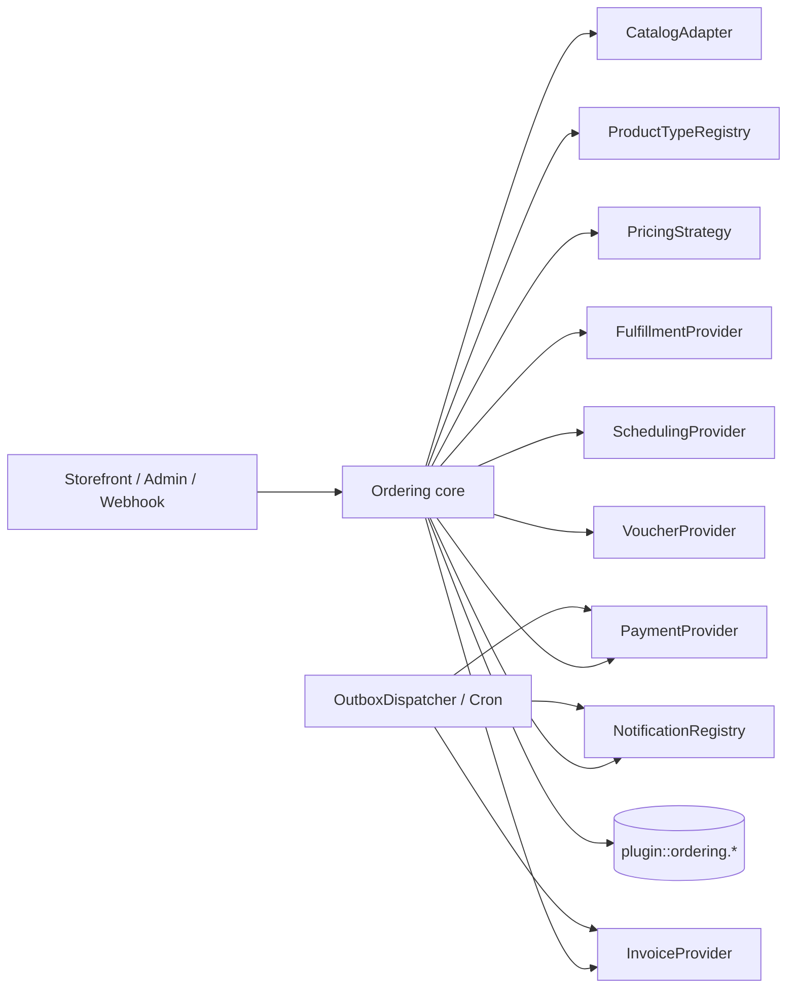

# Hợp đồng lõi cho plugin `ordering`

Ngày cập nhật: 2026-10-10

Đây là tài liệu thiết kế duy nhất của lõi. Nó mô tả contract và dữ liệu, chưa phải code hay schema
Strapi đã triển khai. Plugin là local plugin tại `src/plugins/ordering`, dùng UID và tên bảng
`plugin::ordering.*`; lõi không import UID hoặc API của Salanca.

Voucher/thẻ quà tặng và dịch vụ đặt lịch hẹn đã được chủ dự án xác nhận sẽ có về sau. Chúng chưa
bắt buộc phải bật ở v1, nhưng các contract dưới đây phải giữ đường cho cả hai.

## 1. Phạm vi và nguyên tắc bất biến

- Lõi sở hữu order, order line, totals, payment/refund ledger, hold, outbox, idempotency, timeline
  và các quan hệ nội bộ của plugin.
- Catalog, product type, pricing, payment, fulfillment, scheduling, voucher, notification và invoice
  là registry/provider có contract; provider không import content type của app.
- Sản phẩm của app được tham chiếu bằng `sourceUid`/`sourceDocumentId` dạng string. Quan hệ giữa
  bảng nội bộ plugin là relation thật, không dùng `orderRef` string để giả làm relation.
- Client chỉ gửi ref, quantity, variant, option, nhận hàng, slot và locale. Server đọc lại catalog,
  tính tiền và kiểm availability.
- Một order có thể có nhiều loại line. Workflow được chọn theo `productType` và fulfillment; nếu các
  line không thể cùng xử lý thì core phải tách fulfillment group hoặc từ chối rõ ràng.
- Mọi thay đổi trạng thái, tiền, giữ chỗ và outbox event trong cùng transaction DB. Side effect ra
  ngoài chỉ chạy sau commit qua outbox dispatcher.
- Tiền phase đầu chỉ bật VND nhưng mọi contract có `currency`. Không dùng `bigint` trong API JSON.
- Secret nằm ở env/provider config, không nằm trong order, event, log hoặc raw webhook.

## 2. Module và chiều phụ thuộc



Controller chỉ gọi application service. Provider không được tự ghi bảng app hoặc gọi lại controller.
Registry được đăng ký lúc bootstrap; graph workflow và capability phải được validate trước khi app
nhận traffic. Nguồn tham khảo: [Medusa](https://github.com/medusajs/medusa/tree/146c46b0ad1146b40595c8ef586c4d5890982603),
[Vendure](https://github.com/vendure-ecommerce/vendure/tree/e5146b14b080809b5d4b3bc429eb87b771aa843c) và
[Sylius StateMachine](https://github.com/Sylius/Sylius/tree/39313695548c709756ee9073bf309fa4ae89365a).

## 3. Kiểu chung và tiền

```ts
type Currency = 'VND' | string;
type Money = { amount: number; currency: Currency };
type JsonObject = Record<string, unknown>;
type Locale = string;

type ReceiveMethod =
  | { kind: 'pickup'; locationRef: string }
  | { kind: 'delivery'; address: AddressSnapshot; providerCode?: string }
  | { kind: 'appointment'; locationRef: string; slot: SlotSelection };

type AddressSnapshot = {
  recipientName: string;
  phone: string;
  line1: string;
  provinceCode?: string;
  wardCode?: string;
  provinceName?: string;
  wardName?: string;
  note?: string;
};

type SlotSelection = {
  scheduleRef: string;
  resourceRef?: string;
  startsAt: string;
  endsAt: string;
  timezone: string;
};

type ValidationResult =
  | { valid: true }
  | { valid: false; code: string; message: string; details?: JsonObject };
type SelectedOptionInput = { groupUid: string; optionUid: string; quantity: number };
type LineConfiguration = {
  sellable: Sellable;
  selected: SelectedOptionInput[];
  quantity: number;
  context: { locale: Locale; locationRef?: string; at: string };
};
type QuoteTotals = {
  subtotal: Money;
  adjustmentTotal: Money;
  fulfillmentTotal: Money;
  taxTotal: Money;
  grandTotal: Money;
};
type Adjustment = { code: string; label: string; amount: Money; priority: number; taxable: boolean };
type Quote = {
  quoteVersion: string;
  cartHash: string;
  lines: JsonObject[];
  adjustments: Adjustment[];
  totals: QuoteTotals;
};
type AdapterContext = { now: string; locationRef?: string; channel?: string };
type AvailabilityResult = { available: boolean; reasonCode?: string; availableQuantity?: number };
type Hold = { id: string; expiresAt: string; quantity: number; resourceRef?: string };
type OrderEvent = { order: Order; type: string; actorRef?: string; payload: JsonObject; occurredAt: string };
type Refund = { payment: Payment; amount: number; currency: Currency; reason: string; status: string };
```

Money dùng `number` vì VND không có phần thập phân và giá trị thực tế nằm trong giới hạn số nguyên an
toàn của JavaScript. Mọi boundary phải gọi `Number.isSafeInteger(amount)` và từ chối overflow. PostgreSQL
`bigint`/Strapi `biginteger` đọc về string thì chuyển đổi có kiểm tra trước khi tạo `Money`; không để
`BigInt` lọt vào JSON vì `JSON.stringify()` sẽ lỗi. Nếu currency hoặc amount vượt safe integer, trả
`MONEY_OUT_OF_RANGE` thay vì làm tròn. Đây là rủi ro đã chấp nhận cho VND, không phải tuyên bố an toàn
cho mọi currency tương lai.

## 4. Sellable, variant, option và registry theo dòng

`kind` enum duy nhất không đủ để diễn tả sản phẩm có nhiều capability. Dùng product type registry và
các cờ capability tách rời, theo cách các hệ thống phân biệt physical/virtual/downloadable/gift card.

```ts
type SellableRef = {
  uid: string;
  sourceUid?: string;
  sourceDocumentId?: string;
};

type Sellable = {
  ref: SellableRef;
  productType: string;                 // food, retail, service, voucher, combo...
  title: string;
  description?: string;
  imageUrl?: string;
  variant?: {
    uid: string;
    sku?: string;
    title?: string;
    attributes: JsonObject;
    inventoryRef?: string;
  };
  listPrice: Money;
  compareAtListPrice?: Money;
  requiresShipping: boolean;
  isVirtual: boolean;
  isDownloadable: boolean;
  isGiftCard: boolean;
  fulfillmentKinds: string[];          // pickup, delivery, appointment, issue-code...
  options: OptionGroup[];
  availability: AvailabilityRules;
  taxGroupRef?: string;
  isActive: boolean;
  purchasable: boolean;
  metadata?: JsonObject;
};

type OptionGroup = {
  uid: string;
  name: string;
  required: boolean;
  defaultOptionUids: string[];
  minQuantity: number;
  maxQuantity: number;
  stepQuantity: number;
  freeQuantity: number;
  visibleWhen?: JsonObject;
  options: Array<{
    uid: string;
    name: string;
    unitPriceDelta: Money;
    isActive: boolean;
    taxGroupRef?: string;
  }>;
};

type AvailabilityRules = {
  locationRefs?: string[];
  fulfillmentKinds?: string[];
  activeFrom?: string;
  activeTo?: string;
  blackout?: JsonObject[];
};

type ProductTypeDefinition = {
  code: string;
  version: string;
  capabilities: string[];
  validateLine(input: LineConfiguration): ValidationResult;
  quoteLine(input: LineConfiguration): Promise<LinePriceResult>;
  selectWorkflow(input: { lines: Sellable[]; fulfillment: ReceiveMethod }): string;
};

interface ProductTypeRegistry {
  register(definition: ProductTypeDefinition): void;
  resolve(productType: string): ProductTypeDefinition;
}
```

Variant là SKU/inventory identity. Option selection là cấu hình và price add-on; không gộp hai khái
niệm. `defaultOptionUids`, `freeQuantity`, điều kiện hiển thị, min/max/step và branch/time availability
phải được snapshot vào line. Combo/kit là product type có component:

```ts
type KitComponent = {
  sellableRef: SellableRef;
  requiredQuantity: number;
  variantUid?: string;
  selectedOptions?: SelectedOptionInput[];
};
```

`CatalogAdapter` chỉ normalize catalog, trả list price và availability data. Nó không validate option
lần hai và không quyết định final order price:

```ts
interface CatalogAdapter {
  getSellable(ctx: AdapterContext, ref: SellableRef, input: { locale: Locale }): Promise<Sellable | null>;
  getListPrice(ctx: AdapterContext, sellable: Sellable): Promise<Money>;
  getAvailability(ctx: AdapterContext, sellable: Sellable, quantity: number): Promise<AvailabilityResult>;
}
```

Nguồn so sánh: [Bagisto product types](https://github.com/bagisto/bagisto/tree/3fb8300b6343baefcf57bec5b6a9c188a2177d57/packages/Webkul/Product/src/Type),
[Medusa product module](https://github.com/medusajs/medusa/tree/146c46b0ad1146b40595c8ef586c4d5890982603/packages/modules) và
[Woo product types](https://github.com/woocommerce/woocommerce/tree/5fb08bdc3cd394aa3748f1e74e46bf0681e85183/plugins/woocommerce/includes).

## 5. Snapshot dòng hàng và quan hệ dữ liệu

```ts
type OrderLine = {
  id: string;
  order: Order;                         // relation thật
  sourceUid?: string;                   // external ref, không phải relation
  sourceDocumentId?: string;
  productType: string;
  variantUid?: string;
  sku?: string;
  titleSnapshot: string;
  descriptionSnapshot?: string;
  imageUrlSnapshot?: string;
  selectedOptionsSnapshot: JsonObject;
  componentsSnapshot?: JsonObject;
  note?: string;
  quantity: number;
  fulfilledQuantity: number;
  returnedQuantity: number;
  canceledQuantity: number;
  unitAmount: number;
  optionAmount: number;
  taxAmount: number;
  lineTotalAmount: number;
  currency: Currency;
};

type Order = {
  id: string;
  lines: OrderLine[];                   // relation thật
  payments: Payment[];                  // relation thật
  refunds: Refund[];                    // relation thật
  timeline: OrderEvent[];               // relation thật
  code: string;
  publicTokenHash: string;
  status: string;
  subtotalAmount: number;
  adjustmentAmount: number;
  fulfillmentAmount: number;
  taxAmount: number;
  totalAmount: number;
  currency: Currency;
  customerRef?: string;
  locationRef?: string;
  receiveMethod: JsonObject;
  origin: {
    kind: 'storefront' | 'staff-draft' | 'import';
    actorRef?: string;
    staffPriceOverride?: { reason: string; actorRef: string; amount: Money };
  };
};
```

`fulfilledQuantity + returnedQuantity + canceledQuantity <= quantity` là invariant. Nếu cần chia
partial fulfillment, mỗi fulfillment giữ relation tới line và quantity; không sửa quantity gốc.
Order totals là cột snapshot để lọc/báo cáo nhanh, đồng thời totals breakdown giữ các adjustment.
Không đọc lại tên/giá catalog khi in đơn cũ.

## 6. Phân vai tính giá và thứ tự gọi

Chỉ `PricingStrategy` điều phối pipeline. `ProductTypeDefinition.validateLine` là authority duy nhất
cho option/product-type rules; catalog chỉ trả dữ liệu và trạng thái publish/availability. Không giữ
đồng thời `CatalogAdapter.validateOptions` và `IndustryModule.validateLine` vì sẽ tạo hai nguồn sự thật.

```ts
interface PricingStrategy {
  quote(ctx: QuoteContext): Promise<Quote>;
}
```

Pipeline cố định:

1. resolve `Sellable` và variant từ `CatalogAdapter`;
2. normalize selected options và gọi `ProductTypeRegistry.resolve().validateLine`;
3. đọc list price/option deltas, kiểm `Number.isSafeInteger`;
4. gọi `quoteLine` để tính product-specific price (combo, voucher, service);
5. áp adjustment/discount/fee theo priority;
6. lấy fulfillment/scheduling quote;
7. resolve tax category/rate nếu bật;
8. làm tròn một lần theo currency policy và tạo totals.

Quote trả `quoteVersion`, `cartHash`, lines, adjustments, fulfillment, tax và totals. Create order phải
re-quote; nếu hash/giá/availability khác, trả `PRICE_CHANGED` hoặc `SELLABLE_UNAVAILABLE` và không tạo
order. Client không gửi amount.

## 7. Workflow và quantity state

Mỗi product type khai báo workflow/version. Bootstrap kiểm graph: initial tồn tại, `next` hợp lệ,
terminal không có cạnh ra. Core lưu transition event và actor. Payment và fulfillment có state riêng;
order status không được set tay từ webhook.

`selectWorkflow` chạy sau khi biết toàn bộ line và receive method. Một order có nhiều product type có
thể tạo fulfillment groups; nếu không có workflow tương thích thì từ chối với `MIXED_WORKFLOW_UNSUPPORTED`.
Voucher có fulfillment kiểu `issue-code`; appointment có line metadata `scheduleRef/resourceRef`;
món ăn có pickup/delivery. Đường này giữ cả voucher và appointment mà không biến chúng thành cột bắt
buộc cho mọi order.

## 8. Payment ledger và `PaymentProvider`

```ts
type Payment = {
  order: Order;
  providerCode: string;
  requestedAmount: number;
  capturedAmount: number;
  refundedAmount: number;
  currency: Currency;
  status: 'pending' | 'authorized' | 'captured' | 'failed' | 'cancelled';
  providerReference?: string;
};

type PaymentEvent = {
  providerCode: string;
  providerTransactionId: string;
  payment?: Payment;                    // relation nếu đã khớp
  transferType?: 'in' | 'out';
  amount: number;
  currency: Currency;
  kind: string;
  rawPayload: JsonObject;
  receivedAt: string;
};

type RawWebhook = {
  headers: Record<string, string>;
  body: string;
  receivedAt: string;
};
type NormalizedPaymentEvent = {
  providerCode: string;
  providerTransactionId: string;
  kind: string;
  amount: Money;
  transferType?: 'in' | 'out';
  reference?: string;
  metadata?: JsonObject;
};
type PaymentInitiation = {
  order: Order;
  amount: Money;
  returnUrl?: string;
  metadata?: JsonObject;
};
type PaymentInitiationResult = {
  status: Payment['status'];
  providerReference?: string;
  redirectUrl?: string;
};
type PaymentAction = { payment: Payment; amount?: Money; providerReference?: string };
type PaymentActionResult = { status: string; providerReference?: string };
type RefundRequest = { payment: Payment; amount: Money; reason: string; idempotencyKey: string };

interface PaymentProvider {
  code: string;
  capabilities: string[];
  getPresentation(input: PaymentInitiation): Promise<{ qr?: string; bankAccount?: JsonObject; memo?: string; expiresAt?: string }>;
  initiate(input: PaymentInitiation): Promise<PaymentInitiationResult>;
  authorize?(input: PaymentAction): Promise<PaymentActionResult>;
  capture?(input: PaymentAction): Promise<PaymentActionResult>;
  cancel?(input: PaymentAction): Promise<PaymentActionResult>;
  refund?(input: RefundRequest): Promise<PaymentActionResult>;
  parseWebhook(input: RawWebhook): Promise<NormalizedPaymentEvent[]>;
  webhookResponse(input: RawWebhook): { status: 200 | 201 | 202 | 204 | 400 | 401 | 500; headers?: Record<string, string>; body?: JsonObject };
  queryTransaction?(reference: string): Promise<NormalizedPaymentEvent | null>;
  listTransactions?(input: { from: string; to: string; cursor?: string }): Promise<NormalizedPaymentEvent[]>;
}
```

`parseWebhook` trả mảng vì một request có thể chứa nhiều event. Core lưu raw payload trước, unique
`providerCode + providerTransactionId`, rồi bỏ qua money-out (`transferType=out`) khi tính tiền khách
trả. SePay payload/response là contract tài liệu chính thức: `id` unique, `code` có thể null,
`transferAmount` là số dương; response phải HTTP 200/201, body JSON đúng `{"success": true}` trong
30 giây. SePay, VNPAY (RspCode) và MoMo (204) có response khác nhau nên không hard-code một response
chung trong core.

Memo/reference được tạo từ template cấu hình, ví dụ `SLC{orderCode}`; provider adapter chịu trách
nhiệm parse code nhưng không tự hoàn tất order. Underpayment giữ pending; overpayment và tiền không
khớp giữ unmatched/review; duplicate provider id không tạo ledger thứ hai. Việc tự động phân bổ phần
thừa hoặc nhiều transfer hợp lệ là câu hỏi nghiệp vụ, không được suy đoán từ free-form content.

Trạng thái payment là projection từ captured ledger trừ refund settled. Refund có amount, reason,
actor, idempotency key và provider reference. [Saleor transaction models](https://github.com/saleor/saleor/blob/782a751f622c4a047798ce7084b7c66c0877ec6f/saleor/payment/models.py)
được dùng làm tham khảo cho transaction item/event.

## 9. Scheduling và giữ slot

```ts
type SchedulePolicy = {
  locationRef: string;
  fulfillmentKind: string;
  timezone: string;
  openingHours: JsonObject;
  leadTimeMinutes: number;
  slotLengthMinutes: number;
  bufferMinutes: number;
  maxAdvanceDays: number;
  capacity: number;
  blackoutPeriods: JsonObject[];
};

interface SchedulingProvider {
  getAvailability(input: { locationRef: string; fulfillmentKind: string; at: string }): Promise<AvailabilityResult>;
  listSlots(input: { scheduleRef: string; from: string; to: string; quantity: number }): Promise<SlotSelection[]>;
  validateSlot(input: { slot: SlotSelection; quantity: number }): Promise<ValidationResult>;
  reserveSlot(input: { order: Order; slot: SlotSelection; quantity: number; expiresAt: string }): Promise<Hold>;
  releaseSlot(input: { hold: Hold; reason: string }): Promise<void>;
}
```

Availability theo branch × fulfillment phải chứa opening hours, lead time, slot duration, break/buffer,
capacity/resource, max advance, holiday/blackout và timezone. Reserve/validate chạy trong DB transaction,
khóa resource theo thứ tự ổn định, hold có `expiresAt`. Payment deposit có thể tạo nhiều payment event;
không coi pending payment là slot đã phục vụ. Nguồn: [Bagisto Booking helper](https://github.com/bagisto/bagisto/blob/3fb8300b6343baefcf57bec5b6a9c188a2177d57/packages/Webkul/BookingProduct/src/Helpers/Booking.php)
 và [TastyIgniter local](https://github.com/tastyigniter/ti-ext-local/tree/b8e31850c6168e4195c15f3049944bad354b7e92/src/Models).

## 10. Voucher/thẻ quà tặng

Voucher là product type và fulfillment module, không phải một chuỗi trên line. Core giữ relation tới
order/line và payment; `VoucherProvider` sở hữu mã đã hash, balance, expiry, trạng thái và redemption
ledger:

```ts
interface VoucherProvider {
  issue(input: { order: Order; line: OrderLine; policy: string }): Promise<{ voucherRef: string; delivery: JsonObject }>;
  redeem(input: { code: string; amount?: Money; actorRef?: string }): Promise<{ redemptionRef: string; remaining: Money }>;
  refundUnused(input: { voucherRef: string; reason: string }): Promise<void>;
  getStatus(input: { voucherRef: string }): Promise<JsonObject>;
}
```

Module phải chống đoán mã, lock khi redeem, ghi actor/time/location và giữ expiry/use-once hoặc partial
balance theo policy. Issue sau captured hay sau duyệt thủ công, revenue lúc bán hay redeem, và refund
chưa dùng cần owner quyết định; core không chặn lựa chọn nào. Salanca map `menu-package` vào `productType`
voucher khi bật module.

## 11. Storefront, draft order và lỗi chuẩn

API chung tối thiểu: `GET /ordering/config`, `POST /ordering/quote`, `POST /ordering/orders`,
`GET /ordering/orders/:publicToken`, `GET /ordering/orders/:publicToken/payment`, `POST .../cancel`.
Endpoint staff tạo draft, sửa giá và gửi link là route Admin riêng, cần permission và audit.

Staff draft giữ `origin.kind = staff-draft`, actor và lý do override trong timeline. Payment link chỉ
được tạo từ draft đã có `publicTokenHash`, expiry và số tiền quote; link không cấp quyền sửa order.

```ts
type ApiError = {
  code: string;
  message: string;
  details?: JsonObject;
  requestId: string;
};
```

Quote/create order dùng locale input nhưng message có thể locale hóa ở adapter. Public lookup dùng
`publicToken` random lưu hash, expiry và rate limit; không dùng code ngắn + số điện thoại làm bí mật
duy nhất. Polling payment có backoff và dừng khi terminal.

`Idempotency-Key` bắt buộc cho create order, payment action, refund và redeem. Cùng key trả cùng result;
khác payload với key cũ trả `IDEMPOTENCY_PAYLOAD_MISMATCH`.

## 12. Outbox, cron và reliable event

Không phát `ordering.order.created` trực tiếp sau commit mà không có durable record: process có thể chết
giữa commit và publish. Tạo outbox row trong cùng transaction với order/payment/hold:

```ts
type OutboxEvent = {
  id: string;
  type: string;
  aggregateType: string;
  aggregateId: string;
  payload: JsonObject;
  uniqueKey: string;
  occurredAt: string;
  availableAt: string;
  attempts: number;
  lockedAt?: string;
  deliveredAt?: string;
  lastError?: string;
};
```

`OutboxDispatcher` chạy bằng Strapi cron hoặc worker được triển khai riêng: claim batch bằng row lock,
`availableAt <= now`, retry exponential backoff, lease timeout và đánh dấu `deliveredAt`. Consumer phải
idempotent theo event id. Strapi hiện không có queue trong `config/server.ts`; cron chỉ là scheduler,
không thay thế outbox hoặc lock. Action Scheduler chỉ được tham khảo thiết kế, không chép vì GPL.

Events chính: `order.created`, `order.transitioned`, `payment.event.received`, `payment.captured`,
`refund.settled`, `fulfillment.changed`, `voucher.issued`, `appointment.reserved`. Notification, invoice
và provider calls chỉ chạy từ outbox sau commit.

## 13. Invoice, tax và phí

```ts
interface InvoiceProvider {
  issue(input: { order: Order; lines: OrderLine[]; totals: QuoteTotals; buyer?: JsonObject }): Promise<{ reference: string; status: string }>;
  cancel(input: { reference: string; reason: string }): Promise<void>;
  getStatus(input: { reference: string }): Promise<JsonObject>;
}
```

Line snapshot có `taxGroupRef`, tax-inclusive flag, unit price, quantity, tax rate/amount khi tax bật.
Vendure tax category/rate/zone và Medusa tax provider chỉ là nguồn tham khảo. Nghị định 70/2025/NĐ-CP
sửa Nghị định 123/2020/NĐ-CP; core không tự kết luận Salanca thuộc diện hóa đơn máy tính tiền.

Fee là `Adjustment` có code, amount, priority, taxable và source; pipeline phải quy định fee trước/sau
discount, VAT và rounding. Phí dịch vụ, đóng gói, tip và fulfillment không thêm cột ad-hoc.

## 14. Notification, admin và provider config

```ts
interface NotificationProviderRegistry {
  register(channel: string, provider: NotificationProvider): void;
  resolve(channel: string): NotificationProvider;
}
interface NotificationProvider { send(input: { recipient: JsonObject; template: string; data: JsonObject }): Promise<void>; }
```

Channel là registry string, không phải union hard-code. Recipient resolver quyết định người nhận; template
renderer quyết định nội dung/locale; provider chỉ gửi. Notification event phát từ outbox và có delivery log.

Provider config có code, enabled, capabilities, secret ref, memo template, display data, min/max order,
fee/conditions và location scope. UI Admin chỉ được bật/tắt instance khi permission cho phép; env secret
không hiển thị. Điều kiện bật provider và toggle runtime cần owner chốt.

Schema nội bộ nên ẩn khỏi Content Manager nếu không cần CRUD; transition, refund, webhook và outbox phải
qua service/route có permission, không cho nhân viên sửa trực tiếp. Source local Strapi 5.51.1 cho thấy
Document Service middleware có thể chặn call qua Document Service và schema có
`content-manager.visible`, nhưng direct `strapi.db.query` bypass và UI/permission cần fixture kiểm chứng.

## 15. Nâng cấp, migration và PII

Mỗi version plugin có migration forward-only, preflight, backup, changelog và compatibility window.
Không đổi nghĩa snapshot cũ; thêm cột nullable trước, backfill theo batch, rồi mới enforce invariant.
Migration và outbox dispatcher phải chịu retry/concurrent deploy.

Order chứa tên, phone, address, public token hash, raw payment payload và audit actor. Áp dụng data
inventory, purpose/consent, retention, access log, redaction và xóa/ẩn danh theo chính sách pháp lý.
Không ghi full phone/token/raw credential vào log. Nghị định 13/2023/NĐ-CP và Luật 91/2025/QH15 là
nguồn cần bộ phận pháp lý xác nhận trước khi chốt retention.

Các module chưa bật vẫn có thể cần dữ liệu bất biến ngay từ v1:

| Module về sau | Dữ liệu nên giữ trong lõi |
| --- | --- |
| Báo cáo doanh thu | totals snapshot, line snapshot, location, tax, payment/refund event |
| Khuyến mãi | adjustment code, rule snapshot, usage reservation và release event |
| Phân đơn/cảnh báo | assignee ref, SLA timestamps, transition event |
| Chống gian lận | risk result, reason code, review actor/event |
| Webhook ra ngoài | outbox destination, delivery attempts, response/status |
| Khách hàng/tích điểm | customerRef, consent, immutable order snapshot |

Subscription, marketplace, multi-currency và in phiếu bếp vẫn ngoài phạm vi; không thêm cột hoặc
workflow dành riêng cho chúng vào phase hiện tại.

## 16. Mapping Salanca

- `menu-item`: catalog adapter; food product type; pickup là fulfillment đầu tiên.
- `menu-package`: product type voucher về sau; mã và redemption thuộc `VoucherProvider`.
- `location`: `locationRef`, opening hours, capacity và provider scope; không import UID vào core.
- SePay: PaymentProvider bank transfer, memo template, webhook raw/event, query reconciliation.
- Cash: provider nội bộ, capture do staff với permission và audit.
- `reservation-request`: tính năng app hiện có; khi chuyển sang appointment, adapter map line schedule
  vào `SchedulingProvider`, không biến reservation content type thành dependency lõi.
- Delivery, VAT/e-invoice, customer account, promotion và loyalty là capability/module bật sau.

## 17. Câu hỏi còn mở

### Cần chủ dự án quyết định

1. SePay: tiền vào được auto-capture ngay hay phải staff duyệt; over/underpayment và nhiều transfer
   hợp lệ xử lý thế nào.
2. Voucher: issue sau captured hay duyệt thủ công; use-once hay trừ dần; expiry, refund và revenue
   recognition.
3. Appointment: deposit/multiple payment, giữ slot bao lâu khi pending, policy đổi/hủy, resource và
   capacity theo location.
4. Mixed product types: có cho món + voucher + appointment trong một order hay tách fulfillment group.
5. Provider Admin: ai được bật/tắt, điều kiện min/max/fee/location và audit.
6. VAT/e-invoice: giá đã gồm VAT chưa, tax category/rate, nhà cung cấp hóa đơn và thời điểm issue.
7. Guest/customer v1: chỉ public token hay thêm customer theo phone; retention và consent.
8. Raw payload/log: thời hạn lưu và field nào được phép giữ để đối soát.

### Cần kiểm bằng plugin trống

1. Build TypeScript với Strapi 5.51.1 và `@strapi/sdk-plugin`.
2. PostgreSQL fixture cho `strapi.db.transaction`, `trx`/`getConnection`, `forUpdate`, sequence và
   relation thật của plugin.
3. Document Service middleware ordering, direct DB bypass, Content Manager visibility và Admin RBAC.
4. Cron/outbox claim, lease, retry và hai process chạy đồng thời.
5. Migration chạy khi có dữ liệu cũ, backfill và rollback/forward compatibility.
6. Contract test cho SePay response exact body, duplicate/money-out, VNPAY/MoMo response và reconciliation.
7. Fixture cho mixed product types, voucher redemption lock, appointment capacity và payment deposit.

## 18. Quyết định đã đổi so với vòng 1

- Bỏ `bigint` khỏi JSON contract, dùng safe integer `number` vì VND và xử lý string từ DB có kiểm tra.
- Đổi `IndustryModule` đơn thành `ProductTypeRegistry` theo từng line để giữ voucher, appointment,
  combo và service cùng lõi.
- Tách variant/SKU khỏi option price add-on, bổ sung default/free/conditional/min-max-step/tax/
  availability và combo component.
- Tách trách nhiệm catalog, product type và pricing; chỉ một authority validate option và một pipeline
  quote/create order.
- Đổi event sau commit thành outbox trong cùng transaction với cron/worker retry; `order.created` không
  còn là publish best-effort.
- Mở rộng PaymentProvider cho QR/memo/expiry, per-provider HTTP response, cancel, query/list và
  webhook nhiều event; SePay money-out bị bỏ khỏi captured ledger.
- Thêm SchedulingProvider dùng chung cho pickup capacity và appointment; appointment cùng voucher là
  đều là năng lực tương lai đã chốt.
- Thêm fee adjustments, storefront/draft/payment-link, migration strategy, PII controls và InvoiceProvider.

## Nguồn chính

- [Strapi server API](https://docs.strapi.io/cms/plugins-development/server-api), [cron](https://docs.strapi.io/cms/configurations/cron),
  [Document Service middleware](https://docs.strapi.io/cms/backend-customization/middlewares).
- [SePay webhook](https://developer.sepay.vn/vi/sepay-webhooks/tich-hop-webhook), [authentication](https://developer.sepay.vn/vi/sepay-webhooks/xac-thuc),
  [error handling](https://developer.sepay.vn/vi/sepay-webhooks/xu-ly-loi).
- [Nghị định 13/2023/NĐ-CP](https://vanban.chinhphu.vn/default.aspx?docid=207759&pageid=27160),
  [Luật 91/2025/QH15](http://thuvienso.quochoi.vn/handle/11742/103334),
  [Nghị định 70/2025/NĐ-CP](https://vanban.chinhphu.vn/?docid=213179&lang=vi&pageid=27160).
- [Bagisto](https://github.com/bagisto/bagisto/tree/3fb8300b6343baefcf57bec5b6a9c188a2177d57),
  [Sylius](https://github.com/Sylius/Sylius/tree/39313695548c709756ee9073bf309fa4ae89365a),
  [Saleor](https://github.com/saleor/saleor/tree/782a751f622c4a047798ce7084b7c66c0877ec6f),
  [Action Scheduler](https://github.com/woocommerce/action-scheduler/tree/3a8178faa44f5b6dc2c7e56eb4a0195f80f86c64).
