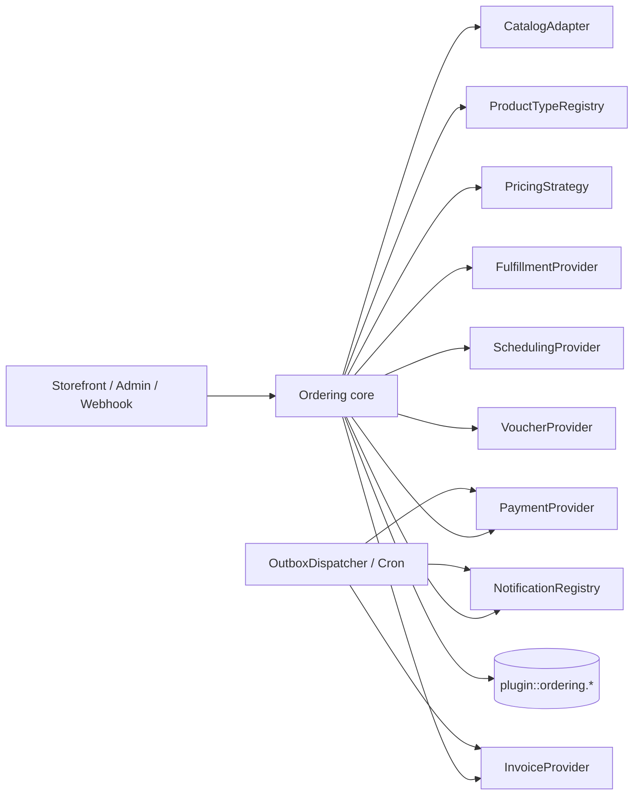

# Hợp đồng lõi cho plugin `ordering`

Ngày cập nhật: 2026-10-10

Đây là tài liệu thiết kế duy nhất của lõi. Nó mô tả contract và dữ liệu, chưa phải code hay schema
Strapi đã triển khai. Plugin là local plugin tại `src/plugins/ordering`, dùng UID và tên bảng
`plugin::ordering.*`; lõi không import UID hoặc API của Salanca.

Voucher/thẻ quà tặng và dịch vụ đặt lịch hẹn đã được chủ dự án xác nhận sẽ có về sau. Chúng chưa
bắt buộc phải bật ở v1, nhưng các contract dưới đây phải giữ đường cho cả hai.

## 1. Phạm vi và nguyên tắc bất biến

- Lõi sở hữu order, order line, totals, payment/refund ledger, hold, outbox, idempotency, timeline
  và các quan hệ nội bộ của plugin.
- Catalog, product type, pricing, payment, fulfillment, scheduling, voucher, notification và invoice
  là registry/provider có contract; provider không import content type của app.
- Sản phẩm của app được tham chiếu bằng `sourceUid`/`sourceDocumentId` dạng string. Quan hệ giữa
  bảng nội bộ plugin là relation thật, không dùng `orderRef` string để giả làm relation.
- Client chỉ gửi ref, quantity, variant, option, nhận hàng, slot và locale. Server đọc lại catalog,
  tính tiền và kiểm availability.
- Một order có thể có nhiều loại line. Workflow được chọn theo `productType` và fulfillment; nếu các
  line không thể cùng xử lý thì core phải tách fulfillment group hoặc từ chối rõ ràng.
- Mọi thay đổi trạng thái, tiền, giữ chỗ và outbox event trong cùng transaction DB. Side effect ra
  ngoài chỉ chạy sau commit qua outbox dispatcher.
- Tiền phase đầu chỉ bật VND nhưng mọi contract có `currency`. Không dùng `bigint` trong API JSON.
- Secret nằm ở env/provider config, không nằm trong order, event, log hoặc raw webhook.

## 2. Module và chiều phụ thuộc



Controller chỉ gọi application service. Provider không được tự ghi bảng app hoặc gọi lại controller.
Registry được đăng ký lúc bootstrap; graph workflow và capability phải được validate trước khi app
nhận traffic. Nguồn tham khảo: [Medusa](https://github.com/medusajs/medusa/tree/146c46b0ad1146b40595c8ef586c4d5890982603),
[Vendure](https://github.com/vendure-ecommerce/vendure/tree/e5146b14b080809b5d4b3bc429eb87b771aa843c) và
[Sylius StateMachine](https://github.com/Sylius/Sylius/tree/39313695548c709756ee9073bf309fa4ae89365a).

## 3. Kiểu chung và tiền

```ts
type Currency = 'VND' | string;
type Money = { amount: number; currency: Currency };
type JsonObject = Record<string, unknown>;
type Locale = string;

type ReceiveMethod =
  | { kind: 'pickup'; locationRef: string }
  | { kind: 'delivery'; address: AddressSnapshot; providerCode?: string }
  | { kind: 'appointment'; locationRef: string; slot: SlotSelection };

type AddressSnapshot = {
  recipientName: string;
  phone: string;
  line1: string;
  provinceCode?: string;
  wardCode?: string;
  provinceName?: string;
  wardName?: string;
  note?: string;
};

type SlotSelection = {
  scheduleRef: string;
  resourceRef?: string;
  startsAt: string;
  endsAt: string;
  timezone: string;
};

type ValidationResult =
  | { valid: true }
  | { valid: false; code: string; message: string; details?: JsonObject };
type SelectedOptionInput = { groupUid: string; optionUid: string; quantity: number };
type LineConfiguration = {
  sellable: Sellable;
  selected: SelectedOptionInput[];
  quantity: number;
  context: { locale: Locale; locationRef?: string; at: string };
};
type QuoteTotals = {
  subtotal: Money;
  adjustmentTotal: Money;
  fulfillmentTotal: Money;
  taxTotal: Money;
  grandTotal: Money;
};
type Adjustment = { code: string; label: string; amount: Money; priority: number; taxable: boolean };
type Quote = {
  quoteVersion: string;
  cartHash: string;
  lines: JsonObject[];
  adjustments: Adjustment[];
  totals: QuoteTotals;
};
type AdapterContext = { now: string; locationRef?: string; channel?: string };
type AvailabilityResult = { available: boolean; reasonCode?: string; availableQuantity?: number };
type Hold = { id: string; expiresAt: string; quantity: number; resourceRef?: string };
type OrderEvent = {
  order: Order;
  type: string;
  actorRef?: string;
  isPublic: boolean;
  payload: JsonObject;
  occurredAt: string;
};
type Refund = {
  payment: Payment;
  amount: number;
  currency: Currency;
  reason: string;
  status: string;
  lines: RefundLine[];                  // rỗng khi hoàn theo số tiền, không theo món
};
```

Money dùng `number` vì VND không có phần thập phân và giá trị thực tế nằm trong giới hạn số nguyên an
toàn của JavaScript. Mọi boundary phải gọi `Number.isSafeInteger(amount)` và từ chối overflow. PostgreSQL
`bigint`/Strapi `biginteger` đọc về string thì chuyển đổi có kiểm tra trước khi tạo `Money`; không để
`BigInt` lọt vào JSON vì `JSON.stringify()` sẽ lỗi. Nếu currency hoặc amount vượt safe integer, trả
`MONEY_OUT_OF_RANGE` thay vì làm tròn. Đây là rủi ro đã chấp nhận cho VND, không phải tuyên bố an toàn
cho mọi currency tương lai.

## 4. Sellable, variant, option và registry theo dòng

`kind` enum duy nhất không đủ để diễn tả sản phẩm có nhiều capability. Dùng product type registry và
các cờ capability tách rời, theo cách các hệ thống phân biệt physical/virtual/downloadable/gift card.

```ts
type SellableRef = {
  uid: string;
  sourceUid?: string;
  sourceDocumentId?: string;
};

type Sellable = {
  ref: SellableRef;
  productType: string;                 // food, retail, service, voucher, combo...
  title: string;
  description?: string;
  imageUrl?: string;
  variant?: {
    uid: string;
    sku?: string;
    title?: string;
    attributes: JsonObject;
    inventoryRef?: string;
  };
  listPrice: Money;
  compareAtListPrice?: Money;
  requiresShipping: boolean;
  isVirtual: boolean;
  isDownloadable: boolean;
  isGiftCard: boolean;
  fulfillmentKinds: string[];          // pickup, delivery, appointment, issue-code...
  options: OptionGroup[];
  availability: AvailabilityRules;
  taxGroupRef?: string;
  isActive: boolean;
  purchasable: boolean;
  metadata?: JsonObject;
};

type OptionGroup = {
  uid: string;
  name: string;
  required: boolean;
  defaultOptionUids: string[];
  minQuantity: number;
  maxQuantity: number;
  stepQuantity: number;
  freeQuantity: number;
  visibleWhen?: JsonObject;
  options: Array<{
    uid: string;
    name: string;
    unitPriceDelta: Money;
    isActive: boolean;
    taxGroupRef?: string;
  }>;
};

type AvailabilityRules = {
  locationRefs?: string[];
  fulfillmentKinds?: string[];
  activeFrom?: string;
  activeTo?: string;
  blackout?: JsonObject[];
};

type ProductTypeDefinition = {
  code: string;
  version: string;
  capabilities: string[];
  validateLine(input: LineConfiguration): ValidationResult;
  quoteLine(input: LineConfiguration): Promise<LinePriceResult>;
  selectWorkflow(input: { lines: Sellable[]; fulfillment: ReceiveMethod }): { name: string; version: string };
};

interface ProductTypeRegistry {
  register(definition: ProductTypeDefinition): void;
  resolve(productType: string): ProductTypeDefinition;
}
```

Variant là SKU/inventory identity. Option selection là cấu hình và price add-on; không gộp hai khái
niệm. `defaultOptionUids`, `freeQuantity`, điều kiện hiển thị, min/max/step và branch/time availability
phải được snapshot vào line. Combo/kit là product type có component:

```ts
type KitComponent = {
  sellableRef: SellableRef;
  requiredQuantity: number;
  variantUid?: string;
  selectedOptions?: SelectedOptionInput[];
};
```

`CatalogAdapter` chỉ normalize catalog, trả list price và availability data. Nó không validate option
lần hai và không quyết định final order price:

```ts
interface CatalogAdapter {
  getSellable(ctx: AdapterContext, ref: SellableRef, input: { locale: Locale }): Promise<Sellable | null>;
  getListPrice(ctx: AdapterContext, sellable: Sellable): Promise<Money>;
  getAvailability(ctx: AdapterContext, sellable: Sellable, quantity: number): Promise<AvailabilityResult>;
}
```

Nguồn so sánh: [Bagisto product types](https://github.com/bagisto/bagisto/tree/3fb8300b6343baefcf57bec5b6a9c188a2177d57/packages/Webkul/Product/src/Type),
[Medusa product module](https://github.com/medusajs/medusa/tree/146c46b0ad1146b40595c8ef586c4d5890982603/packages/modules) và
[Woo product types](https://github.com/woocommerce/woocommerce/tree/5fb08bdc3cd394aa3748f1e74e46bf0681e85183/plugins/woocommerce/includes).

## 5. Snapshot dòng hàng và quan hệ dữ liệu

```ts
type OrderLine = {
  id: string;
  order: Order;                         // relation thật
  fulfillmentGroup: FulfillmentGroup;   // relation thật; mỗi line thuộc đúng một group
  sourceUid?: string;                   // external ref, không phải relation
  sourceDocumentId?: string;
  productType: string;
  variantUid?: string;
  sku?: string;
  titleSnapshot: string;
  descriptionSnapshot?: string;
  imageUrlSnapshot?: string;
  selectedOptionsSnapshot: JsonObject;
  componentsSnapshot?: JsonObject;
  note?: string;
  quantity: number;
  fulfilledQuantity: number;
  returnedQuantity: number;
  canceledQuantity: number;
  unitAmount: number;
  optionAmount: number;
  discountAmount: number;
  feeAmount: number;
  roundingDelta: number;
  taxAmount: number;
  lineTotalAmount: number;
  currency: Currency;
};

type FulfillmentGroup = {
  id: string;
  order: Order;                         // relation thật
  workflowName: string;
  workflowVersion: string;
  receiveMethod: JsonObject;
  status: string;                       // state trong workflow của group
  lines: OrderLine[];                   // relation ngược của order-line.fulfillmentGroup
};

type Fulfillment = {
  id: string;
  order: Order;                         // relation thật
  group: FulfillmentGroup;              // relation thật
  providerCode: string;
  providerReference?: string;
  status: string;
  addressSnapshot?: AddressSnapshot;
  packedAt?: string;
  shippedAt?: string;
  deliveredAt?: string;
  canceledAt?: string;
  trackingNumber?: string;
  trackingUrl?: string;
  metadata?: JsonObject;
};

type FulfillmentLine = {
  fulfillment: Fulfillment;             // relation thật
  line: OrderLine;                      // relation thật; line phải thuộc fulfillment.group
  quantity: number;
};

type OrderAdjustment = {
  id: string;
  order: Order;                         // relation thật
  kind: 'discount' | 'fee' | 'rounding';
  code: string;                         // mã khuyến mãi, loại phí...
  label: string;
  sourceRef?: string;                   // promotion/rule ngoài plugin, dạng string
  ruleSnapshot?: JsonObject;            // điều kiện và cách tính tại lúc đặt
  amount: number;                       // âm cho giảm, dương cho phí; tổng đã phân bổ
  taxable: boolean;
  allocations: AdjustmentAllocation[];  // relation thật
};

type AdjustmentAllocation = {
  adjustment: OrderAdjustment;          // relation thật
  line: OrderLine;                      // relation thật
  weight: number;
  amount: number;                       // số nguyên VND sau largest remainder
};

type RefundLine = {
  refund: Refund;                       // relation thật
  line: OrderLine;                      // relation thật
  quantity: number;
  amount: number;                       // tính từ snapshot line, không từ catalog
};

type OrderStatus = 'draft' | 'open' | 'completed' | 'canceled';
type OrderPaymentStatus =
  | 'unpaid'
  | 'partially-paid'
  | 'paid'
  | 'overpaid'
  | 'partially-refunded'
  | 'refunded';
type OrderFulfillmentStatus = 'not-started' | 'in-progress' | 'partially-done' | 'done' | 'canceled';

type Order = {
  id: string;
  lines: OrderLine[];                   // relation thật
  fulfillmentGroups: FulfillmentGroup[]; // relation thật
  fulfillments: Fulfillment[];          // relation thật
  adjustments: OrderAdjustment[];       // relation thật
  payments: Payment[];                  // relation thật
  refunds: Refund[];                    // relation thật
  timeline: OrderEvent[];               // relation thật
  code: string;
  publicTokenHash: string;
  status: OrderStatus;                  // projection, xem mục 7
  paymentStatus: OrderPaymentStatus;    // cột cache, tính lại được từ payment ledger
  fulfillmentStatus: OrderFulfillmentStatus; // cột cache, tính lại được từ các group
  subtotalAmount: number;
  adjustmentAmount: number;
  fulfillmentAmount: number;
  taxAmount: number;
  totalAmount: number;
  currency: Currency;
  customerRef?: string;
  contactSnapshot: {
    name?: string;
    phone?: string;
    email?: string;
  };
  locationRef?: string;
  businessDate: string;                 // YYYY-MM-DD theo timezone + giờ chốt của chi nhánh, tính một lần
  placedAt: string;                     // UTC
  receiveMethod: JsonObject;
  origin: {
    kind: 'storefront' | 'staff-draft' | 'import';
    actorRef?: string;
    staffPriceOverride?: { reason: string; actorRef: string; amount: Money };
  };
};
```

`fulfilledQuantity + returnedQuantity + canceledQuantity <= quantity` là invariant. Nếu cần chia
partial fulfillment, mỗi fulfillment giữ relation tới line và quantity; không sửa quantity gốc.
Order totals là cột snapshot để lọc/báo cáo nhanh, đồng thời totals breakdown giữ các adjustment.
Không đọc lại tên/giá catalog khi in đơn cũ.

`workflowName` và `workflowVersion` được lưu trên từng `FulfillmentGroup`. Như vậy workflow mới không
làm order cũ mất transition hợp lệ. Order có một group vẫn đi qua group, không có đường riêng.
`contactSnapshot` là tên/SĐT/email tại lúc đặt; `customerRef` chỉ là liên kết tùy chọn.

Sửa sau review vòng 4: bản trước lưu `workflowName`/`workflowVersion` cả trên order lẫn group, nên có
hai nguồn sự thật khi order nhiều group. Nay workflow chỉ nằm trên group. Bản trước cũng cho
`FulfillmentGroup.lines` trỏ tới `FulfillmentLine`, mà `FulfillmentLine` thuộc `Fulfillment`, nên không
biết line nào thuộc group nào trước khi giao. Nay line thuộc group qua `order-line.fulfillmentGroup`;
`fulfillment-line` chỉ ghi số lượng đã giao trong từng lần giao.

Adjustment cấp order được lưu thành `order-adjustment` kèm `adjustment-allocation` theo line, không
chỉ nằm trong quote. Tổng `allocation.amount` của một adjustment bằng `adjustment.amount`; cột
`discountAmount`/`feeAmount` trên line là tổng các allocation của line đó. Refund theo món ghi
`refund-line`; refund theo số tiền (thiện chí, bồi thường) không có line.

### Mô hình dữ liệu lõi

| Entity | Quan hệ và dữ liệu bất biến tối thiểu |
| --- | --- |
| `order` | code, status (projection), paymentStatus/fulfillmentStatus (cache), contact snapshot, receive/address snapshot, totals, currency, customerRef, locationRef, businessDate, placedAt, public token hash, origin |
| `order-line` | order và fulfillment group relation, source refs, product type/variant, title/SKU/options/components snapshot, quantity và fulfilled/returned/canceled quantities, unit/discount/fee/tax/total |
| `order-adjustment` | order relation, kind discount/fee/rounding, code, label, sourceRef, rule snapshot, amount, taxable |
| `adjustment-allocation` | adjustment/line relations, weight, amount đã làm tròn |
| `order-event` | order relation, type, actorRef, `isPublic`, payload đã che PII, occurredAt |
| `fulfillment-group` | order relation, workflow name/version, receive method, status; line nối qua `order-line.fulfillmentGroup` |
| `fulfillment` | order/group relation, provider, status, address snapshot, timestamps, tracking |
| `fulfillment-line` | fulfillment/line relations và quantity |
| `payment` | order relation, provider, requested/captured/refunded amount, status, provider reference |
| `payment-event` | payment tùy chọn, provider transaction id unique, transfer type, amount, kind, raw payload đã bảo vệ |
| `refund` | payment/order relation, amount, reason, actor, idempotency key, provider reference, status |
| `refund-line` | refund/line relations, quantity, amount theo snapshot line |
| `invoice` | order relation, provider, reference, status, issuedAt/canceledAt, lỗi gần nhất (không chứa dữ liệu người mua thô) |
| `hold` | order/line hoặc group relation, resource, quantity, expiresAt, releasedAt |
| `idempotency-key` | scope, key unique, request hash, response reference, status, expiresAt |
| `outbox` | event type/aggregate, payload, unique key, availableAt, attempts, lease, deliveredAt, lastError |
| `notification-delivery` | event, channel, recipient reference đã che, template, idempotency key, status, provider id, attempts |
| `voucher` / `voucher-redemption` | line/order relation, code hash, balance/expiry/status, redemption amount, actor/time/location |
| `order-job-lock` | job name, shard/key, lease owner, lockedAt, expiresAt, attempts, lastError |
| `staff-location-scope` | admin user id unique, allLocations (cờ rõ ràng), locationRefs, updatedBy/updatedAt (xem mục 14) |
| `ops-alert` | alertCode, dedupe key, severity/critical, aggregate ref đã che, status open/acknowledged/resolved, acknowledgedBy, firstSeenAt/lastSeenAt, count; mỗi key chỉ một bản ghi `open` |

Các quan hệ trong bảng là relation thật của plugin. Chỉ `sourceUid`, `sourceDocumentId`,
`customerRef`, `locationRef` và admin user id đi ra ngoài plugin mới là string/số tham chiếu.

```ts
interface FulfillmentProvider {
  code: string;
  capabilities: string[]; // pickup, self-delivery, carrier, label, tracking...
  getOptions(input: { order: Order; group: FulfillmentGroup }): Promise<JsonObject[]>;
  validate(input: { order: Order; group: FulfillmentGroup; option: JsonObject }): Promise<ValidationResult>;
  calculatePrice(input: { order: Order; group: FulfillmentGroup; option: JsonObject }): Promise<Money>;
  create(input: { order: Order; group: FulfillmentGroup; option: JsonObject }): Promise<{
    providerReference?: string;         // mã phía hãng giao; id của fulfillment do core tạo
    trackingNumber?: string;
    trackingUrl?: string;
  }>;
  cancel?(input: { fulfillment: Fulfillment; reason: string }): Promise<void>;
  getDocuments?(input: { fulfillment: Fulfillment }): Promise<JsonObject[]>;
}
```

`create()` không tự đổi `order.status`; core tạo `fulfillment` và `fulfillment-line` trong transaction,
sau đó phát `fulfillment.changed`. `addressSnapshot` là địa chỉ tại lúc đặt, còn tracking/provider
reference là dữ liệu của fulfillment. Pickup, cửa hàng tự giao và hãng giao đều dùng contract này.
Bản trước trả `fulfillmentId` từ provider, dễ nhầm với id core; nay provider chỉ trả
`providerReference`, lưu vào cột `fulfillment.providerReference`.

## 6. Phân vai tính giá và thứ tự gọi

Chỉ `PricingStrategy` điều phối pipeline. `ProductTypeDefinition.validateLine` là authority duy nhất
cho option/product-type rules; catalog chỉ trả dữ liệu và trạng thái publish/availability. Không giữ
đồng thời `CatalogAdapter.validateOptions` và `IndustryModule.validateLine` vì sẽ tạo hai nguồn sự thật.

```ts
interface PricingStrategy {
  quote(ctx: QuoteContext): Promise<Quote>;
}
```

Pipeline cố định:

1. resolve `Sellable` và variant từ `CatalogAdapter`;
2. normalize selected options và gọi `ProductTypeRegistry.resolve().validateLine`;
3. đọc list price/option deltas, kiểm `Number.isSafeInteger`;
4. gọi `quoteLine` để tính product-specific price (combo, voucher, service);
5. lấy fulfillment/scheduling quote (để khuyến mãi kiểu miễn phí giao biết phí trước);
6. áp adjustment/discount/fee cấp line và cấp order theo priority;
7. phân bổ adjustment cấp order xuống line theo weight; làm tròn từng line theo currency policy,
   dùng phương pháp phần dư lớn nhất để tổng các line khớp tổng order;
8. resolve tax category/rate nếu bật, tính thuế theo từng line trên số tiền đã phân bổ;
9. tạo totals và kiểm `Σ lineTotal + fulfillment = grandTotal`; lệch thì lỗi, không tự bù.

Sửa sau review vòng 4: bản trước tính thuế (bước 7) trước khi phân bổ giảm giá (bước 8), nên VAT theo
line tính trên số tiền chưa giảm. Nay phân bổ trước, thuế sau.

Quote trả `quoteVersion`, `cartHash`, lines, adjustments, fulfillment, tax và totals. Create order phải
re-quote; nếu hash/giá/availability khác, trả `PRICE_CHANGED` hoặc `SELLABLE_UNAVAILABLE` và không tạo
order. Client không gửi amount.

Với giảm/phí cấp order, pipeline tính weight theo giá trị dòng hoặc strategy đã chọn, phân bổ số tiền
nguyên xuống từng line, làm tròn từng line theo VND và phân các đồng dư lớn nhất trước. Line lưu
`discountAmount`, `feeAmount` và `roundingDelta`. Refund/hoàn một món dùng đúng các số đã snapshot;
không tính lại discount từ tổng order sau khi một line bị hủy. Cách này theo
[Vendure `OrderLineDiscountDistributionStrategy`](https://github.com/vendure-ecommerce/vendure/blob/e5146b14b080809b5d4b3bc429eb87b771aa843c/packages/core/src/config/order/order-line-discount-distribution-strategy.ts)
và tránh lệch VAT/tổng do chỉ làm tròn một lần ở cuối.

## 7. Workflow và quantity state

Mỗi product type khai báo workflow/version. Bootstrap kiểm graph: initial tồn tại, `next` hợp lệ,
terminal không có cạnh ra. Core lưu transition event và actor. Payment và fulfillment có state riêng;
order status không được set tay từ webhook. `FulfillmentGroup` là entity riêng, có workflow/version,
receive method và các line quantity; một order có thể có nhiều group (bếp/đóng gói, issue-code,
appointment hoặc shipping). Order status chỉ là projection từ các group và payment ledger, không phải
workflow duy nhất. Nếu các line không có group tương thích, trả `MIXED_WORKFLOW_UNSUPPORTED`.

`selectWorkflow` chạy sau khi biết toàn bộ line và receive method. Một order có nhiều product type có
thể tạo fulfillment groups; nếu không có workflow tương thích thì từ chối với
`MIXED_WORKFLOW_UNSUPPORTED`.

```ts
type WorkflowDefinition = {
  name: string;
  version: string;
  initial: string;
  states: Record<string, {
    next: string[];
    terminal?: 'success' | 'canceled'; // state cuối và kết quả của nó
    isPublic: boolean;                  // có hiện bước này cho khách không
    slaMinutes?: number;                // ở bước này quá lâu thì mở alert (mục 12)
  }>;
};
```

`selectWorkflow` trả `{ name, version }` của definition đã đăng ký; core ghi cả hai vào group. Khi
cấu hình không cho trộn loại hàng (câu hỏi 4), core vẫn tạo đúng một group và từ chối line khác
workflow; khi cho trộn, core tạo một group cho mỗi workflow. Hai chế độ dùng chung code.

`order.status` là projection, core tính lại trong cùng transaction với mọi transition của group,
payment hoặc refund:

| `order.status` | Điều kiện |
| --- | --- |
| `draft` | `origin.kind = staff-draft` và staff chưa xác nhận gửi khách |
| `canceled` | mọi group ở state `terminal = canceled` |
| `completed` | mọi group đã terminal, ít nhất một group `success`, và payment không còn thiếu |
| `open` | các trường hợp còn lại |

Hủy cả đơn là transition hủy lần lượt từng group, không set thẳng `order.status`. `paymentStatus`
tính từ payment ledger (mục 8), `fulfillmentStatus` tính từ trạng thái các group; cả hai là cột cache
để Admin lọc nhanh và có job kiểm lại khớp với nguồn. Cách này giống Sylius: order chỉ giữ vài giá
trị, payment và giao nhận có trục riêng.
Voucher có fulfillment kiểu `issue-code`; appointment có line metadata `scheduleRef/resourceRef`;
món ăn có pickup/delivery. Đường này giữ cả voucher và appointment mà không biến chúng thành cột bắt
buộc cho mọi order.

## 8. Payment ledger và `PaymentProvider`

```ts
type Payment = {
  order: Order;
  providerCode: string;
  requestedAmount: number;
  capturedAmount: number;
  refundedAmount: number;
  currency: Currency;
  status: 'pending' | 'authorized' | 'captured' | 'failed' | 'cancelled';
  providerReference?: string;
};

type PaymentEvent = {
  providerCode: string;
  providerTransactionId: string;
  payment?: Payment;                    // relation nếu đã khớp
  transferType?: 'in' | 'out';
  amount: number;
  currency: Currency;
  kind: string;
  rawPayload: JsonObject;
  receivedAt: string;
};

type RawWebhook = {
  headers: Record<string, string>;
  body: string;
  receivedAt: string;
};
type NormalizedPaymentEvent = {
  providerCode: string;
  providerTransactionId: string;
  kind: string;
  amount: Money;
  transferType?: 'in' | 'out';
  reference?: string;
  metadata?: JsonObject;
};
type WebhookAckMode = 'after-processing' | 'immediate';
type WebhookProcessingResult =
  | 'accepted'
  | 'duplicate'
  | 'order-not-found'
  | 'amount-mismatch'
  | 'invalid-signature'
  | 'invalid-payload'
  | 'ignored-money-out'
  | 'failed';
type PaymentInitiation = {
  order: Order;
  amount: Money;
  returnUrl?: string;
  metadata?: JsonObject;
};
type PaymentInitiationResult = {
  status: Payment['status'];
  providerReference?: string;
  redirectUrl?: string;
};
type PaymentAction = { payment: Payment; amount?: Money; providerReference?: string };
type PaymentActionResult = { status: string; providerReference?: string };
type RefundRequest = { payment: Payment; amount: Money; reason: string; idempotencyKey: string };

interface PaymentProvider {
  code: string;
  capabilities: string[];
  webhookAckMode: WebhookAckMode;
  getPresentation(input: PaymentInitiation): Promise<{ qr?: string; bankAccount?: JsonObject; memo?: string; expiresAt?: string }>;
  initiate(input: PaymentInitiation): Promise<PaymentInitiationResult>;
  authorize?(input: PaymentAction): Promise<PaymentActionResult>;
  capture?(input: PaymentAction): Promise<PaymentActionResult>;
  cancel?(input: PaymentAction): Promise<PaymentActionResult>;
  refund?(input: RefundRequest): Promise<PaymentActionResult>;
  parseWebhook(input: RawWebhook): Promise<NormalizedPaymentEvent[]>;
  webhookResponse(input: {
    raw: RawWebhook;
    result: WebhookProcessingResult;
  }): { status: 200 | 201 | 202 | 204 | 400 | 401 | 500; headers?: Record<string, string>; body?: JsonObject };
  queryTransaction?(reference: string): Promise<NormalizedPaymentEvent | null>;
  listTransactions?(input: { from: string; to: string; cursor?: string }): Promise<NormalizedPaymentEvent[]>;
}
```

`parseWebhook` trả mảng vì một request có thể chứa nhiều event. Core xác minh chữ ký, lưu raw payload
và unique `providerCode + providerTransactionId` trước khi chạy nghiệp vụ. Khi
`webhookAckMode = immediate`, response `accepted`/`duplicate` được tạo ngay sau khi bản ghi raw và
outbox đã bền vững; khi `after-processing`, core truyền kết quả thực tế (`amount-mismatch`,
`order-not-found`...) vào `webhookResponse`. Provider quyết định mã HTTP/body riêng của mình. SePay
phải trả HTTP 200/201 và body JSON đúng `{"success": true}` trong 30 giây; VNPAY dùng `RspCode` theo
kết quả (`00`, `01`, `02`, `04`, `97`, `99`); MoMo yêu cầu HTTP 204. Không hard-code một response
chung trong core.

`RawWebhook.body` phải là bytes gốc, không phải JSON đã parse rồi stringify lại. SePay HMAC ký chuỗi
`{X-SePay-Timestamp}.{raw_body}` và tài liệu cảnh báo serialize lại sẽ làm sai chữ ký
([xác thực](https://developer.sepay.vn/vi/sepay-webhooks/xac-thuc)). Strapi 5.51.1 parse body bằng
`koa-body` trong middleware `strapi::body` toàn cục, chạy trước route của plugin, nên plugin không tự
lấy được body gốc. App phải bật `includeUnparsed: true` cho `strapi::body` trong
`config/middlewares.ts`; route webhook đọc `ctx.request.body[Symbol.for('unparsedBody')]`. Bootstrap
plugin kiểm: provider nào cần chữ ký mà app chưa bật thì báo lỗi rõ ràng, không âm thầm bỏ qua kiểm
chữ ký. Timestamp lệch quá 5 phút bị từ chối (`invalid-signature`) để chống replay.

Đối soát SePay dùng `GET https://userapi.sepay.vn/v2/transactions` với `since_id` làm cursor của
`listTransactions`; API giới hạn 3 request/giây, vượt thì HTTP 429
([đối soát](https://developer.sepay.vn/vi/sepay-webhooks/doi-soat-giao-dich)). Event từ đối soát đi
qua cùng đường unique `providerCode + providerTransactionId` như webhook nên không tạo ledger trùng.

Memo/reference được tạo từ template cấu hình, ví dụ `SLC{orderCode}`; provider adapter chịu trách
nhiệm parse code nhưng không tự hoàn tất order. Underpayment giữ pending; overpayment và tiền không
khớp giữ unmatched/review; duplicate provider id không tạo ledger thứ hai. Việc tự động phân bổ phần
thừa hoặc nhiều transfer hợp lệ là câu hỏi nghiệp vụ, không được suy đoán từ free-form content.

Trạng thái payment là projection từ captured ledger trừ refund settled. Refund có amount, reason,
actor, idempotency key và provider reference. [Saleor transaction models](https://github.com/saleor/saleor/blob/782a751f622c4a047798ce7084b7c66c0877ec6f/saleor/payment/models.py)
được dùng làm tham khảo cho transaction item/event.

## 9. Scheduling và giữ slot

```ts
type SchedulePolicy = {
  locationRef: string;
  fulfillmentKind: string;
  timezone: string;
  businessDayPolicy: {
    startLocalTime: string;
    cutoffLocalTime?: string;
    holidayDates: string[];
  };
  openingHours: JsonObject;
  leadTimeMinutes: number;
  slotLengthMinutes: number;
  bufferMinutes: number;
  maxAdvanceDays: number;
  capacity: number;
  blackoutPeriods: JsonObject[];
};

interface SchedulingProvider {
  getAvailability(input: { locationRef: string; fulfillmentKind: string; at: string }): Promise<AvailabilityResult>;
  listSlots(input: { scheduleRef: string; from: string; to: string; quantity: number }): Promise<SlotSelection[]>;
  validateSlot(input: { slot: SlotSelection; quantity: number }): Promise<ValidationResult>;
  reserveSlot(input: { order: Order; slot: SlotSelection; quantity: number; expiresAt: string }): Promise<Hold>;
  releaseSlot(input: { hold: Hold; reason: string }): Promise<void>;
}
```

Availability theo branch × fulfillment phải chứa opening hours, lead time, slot duration, break/buffer,
capacity/resource, max advance, holiday/blackout và timezone. Reserve/validate chạy trong DB transaction,
khóa resource theo thứ tự ổn định, hold có `expiresAt`. Payment deposit có thể tạo nhiều payment event;
không coi pending payment là slot đã phục vụ. Nguồn: [Bagisto Booking helper](https://github.com/bagisto/bagisto/blob/3fb8300b6343baefcf57bec5b6a9c188a2177d57/packages/Webkul/BookingProduct/src/Helpers/Booking.php)
 và [TastyIgniter local](https://github.com/tastyigniter/ti-ext-local/tree/b8e31850c6168e4195c15f3049944bad354b7e92/src/Models).

Server lưu timestamp UTC; `businessDate` được tính từ `timezone` và `businessDayPolicy` của branch,
không từ timezone của server. `Asia/Ho_Chi_Minh` là mapping hiện tại cho Salanca. Việc ngày kinh doanh
có kết thúc sau nửa đêm (quán mở tới 1–2 giờ sáng) vẫn là câu hỏi chủ dự án; contract giữ được cả
`startLocalTime` và `cutoffLocalTime`.

Quy tắc thời gian (nguồn so sánh ở reference C17.2):

- `timezone` là tên IANA trên từng chi nhánh, bắt buộc khi bật bán online. Không dùng timezone của
  server, của Node process hay của người đang xem Admin.
- `order.businessDate` được tính một lần khi đặt đơn: đổi `placedAt` sang giờ chi nhánh; nếu giờ địa
  phương trước `cutoffLocalTime` thì thuộc ngày hôm trước. Ví dụ chốt ngày lúc 04:00: đơn 01:30 sáng
  thứ Bảy thuộc ngày thứ Sáu. Báo cáo, "hết món đến cuối ngày" và số thứ tự trong ngày đều theo cột này.
  Đổi giờ chốt chỉ áp cho đơn mới, không viết lại đơn cũ.
- Khoảng giờ mở có `end < start` nghĩa là đóng sau nửa đêm (22:00–02:00), giống
  `WorkingRange::endsNextDay()` của TastyIgniter. Slot và lead time tính trên giờ chi nhánh rồi đổi
  sang UTC để lưu.
- `SlotSelection` lưu `startsAt`/`endsAt` bằng UTC. Màn hình bếp và email hiển thị theo timezone
  chi nhánh.
- Ca bán hàng/đóng ca (Odoo POS gắn mỗi đơn vào một session đang mở) phục vụ đối soát tiền mặt; là
  module về sau. Lõi chỉ cần `businessDate`, actor và thời điểm ghi nhận tiền để module đó dùng lại.

## 10. Voucher/thẻ quà tặng

Voucher là product type và fulfillment module, không phải một chuỗi trên line. Core giữ relation tới
order/line và payment; `VoucherProvider` sở hữu mã đã hash, balance, expiry, trạng thái và redemption
ledger:

```ts
interface VoucherProvider {
  issue(input: { order: Order; line: OrderLine; policy: string }): Promise<{ voucherRef: string; delivery: JsonObject }>;
  redeem(input: { code: string; amount?: Money; actorRef?: string }): Promise<{ redemptionRef: string; remaining: Money }>;
  refundUnused(input: { voucherRef: string; reason: string }): Promise<void>;
  getStatus(input: { voucherRef: string }): Promise<JsonObject>;
}
```

Module phải chống đoán mã, lock khi redeem, ghi actor/time/location và giữ expiry/use-once hoặc partial
balance theo policy. Issue sau captured hay sau duyệt thủ công, revenue lúc bán hay redeem, và refund
chưa dùng cần owner quyết định; core không chặn lựa chọn nào. Salanca map `menu-package` vào `productType`
voucher khi bật module.

## 11. Storefront, draft order và lỗi chuẩn

API chung tối thiểu: `GET /ordering/config`, `POST /ordering/quote`, `POST /ordering/orders`,
`GET /ordering/orders` với header `X-Order-Token` (không dùng `Authorization: Bearer`, lý do ở dưới),
`GET /ordering/orders/payment`, `POST /ordering/orders/cancel`. Token không nằm trong path/query để
không lọt vào access log của Cloudflare, proxy hoặc analytics.

Link gửi khách qua email/SMS (`https://<web>/don-hang#t=<token>`) đặt token sau dấu `#`. Phần fragment
không được trình duyệt gửi lên server, không vào access log và không nằm trong header `Referer`. Trang
web đọc token từ fragment, gọi API bằng header, rồi xóa fragment bằng `history.replaceState` để token
không còn trên thanh địa chỉ. Token có thể lưu trong `sessionStorage` của tab cho lần tải lại; không
lưu vào cookie hay `localStorage` lâu dài. Header tùy chỉnh làm phát sinh CORS preflight, nên
`X-Order-Token` và `Idempotency-Key` phải nằm trong danh sách header được phép của `strapi::cors`.
Mặc định của Strapi và `config/middlewares.ts` hiện tại của Salanca chỉ cho `Content-Type`,
`Authorization`, `Origin`, `Accept`; đây là bước cài đặt của app. Chọn `X-Order-Token`,
không dùng `Authorization: Bearer`, vì header đó đã dành cho JWT users-permissions và API token của
Strapi; dùng chung dễ bị middleware xác thực hiểu nhầm.
Endpoint staff tạo draft, sửa giá và gửi link là route Admin riêng, cần permission và audit.

Staff draft giữ `origin.kind = staff-draft`, actor và lý do override trong timeline. Payment link chỉ
được tạo từ draft đã có `publicTokenHash`, expiry và số tiền quote; link không cấp quyền sửa order.

```ts
type ApiError = {
  code: string;
  message: string;
  details?: JsonObject;
  requestId: string;
};
```

Quote/create order dùng locale input nhưng message có thể locale hóa ở adapter. Public lookup dùng
`publicToken` random lưu hash, expiry và rate limit; không dùng code ngắn + số điện thoại làm bí mật
duy nhất. Polling payment có backoff và dừng khi terminal.

`Idempotency-Key` bắt buộc cho create order, payment action, refund và redeem. Cùng key trả cùng result;
khác payload với key cũ trả `IDEMPOTENCY_PAYLOAD_MISMATCH`.

Route `quote`, create order và public lookup có rate limit theo IP/token. Trước khi tạo order, core gọi
`CaptchaProvider` đã đăng ký; provider có thể là Turnstile hoặc reCAPTCHA tùy app. Captcha chỉ chứng
minh request không phải bot, không thay cho idempotency, kiểm giá, branch scope hay permission.

```ts
interface CaptchaProvider {
  code: string;
  verify(input: { token: string; ip?: string; action: string }): Promise<ValidationResult>;
}
```

## 12. Outbox, cron và reliable event

Không phát `ordering.order.created` trực tiếp sau commit mà không có durable record: process có thể chết
giữa commit và publish. Tạo outbox row trong cùng transaction với order/payment/hold:

```ts
type OutboxEvent = {
  id: string;
  type: string;
  aggregateType: string;
  aggregateId: string;
  payload: JsonObject;
  uniqueKey: string;
  occurredAt: string;
  availableAt: string;
  attempts: number;
  lockedAt?: string;
  deliveredAt?: string;
  lastError?: string;
};
```

`OutboxDispatcher` chạy bằng Strapi cron hoặc worker được triển khai riêng: claim batch bằng row lock,
`availableAt <= now`, retry exponential backoff, lease timeout và đánh dấu `deliveredAt`. Consumer phải
idempotent theo event id. Strapi hiện không có queue trong `config/server.ts`; cron chỉ là scheduler,
không thay thế outbox hoặc lock. Action Scheduler chỉ được tham khảo thiết kế, không chép vì GPL.

Khi có nhiều server, dispatcher dùng `SELECT ... FOR UPDATE SKIP LOCKED` để claim batch và lease;
job hết hạn hold, reconciliation và alert dùng cùng cơ chế với `jobName + shardKey` unique. Advisory
lock có thể bảo vệ một singleton không có row, nhưng không thay thế trạng thái job/attempt. Process
chết sẽ để lease hết hạn để worker khác claim lại.

### Bảng event

| Event | Khi phát | Payload tối thiểu |
| --- | --- | --- |
| `order.created` | order và line đã commit | orderId, code, status, total, currency, locationRef |
| `order.transitioned` | projection `order.status` đổi giá trị | orderId, from, to, actorRef |
| `fulfillment-group.transitioned` | transition của group đã commit | orderId, groupId, from, to, workflowName/version, actorRef, isPublic |
| `payment.event.received` | raw payment event đã lưu | paymentEventId, providerCode, providerTransactionId, kind, amount, transferType |
| `payment.captured` | ledger captured đã commit | orderId, paymentId, capturedAmount, providerReference |
| `refund.settled` | refund settled đã commit | orderId, paymentId, refundId, amount, actorRef |
| `fulfillment.changed` | fulfillment được tạo, đổi trạng thái hoặc có tracking | orderId, groupId, fulfillmentId (id core), status, trackingNumber |
| `voucher.issued` | voucher code đã tạo và hash | orderId, lineId, voucherRef, expiresAt |
| `appointment.reserved` | hold slot đã commit | orderId, lineId, scheduleRef, resourceRef, startsAt, endsAt |
| `notification.delivery.failed` | delivery vượt retry policy | deliveryId, channel, errorCode, attempts |
| `ordering.alert.raised` | rule vận hành mở alert | alertCode, aggregateRef, severity, attempts, occurredAt |

Notification, invoice và provider calls chỉ chạy từ outbox sau commit. Alert cho webhook lỗi liên tục,
tiền không khớp, outbox kẹt/retry quá ngưỡng hoặc order chờ nhận quá lâu dùng
`NotificationProvider`; log chỉ ghi alertCode, provider/order ref đã che, status, attempts, requestId,
không ghi tên, SĐT, địa chỉ hoặc raw payload.

Alert ghi vào `ops-alert` theo `dedupeKey` (ví dụ `webhook-failing:sepay`). Cùng key đang `open` chỉ
tăng `count`/`lastSeenAt`, không gửi lại; gửi nhắc lại theo chu kỳ cấu hình hoặc khi severity tăng.
Không có bước này thì webhook lỗi liên tục sẽ sinh hàng trăm email cảnh báo.

Mô hình cảnh báo theo `AppProblem` của Saleor (reference C17.3): báo lại cùng key trong cửa sổ gộp
chỉ tăng `count`; đạt ngưỡng thì thành `critical` và gửi ngay; ngoài cửa sổ thì mở bản ghi mới; người
xem bấm "đã biết" (`acknowledged`) thì ngừng nhắc; giữ tối đa N bản ghi, xóa bản cũ nhất đã đóng.

```ts
type OpsAlertRule = {
  code: string;
  enabled: boolean;
  threshold: number;                    // số lần hoặc số phút, tùy rule
  criticalThreshold?: number;
  aggregationMinutes: number;           // cửa sổ gộp cùng dedupeKey
  recipients: string[];                 // channel + nhóm người nhận, resolver quyết định địa chỉ
};
```

Rule mặc định (giá trị là đề xuất, chủ dự án chỉnh được; câu hỏi 15):

| Rule | Điều kiện mặc định | Nguồn tham khảo |
| --- | --- | --- |
| `webhook-failing` | 5 webhook liên tiếp lỗi chữ ký/xử lý cùng provider; critical ở 20; thành công thì đặt lại đếm | WooCommerce tự tắt webhook sau 5 lần lỗi |
| `payment-unmatched` | mỗi tiền vào không khớp đơn hoặc sai số tiền; gộp theo provider trong 60 phút | Saleor gộp 60 phút |
| `outbox-stuck` | event chờ lâu nhất quá 10 phút, hoặc một event vượt số lần retry tối đa | Action Scheduler cảnh báo việc quá hạn |
| `job-heartbeat-missed` | dispatcher/đối soát không chạy thành công trong 2 chu kỳ liên tiếp | Strapi `/_health` không thấy lỗi này |
| `order-awaiting-acceptance` | group ở bước chờ nhận quá `slaMinutes` của bước đó (mặc định 10 phút) | Theo nghiệp vụ quán; chưa thấy ở nguồn đã đọc |
| `reconciliation-mismatch` | đối soát định kỳ thấy giao dịch có ở provider mà chưa có trong ledger | SePay khuyên đối soát định kỳ |

Lease mặc định 5 phút: claim mà không chạy, hoặc chạy quá 5 phút, thì trả lại để worker khác nhận
(Action Scheduler dùng 300 giây). Thời hạn lưu mặc định: outbox đã giao 30 ngày, outbox lỗi 90 ngày,
alert đã đóng 90 ngày (Action Scheduler giữ việc xong 1 tháng, việc lỗi 3 tháng).

Plugin có trang "Tình trạng vận hành" trong Admin, cần permission riêng: số event outbox đang chờ và
tuổi của event chờ lâu nhất, lần webhook thành công gần nhất theo provider, lần chạy gần nhất của từng
job, alert đang mở. `/_health` của Strapi chỉ cho biết process còn sống nên không thay được trang này.

## 13. Invoice, tax và phí

```ts
interface InvoiceProvider {
  issue(input: { order: Order; lines: OrderLine[]; totals: QuoteTotals; buyer?: JsonObject }): Promise<{ reference: string; status: string }>;
  cancel(input: { reference: string; reason: string }): Promise<void>;
  getStatus(input: { reference: string }): Promise<JsonObject>;
}
```

Line snapshot có `taxGroupRef`, tax-inclusive flag, unit price, quantity, tax rate/amount khi tax bật.
Vendure tax category/rate/zone và Medusa tax provider chỉ là nguồn tham khảo. Nghị định 70/2025/NĐ-CP
sửa Nghị định 123/2020/NĐ-CP; core không tự kết luận Salanca thuộc diện hóa đơn máy tính tiền.

Fee là `Adjustment` có code, amount, priority, taxable và source; pipeline phải quy định fee trước/sau
discount, VAT và rounding. Phí dịch vụ, đóng gói, tip và fulfillment không thêm cột ad-hoc.

## 14. Notification, admin và provider config

```ts
interface NotificationProviderRegistry {
  register(channel: string, provider: NotificationProvider): void;
  resolve(channel: string): NotificationProvider;
}
interface NotificationProvider { send(input: { recipient: JsonObject; template: string; data: JsonObject }): Promise<void>; }
```

Channel là registry string, không phải union hard-code. Recipient resolver quyết định người nhận; template
renderer quyết định nội dung/locale; provider chỉ gửi. Notification event phát từ outbox và có delivery log.

Provider config có code, enabled, capabilities, secret ref, memo template, display data, min/max order,
fee/conditions và location scope. UI Admin chỉ được bật/tắt instance khi permission cho phép; env secret
không hiển thị. Điều kiện bật provider và toggle runtime cần owner chốt.

Cấu hình có hai nửa, theo cách Strapi 5.51.1 nạp config plugin
(`@strapi/core/dist/loaders/plugins/index.js`, hàm `applyUserConfig`): Strapi lấy `default` của
plugin, gộp với `<tên plugin>.config` của app bằng `defaultsDeep` (giá trị của app thắng), rồi gọi
`validator(config)`. `validator` phải throw khi sai; giá trị nó trả về bị bỏ qua.

Sửa sau review vòng 4: bản trước đặt `default` và `validator` trong `config/plugins.ts` của app. Ở đó
Strapi coi chúng là giá trị cấu hình bình thường, nên validator không bao giờ chạy. Bản trước cũng
thiếu `resolve` cho local plugin và dùng mảng cho danh sách provider.

Nửa của plugin (`src/plugins/ordering/server/src/config/index.ts`):

```ts
export default {
  default: {
    currency: 'VND',
    // Danh sách provider/product type là object theo code, không dùng mảng:
    // defaultsDeep gộp mảng theo vị trí, nên mảng mặc định của plugin sẽ trộn vào mảng của app.
    productTypes: {},
    providers: { payment: {}, fulfillment: {}, scheduling: {}, voucher: {}, captcha: {} },
  },
  validator(config) {
    if (config.currency !== 'VND') throw new Error('currency must be VND in phase 1');
    for (const [code, provider] of Object.entries(config.providers.payment)) {
      if (provider.enabled && provider.requiresSecret !== false && !provider.webhookSecret) {
        throw new Error(`providers.payment.${code}: webhookSecret is required`);
      }
    }
  },
};
```

Nửa của app Salanca (`config/plugins.ts`):

```ts
export default ({ env }) => ({
  ordering: {
    enabled: true,
    resolve: './src/plugins/ordering',
    config: {
      catalog: { adapter: 'salanca-menu-item', locale: 'vi' },
      productTypes: { food: { enabled: true }, voucher: { enabled: false } },
      providers: {
        payment: {
          sepay: { enabled: true, webhookSecret: env('SEPAY_WEBHOOK_SECRET'), memoTemplate: 'SLC{orderCode}' },
          cash: { enabled: true, requiresSecret: false },
        },
        fulfillment: { pickup: { enabled: true } },
        scheduling: { 'salanca-location': { enabled: true } },
        captcha: { turnstile: { enabled: true, secret: env('TURNSTILE_SECRET_KEY') } },
      },
    },
  },
});
```

`validator` chạy lúc nạp plugin, trước `register()` của app, nên chưa kiểm được code có tồn tại không.
App đăng ký adapter trong `register()` của mình (ví dụ catalog `salanca-menu-item`); `bootstrap()`
của plugin mới đối chiếu mọi code đang `enabled` với registry và dừng khởi động nếu thiếu. Thứ tự này
có trong `@strapi/core/dist/Strapi.js`: register plugin, register app, bootstrap plugin, bootstrap app.
Secret lấy
qua `env()` của Strapi; plugin không log, không trả config ra API Admin hay storefront. Setting vận hành theo branch (bật/tắt, min/max order, fee, location scope)
để trong `strapi.store` hoặc content type setting riêng, có permission và audit; không để admin đổi
workflow graph đang chạy.

Schema nội bộ nên ẩn khỏi Content Manager nếu không cần CRUD; transition, refund, webhook và outbox phải
qua service/route có permission, không cho nhân viên sửa trực tiếp. Source local Strapi 5.51.1 cho thấy
Document Service middleware có thể chặn call qua Document Service và schema có
`content-manager.visible`, nhưng direct `strapi.db.query` bypass và UI/permission cần fixture kiểm chứng.

Route custom phải lấy `branchRef` từ identity/permission và thêm predicate vào mọi query order,
fulfillment, payment và setting; không dựa vào việc ẩn link trong Admin. Condition của Strapi có thể
đóng góp query condition, nhưng service vẫn phải kiểm tra lại branch trước transition, refund hoặc
đọc raw payment. Việc map role/branch cụ thể cho Admin UI còn **Chưa kiểm** bằng fixture.

Tài khoản admin của Strapi không có field chi nhánh, và plugin không được sửa schema `admin::user`.
Vì vậy plugin giữ bảng `staff-location-scope` (admin user id → danh sách `locationRef`, hoặc
`allLocations` cho quản lý chung). Màn hình gán chi nhánh nằm trong Settings của plugin, cần permission
riêng và ghi audit. Nhân viên không có dòng scope thì không thấy đơn nào (mặc định từ chối).

Service đọc scope một lần mỗi request rồi thêm `locationRef IN (...)` vào mọi query. Có thể đăng ký
thêm condition Admin dạng `plugin::ordering.same-location`: handler nhận `user` và trả query object,
giống condition `admin::is-creator` có sẵn (`@strapi/admin/dist/server/server/src/config/admin-conditions.js`
trả `{ 'createdBy.id': user.id }`). Condition chỉ có tác dụng với route dùng permission engine của
Strapi; route custom của plugin vẫn phải tự áp scope ở service.

Quy tắc scope (nguồn so sánh ở reference C17.1):

```ts
type StaffLocationScope = {
  adminUserId: string;
  allLocations: boolean;                // cờ rõ ràng, không suy ra từ danh sách rỗng
  locationRefs: string[];
  updatedBy: string;
  updatedAt: string;
};
```

- Không có dòng scope, hoặc `allLocations = false` và `locationRefs` rỗng: không thấy đơn nào.
  TastyIgniter làm ngược lại (danh sách rỗng thì bỏ lọc), nên quên gán chi nhánh là lộ mọi đơn.
- Super Admin của Strapi được coi là `allLocations = true`; quy tắc này ghi rõ trong code, không dựa
  vào việc thiếu dữ liệu.
- Đọc: lọc `locationRef IN (...)`. Ghi (transition, refund, ghi nhận tiền mặt, sửa đơn): đọc đơn
  trong transaction rồi kiểm `order.locationRef` thuộc scope trước khi làm, như
  `check_channel_permissions` của Saleor. Đơn ngoài scope trả `ORDER_NOT_FOUND`, không trả 403, để
  nhân viên không dò được mã đơn của chi nhánh khác.
- Condition Strapi trả `false` khi không có scope, không bao giờ trả `undefined`/`null`: engine
  Strapi 5.51.1 loại kết quả không hợp lệ, và nếu mọi condition bị loại thì cấp quyền không điều kiện.
- Scope gắn theo user (giống TastyIgniter) vì nhân viên quán hay luân chuyển; quyền làm gì vẫn do role
  Strapi quyết định. Nếu khách sau muốn gắn theo role (giống Vendure/Saleor), thêm bảng
  `role-location-scope` và lấy hợp của hai bảng; không đổi service.
- "Chỉ thấy đơn được giao cho mình" (TastyIgniter `sale_permission = 3`) là chiều khác, thuộc module
  phân đơn về sau.

## 15. Nâng cấp, migration và PII

Mỗi version plugin có migration forward-only, preflight, backup, changelog và compatibility window.
Không đổi nghĩa snapshot cũ; thêm cột nullable trước, backfill theo batch, rồi mới enforce invariant.
Migration và outbox dispatcher phải chịu retry/concurrent deploy.

Order chứa tên, phone, address, public token hash, raw payment payload và audit actor. Áp dụng data
inventory, purpose/consent, retention, access log, redaction và xóa/ẩn danh theo chính sách pháp lý.
Không ghi full phone/token/raw credential vào log. Nghị định 13/2023/NĐ-CP và Luật 91/2025/QH15 là
nguồn cần bộ phận pháp lý xác nhận trước khi chốt retention.

Các module chưa bật vẫn có thể cần dữ liệu bất biến ngay từ v1:

| Module về sau | Dữ liệu nên giữ trong lõi |
| --- | --- |
| Báo cáo doanh thu | totals snapshot, line snapshot, location, tax, payment/refund event |
| Khuyến mãi | adjustment code, rule snapshot, usage reservation và release event |
| Phân đơn/cảnh báo | assignee ref, SLA timestamps, transition event |
| Chống gian lận | risk result, reason code, review actor/event |
| Webhook ra ngoài | outbox destination, delivery attempts, response/status |
| Khách hàng/tích điểm | customerRef, consent, immutable order snapshot |
| Ca bán hàng/đối soát tiền mặt | businessDate, actor và thời điểm ghi nhận từng payment, locationRef |

Subscription, marketplace, multi-currency và in phiếu bếp vẫn ngoài phạm vi; không thêm cột hoặc
workflow dành riêng cho chúng vào phase hiện tại.

## 16. Mapping Salanca

- `menu-item`: catalog adapter; food product type; pickup là fulfillment đầu tiên.
- `menu-package`: product type voucher về sau; mã và redemption thuộc `VoucherProvider`.
- `location`: `locationRef`, opening hours, capacity, `Asia/Ho_Chi_Minh` và provider scope; không import UID vào core.
- SePay: `PaymentProvider` bank transfer, memo template, QR/presentation, HMAC/API Key secret ref,
  webhook raw/event, query reconciliation và response theo `webhookAckMode`.
- Cash: provider nội bộ, capture do staff với permission và audit.
- Pickup: `FulfillmentProvider` `pickup`, `FulfillmentGroup` lưu workflow/version và
  `fulfillment-line` lưu quantity theo món.
- `reservation-request`: tính năng app hiện có; khi chuyển sang appointment, adapter map line schedule
  vào `SchedulingProvider`, không biến reservation content type thành dependency lõi.
- Delivery, VAT/e-invoice, customer account, promotion và loyalty là capability/module bật sau.

## 17. Câu hỏi còn mở

### Cần chủ dự án quyết định

1. SePay: tiền vào được auto-capture ngay hay phải staff duyệt; over/underpayment và nhiều transfer
   hợp lệ xử lý thế nào.
2. Voucher: issue sau captured hay duyệt thủ công; use-once hay trừ dần; expiry, refund và revenue
   recognition.
3. Appointment: deposit/multiple payment, giữ slot bao lâu khi pending, policy đổi/hủy, resource và
   capacity theo location.
4. Mixed product types: có cho món + voucher + appointment trong một order hay tách fulfillment group.
5. Provider Admin: ai được bật/tắt, điều kiện min/max/fee/location và audit.
6. VAT/e-invoice: giá đã gồm VAT chưa, tax category/rate, nhà cung cấp hóa đơn và thời điểm issue.
7. Guest/customer v1: chỉ public token hay thêm customer theo phone; retention và consent.
8. Raw payload/log: thời hạn lưu và field nào được phép giữ để đối soát.
9. Ngày kinh doanh của branch có kết thúc sau nửa đêm không, và `cutoffLocalTime` cụ thể là gì.
10. SePay dùng auto-capture sau khi đã xác minh amount/code hay staff duyệt; webhook ACK immediate hay
    after-processing cho từng provider.
11. Discount/fee tính trước hay sau VAT, rounding policy cho từng loại fee, và refund line dùng weight
    placement-stable hay re-distribute.
12. Role nào được xem raw payment/PII và nhận alert vận hành; retention/ẩn danh cụ thể theo policy nào.
13. Ai được xem đơn của mọi chi nhánh; một nhân viên có làm ở nhiều chi nhánh không; ai gán chi nhánh
    cho nhân viên.
14. Đơn trả tiền mặt khi nhận: group đã giao xong nhưng chưa ghi nhận tiền thì đơn chưa `completed`.
    Staff ghi nhận tiền mặt ngay khi giao, hay cuối ca đối soát?
15. Ngưỡng cảnh báo: đơn chờ nhận bao lâu thì báo (đề xuất 10 phút), báo cho ai (bếp chi nhánh, quản
    lý, kỹ thuật) và qua kênh nào (email, Zalo, Telegram…); các ngưỡng còn lại ở bảng rule mục 12.

### Cần kiểm bằng plugin trống

1. Build TypeScript với Strapi 5.51.1 và `@strapi/sdk-plugin`.
2. PostgreSQL fixture cho `strapi.db.transaction`, `trx`/`getConnection`, `forUpdate`, sequence và
   relation thật của plugin.
3. Document Service middleware ordering, direct DB bypass, Content Manager visibility và Admin RBAC.
4. Cron/outbox claim, lease, retry và hai process chạy đồng thời.
5. Migration chạy khi có dữ liệu cũ, backfill và rollback/forward compatibility.
6. Contract test cho SePay response exact body, duplicate/money-out, VNPAY/MoMo response và reconciliation.
7. Fixture cho mixed product types, voucher redemption lock, appointment capacity và payment deposit.
8. Fixture hai branch và hai role để chứng minh service query/transition/refund đều áp branch scope.
9. Fixture rounding nhiều line/discount/fee/VAT để chứng minh largest-remainder luôn reconcile totals.
10. Local plugin với `resolve` trong `config/plugins.ts`: `default`/`validator` của plugin chạy đúng,
    validator throw thì Strapi dừng; app `register()` đăng ký được adapter vào registry của plugin.
11. Bật `includeUnparsed` cho `strapi::body`: route webhook lấy đúng bytes gốc qua
    `Symbol.for('unparsedBody')`, HMAC SePay khớp; đo ảnh hưởng tới upload/route khác.
12. `strapi::cors` cho phép `X-Order-Token` và `Idempotency-Key`; preflight qua Cloudflare chạy đúng.
13. Condition `plugin::ordering.same-location` với handler async đọc `staff-location-scope`. Source
    đã xác nhận engine `await` handler; fixture cần chứng minh user không có scope bị từ chối (handler
    trả `false`) và handler trả `null` thì bị bắt trong test, vì engine sẽ cấp quyền không điều kiện.
14. Fixture `businessDate` với giờ chốt 04:00 và giờ mở 22:00–02:00 theo `Asia/Ho_Chi_Minh`, server
    chạy UTC.

## 18. Quyết định đã đổi so với vòng 1

- Bỏ `bigint` khỏi JSON contract, dùng safe integer `number` vì VND và xử lý string từ DB có kiểm tra.
- Đổi `IndustryModule` đơn thành `ProductTypeRegistry` theo từng line để giữ voucher, appointment,
  combo và service cùng lõi.
- Tách variant/SKU khỏi option price add-on, bổ sung default/free/conditional/min-max-step/tax/
  availability và combo component.
- Tách trách nhiệm catalog, product type và pricing; chỉ một authority validate option và một pipeline
  quote/create order.
- Đổi event sau commit thành outbox trong cùng transaction với cron/worker retry; `order.created` không
  còn là publish best-effort.
- Mở rộng PaymentProvider cho QR/memo/expiry, per-provider HTTP response, cancel, query/list và
  webhook nhiều event; SePay money-out bị bỏ khỏi captured ledger.
- Thêm SchedulingProvider dùng chung cho pickup capacity và appointment; appointment cùng voucher là
  đều là năng lực tương lai đã chốt.
- Thêm fee adjustments, storefront/draft/payment-link, migration strategy, PII controls và InvoiceProvider.
- Thêm `FulfillmentGroup`/`FulfillmentLine`, workflow name/version và contact snapshot để một order
  chạy nhiều workflow mà không làm kẹt order cũ.
- Đổi webhook contract nhận `WebhookProcessingResult` và `webhookAckMode`; provider tự tạo HTTP response
  (SePay ACK exact, VNPAY `RspCode`, MoMo 204) thay vì core đoán từ raw payload.
- Đổi public lookup sang header token, thêm `CaptchaProvider` và rate limit vì token trong URL lọt access log.
- Đổi rounding sang phân bổ từng line bằng largest remainder, lưu discount/fee/rounding snapshot để
  refund một món và tax theo line không lệch.
- Thêm branch predicate ở service, business date theo timezone branch, row claim/lease cho cron nhiều
  server và event/alert payload tối thiểu để vận hành không ghi PII.

Sửa sau review vòng 4 (đã đối chiếu source Strapi 5.51.1 và tài liệu SePay):

- `order.status` chỉ còn `draft`/`open`/`completed`/`canceled`, tính từ group và payment; thêm cột cache
  `paymentStatus`/`fulfillmentStatus`. Lý do: bản trước nói "projection" nhưng không có giá trị và quy tắc.
- Workflow name/version chỉ nằm trên group; line thuộc group qua `order-line.fulfillmentGroup`. Lý do:
  bản trước có hai nguồn workflow và group không biết line nào của mình.
- Thêm `order-adjustment`, `adjustment-allocation`, `refund-line`, `invoice`, `staff-location-scope`,
  `ops-alert`. Lý do: adjustment chỉ có trong quote, hoàn theo món không có chỗ ghi, scope chi nhánh và
  chống gửi trùng cảnh báo chưa có dữ liệu.
- Pipeline phân bổ giảm giá trước rồi mới tính thuế. Lý do: VAT theo line phải tính trên số đã giảm.
- Ví dụ config tách nửa plugin (`default`/`validator`) và nửa app (`resolve`/`config`), provider theo
  object. Lý do: Strapi chỉ gọi `validator` của plugin, và `defaultsDeep` trộn mảng theo vị trí.
- Link khách dùng `#t=<token>`, API dùng `X-Order-Token`, bỏ phương án `Authorization: Bearer`. Lý do:
  fragment không lên server/log/Referer; Bearer trùng JWT của Strapi.
- Webhook đọc body gốc qua `includeUnparsed`; đối soát SePay dùng `since_id`. Lý do: HMAC SePay ký
  bytes gốc kèm timestamp.
- `FulfillmentProvider.create` trả `providerReference` thay vì `fulfillmentId`. Lý do: tránh nhầm với
  id do core tạo.

Bổ sung sau nghiên cứu C17:

- Scope chi nhánh có cờ `allLocations` rõ ràng; không có scope thì từ chối; ghi phải kiểm chi nhánh của
  đơn đích và trả `ORDER_NOT_FOUND`. Lý do: TastyIgniter bỏ lọc khi danh sách rỗng, Saleor kiểm object
  khi sửa, và engine Strapi cấp quyền không điều kiện khi condition trả giá trị không hợp lệ.
- Thêm `order.businessDate` và `placedAt`, tính một lần theo timezone và giờ chốt của chi nhánh. Lý do:
  báo cáo và "hết món đến cuối ngày" không được đổi khi đổi cấu hình; quán mở qua nửa đêm.
- Thêm `OpsAlertRule` với ngưỡng mặc định, cửa sổ gộp, ngưỡng critical, `slaMinutes` trên bước workflow
  và trang tình trạng vận hành. Lý do: theo `AppProblem` của Saleor, WooCommerce và Action Scheduler;
  `/_health` của Strapi không thấy outbox hay webhook kẹt.

## Nguồn chính

- [Strapi server API](https://docs.strapi.io/cms/plugins-development/server-api), [cron](https://docs.strapi.io/cms/configurations/cron),
  [Document Service middleware](https://docs.strapi.io/cms/api/document-service/middlewares).
- [SePay webhook](https://developer.sepay.vn/vi/sepay-webhooks/tich-hop-webhook), [authentication](https://developer.sepay.vn/vi/sepay-webhooks/xac-thuc),
  [security](https://developer.sepay.vn/vi/sepay-webhooks/bao-mat), [error handling](https://developer.sepay.vn/vi/sepay-webhooks/xu-ly-loi),
  [reconciliation](https://developer.sepay.vn/vi/sepay-webhooks/doi-soat-giao-dich).
- [Nghị định 13/2023/NĐ-CP](https://vanban.chinhphu.vn/default.aspx?docid=207759&pageid=27160),
  [Luật 91/2025/QH15](http://thuvienso.quochoi.vn/handle/11742/103334),
  [Nghị định 70/2025/NĐ-CP](https://vanban.chinhphu.vn/?docid=213179&lang=vi&pageid=27160).
- [Bagisto](https://github.com/bagisto/bagisto/tree/3fb8300b6343baefcf57bec5b6a9c188a2177d57),
  [Sylius](https://github.com/Sylius/Sylius/tree/39313695548c709756ee9073bf309fa4ae89365a),
  [Saleor](https://github.com/saleor/saleor/tree/782a751f622c4a047798ce7084b7c66c0877ec6f),
  [Action Scheduler](https://github.com/woocommerce/action-scheduler/tree/3a8178faa44f5b6dc2c7e56eb4a0195f80f86c64).
